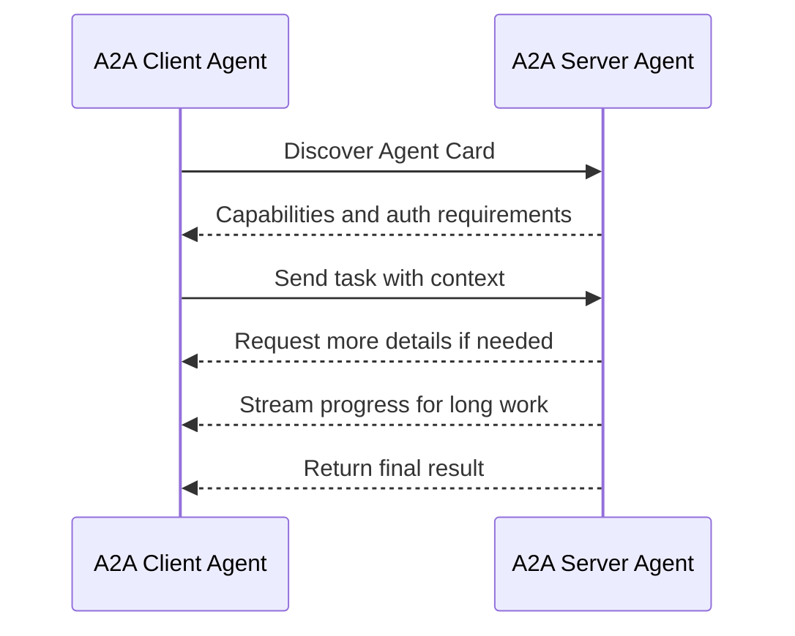
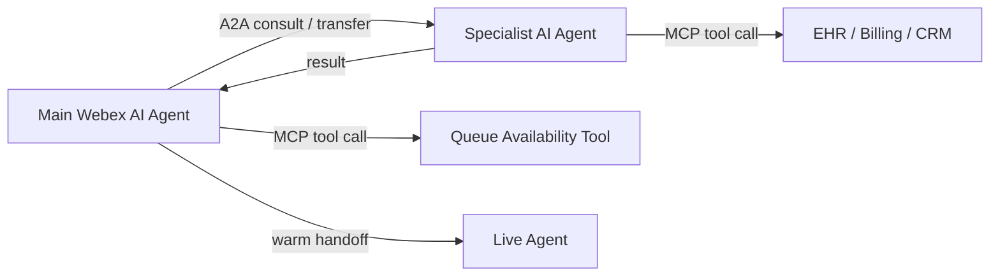

# A2A

A2A means Agent-to-Agent. This chapter explains how A2A-style communication helps AI agents discover each other, exchange tasks, coordinate work, and return results without sharing internal implementation details.

> Image note: The images in this chapter were extracted as standalone picture objects from `MGB (1).pptx`. They are not full-slide screenshots.

## Plain-English Definition

A2A is a shared way for one agent to ask another agent to do work.

Use A2A when the target is another agent. Use MCP when the target is a tool, data source, or system.

| Need | Best Fit |
| --- | --- |
| Ask a billing agent to review a billing intent | A2A |
| Ask a scheduling agent to own appointment booking | A2A |
| Look up appointments in an EHR or scheduling system | MCP |
| Create a case in CRM | MCP |
| Check queue availability before handoff | MCP |
| Pass a task and context to a remote agent | A2A |

## Core Actors

| Actor | Meaning |
| --- | --- |
| User | A human, service, or initiating AI agent with a goal |
| A2A Client | The agent or application acting on behalf of the user |
| A2A Server | The remote agent that exposes capabilities through an endpoint |

The remote agent remains opaque. The client does not need to know its internal tools, prompts, memory, or reasoning path. It only needs to know what capability the agent advertises and how to request it.

## Agent Card Mental Model

In the workshop, the Agent Card was described like a resume. It advertises what the agent can do.

An Agent Card should describe:

- Agent name and description.
- Skills and supported tasks.
- Input and output formats.
- Authentication requirements.
- Supported transports and streaming behavior.
- Contact, owner, or operational metadata.
- Limits, safety constraints, and escalation expectations.

## Consult vs Transfer

A2A is especially useful for consult and transfer mechanics.

| Pattern | Ownership | Example |
| --- | --- | --- |
| Consult | Primary agent keeps control | Main agent asks insurance agent to validate coverage and then continues |
| Transfer | Target agent takes control | Main agent sends the caller to a scheduling agent after verification |
| Human handoff | Human takes control | Customer is frustrated, identity match is uncertain, or action is sensitive |

Consult first when transfer failure is expensive. Validate destination, required slots, identity state, queue availability, and fallback path before moving ownership.

## Warm-Handoff Payload

Pass structured context, not a raw transcript.

Recommended payload fields:

| Field | Purpose |
| --- | --- |
| conversationId | Links events across agents and systems |
| sourceAgent | Shows who initiated the handoff |
| targetAgent | Shows the requested owner or consultant |
| customerIntent | Captures why the customer called |
| verificationStatus | Prevents repeated identity questions |
| requiredSlots | Shows what has already been collected |
| lastSuccessfulAction | Helps the target continue cleanly |
| mcpResults | Passes approved system lookup results |
| handoffReason | Explains why consult or transfer happened |
| riskFlags | Captures sentiment, compliance, or safety concerns |
| correlationIds | Connects A2A, MCP, and contact center logs |

## A2A and MCP Together

A2A and MCP solve different parts of the architecture.

The pattern is simple:

1. The main agent understands the caller goal.
2. MCP checks the data or system readiness.
3. A2A consults or transfers to the right specialist agent.
4. MCP lets that specialist complete approved backend work.
5. The orchestrator or human receives a clean result.

## Transfer Readiness Checklist

Before transferring to another agent or human:

- Caller identity is verified or verification status is explicit.
- Intent and confidence are captured.
- Required slots are present.
- Target agent capability is known.
- Target route or endpoint is available.
- Timeout and retry limits are defined.
- Fallback route is available.
- Customer-facing message is prepared.
- Correlation IDs are attached.
- The payload contains enough context for a warm handoff.

## Failure Controls

Every A2A task should have a failure plan.

Handle:

- Target unavailable.
- Authentication failure.
- Unsupported task.
- Missing required fields.
- Long-running task timeout.
- Conflicting result.
- Customer changes intent mid-handoff.
- Human escalation trigger.

Fallback options:

- Return to orchestrator.
- Ask one clarifying question.
- Retry with backoff.
- Route to a human queue.
- Offer callback.
- Create a case and provide confirmation.

## Key Takeaway

A2A is the collaboration layer. MCP is the system-access layer. Together with a multi-agent strategy, they let contact center journeys move from blind transfers to structured, observable, recoverable handoffs.

## Related Chapters

- [Multi Agent Strategy](multi-agent-strategy.md)
- [Model Context Protocol](model-context-protocol.md)

## References

- A2A protocol specification: <https://a2a-protocol.org/latest/specification/>
- Workshop transcript: `AI Strategic Partner Tech Workshop-20260518 1705-1.vtt`
- Slide deck: `MGB (1).pptx`
