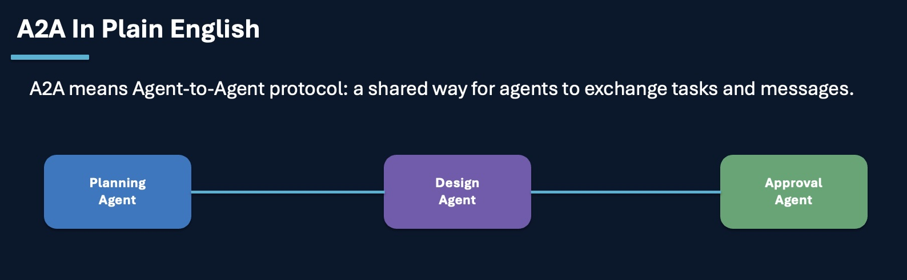
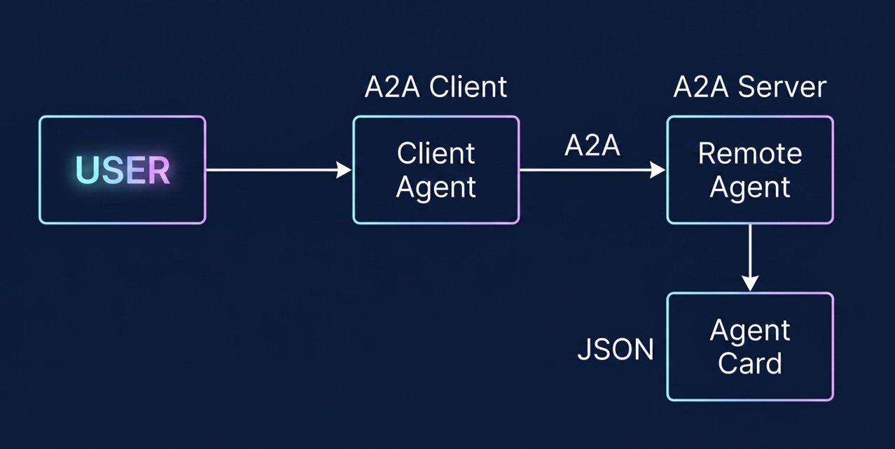
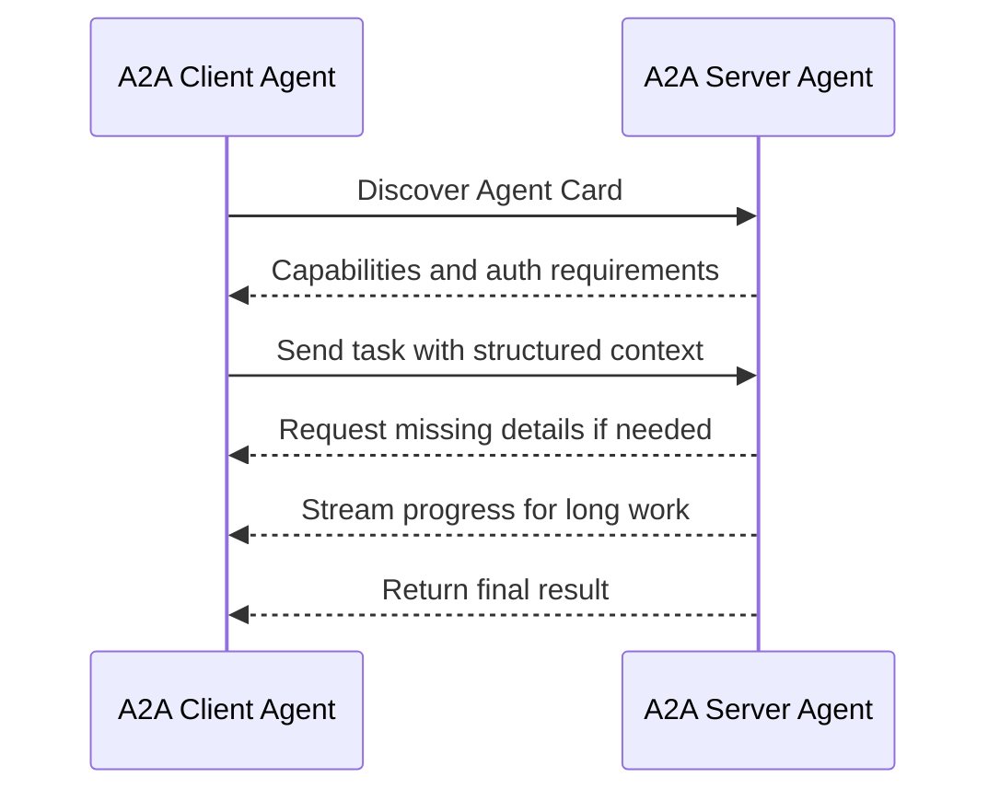
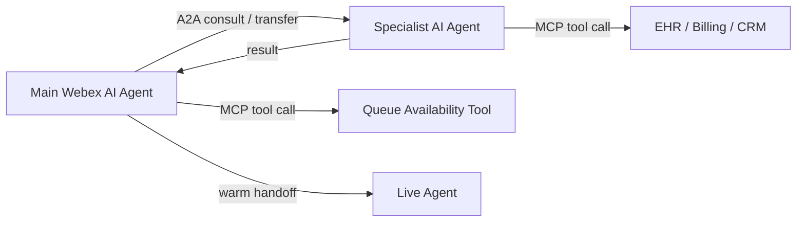

# A2A

A2A means Agent-to-Agent. It is the collaboration layer that lets one AI agent discover another agent, understand what it can do, send it a task, pass structured context, and receive a result.

It was Originally developed by Google, Now managed by  to the Linux Foundation

## What

A2A is a shared way for one agent to ask another agent to do work.

Use A2A when the target is another agent. Use MCP when the target is a tool, data source, API, database, or enterprise system.

| Need | Best Fit |
| --- | --- |
| Ask a billing agent to review a billing intent | A2A |
| Ask a scheduling agent to own appointment booking | A2A |
| Pass a task and context to a remote agent | A2A |
| Look up appointments in an EHR or scheduling system | MCP |
| Create a case in CRM | MCP |
| Check queue availability before handoff | MCP |

### Core Actors

| Actor | Meaning |
| --- | --- |
| User | A human, service, or initiating AI agent with a goal |
| A2A Client | The agent or application acting on behalf of the user |
| A2A Server | The remote agent that exposes capabilities through an endpoint |

The remote agent remains opaque. The client does not need to know the remote agent's internal prompts, tools, memory, or reasoning path. It only needs to know what capability the agent advertises and how to request it.

### Agent Card Mental Model

Imagine Agent Card is  like a resume. It advertises what the agent can do.

An Agent Card should describe:

- Agent name and description.
- Skills and supported tasks.
- Input and output formats.
- Authentication requirements.
- Supported transports and streaming behavior.
- Contact, owner, or operational metadata.
- Limits, safety constraints, and escalation expectations.

## Why

Contact center handoffs often fail because the receiving agent or human does not get enough context. The customer has to repeat information, verification may happen twice, and the next team may not know what was already attempted.

A2A helps move from blind transfers to structured collaboration.

| Without Structured A2A | With A2A |
| --- | --- |
| The source agent transfers with little context | The source agent sends intent, state, and required fields |
| The receiving agent may not know why the handoff happened | The handoff reason is explicit |
| The customer may repeat identity or appointment details | Verification status and required slots can be passed forward |
| Failures are hard to trace | Correlation IDs connect the journey across agents |
| Long work may appear stalled | The target agent can stream progress or return interim status |

A2A is especially valuable in multi-agent healthcare and contact center workflows where a main orchestrator needs help from specialists such as scheduling, billing, insurance, verification, or escalation agents.

## How

Design A2A around task ownership, context payloads, readiness checks, and failure controls.

### Recommended Interaction Pattern

### Consult Vs Transfer

A2A is useful for both consult and transfer mechanics.

| Pattern | Ownership | Example |
| --- | --- | --- |
| Consult | Primary agent keeps control | Main agent asks insurance agent to validate coverage and then continues |
| Transfer | Target agent takes control | Main agent sends the caller to a scheduling agent after verification |
| Human handoff | Human takes control | Customer is frustrated, identity match is uncertain, or action is sensitive |

Use consult when the source agent only needs help. Use transfer when the target agent or human should own the next part of the conversation.

Consult first when transfer failure is expensive. Validate the destination, required slots, identity state, queue availability, and fallback path before moving ownership.

### A2A And MCP Together

A2A and MCP solve different parts of the architecture.

The pattern is simple:

1. The main agent understands the caller goal.
2. MCP checks data, system readiness, or queue availability.
3. A2A consults or transfers to the right specialist agent.
4. MCP lets that specialist complete approved backend work.
5. The orchestrator or human receives a clean result.

### Failure Controls

Every A2A task should have a failure plan.

Handle:

- Target unavailable.
- Authentication failure.
- Unsupported task.
- Missing required fields.
- Long-running task timeout.
- Conflicting result.
- Customer changes intent mid-handoff.
- Human escalation trigger.

Fallback options:

- Return to orchestrator.
- Ask one clarifying question.
- Retry with backoff.
- Route to a human queue.
- Offer callback.
- Create a case and provide confirmation.

## Benefits

### Better Collaboration Between Agents

A2A lets specialist agents work together without exposing their internal implementation. A billing agent can review a billing intent, a scheduling agent can own appointment booking, and an insurance agent can validate coverage while the main orchestrator keeps the customer journey coherent.

### Cleaner Handoffs

Structured payloads reduce repeated questions. The receiving agent can see the customer intent, verification status, required slots, last successful action, and handoff reason.

### Stronger Observability

Correlation IDs make the journey easier to trace across A2A requests, MCP calls, contact center events, and human handoffs. This is important for debugging, governance, and compliance review.

### Safer Ownership Changes

A2A makes consult and transfer decisions explicit. The system can validate readiness before moving ownership and can fall back to the orchestrator or a human route if the target is unavailable.

### Better Human Escalation

When sentiment, confidence, compliance, or risk requires a human, A2A-style context passing supports a warm handoff. The live agent receives the reason for escalation and the context needed to continue without making the customer start over.

## FAQ

### Q1. What is A2A?

A2A means Agent-to-Agent. It is a structured way for one AI agent to discover another agent, send it a task, pass context, and receive a result.

### Q2. When should I use A2A instead of MCP?

Use A2A when the target is another agent. Use MCP when the target is a tool, data source, API, database, file store, knowledge source, or enterprise system.

### Q3. What is an Agent Card?

An Agent Card advertises what an agent can do. It should describe the agent's skills, supported tasks, input and output formats, authentication needs, transports, limits, safety rules, escalation expectations, and owner metadata.

### Q4. What is the difference between consult and transfer?

In a consult, the source agent keeps ownership and asks another agent for help. In a transfer, ownership moves to the target agent or human. Use consult when the main agent only needs validation or lookup. Use transfer when the next part of the journey belongs to another agent.

### Q5. Should the handoff include the full transcript?

No. Pass structured context instead of a raw transcript. A transcript may be useful for audit or review, but the receiving agent should get a compact payload with the fields it needs to continue.

### Q6. How does A2A help healthcare contact centers?

It lets a main agent coordinate with specialist agents for verification, scheduling, insurance, billing, and escalation. This reduces repeated questions, improves routing, and supports cleaner human handoffs when the caller is frustrated, identity is uncertain, or the action is sensitive.

### Q7. What happens if the target agent is unavailable?

The source agent should use a defined fallback. It can return to the orchestrator, retry with backoff, ask one clarifying question, route to a human queue, offer a callback, or create a case and provide confirmation.

### Q8. How do A2A and MCP work together?

A2A coordinates work between agents. MCP gives agents structured access to tools, data, and enterprise systems. In a typical journey, the orchestrator uses MCP to check readiness, A2A to consult or transfer to a specialist, and MCP again when the specialist needs approved backend access.

## Key Takeaway

A2A is the collaboration layer. MCP is the system-access layer. Together with a multi-agent strategy, they let contact center journeys move from blind transfers to structured, observable, recoverable handoffs. For WxCC AI Agent, this is a forward-looking pattern until native A2A support is available.

## Related Chapters

- [Multi Agent Strategy](multi-agent-strategy.md)
- [Model Context Protocol](model-context-protocol.md)

## References

- A2A protocol specification: <https://a2a-protocol.org/latest/specification/>

