# AI Assist Benefits

This chapter is a fast-read guide for explaining AI Assist in Webex Contact Center conversations. It connects AI Assist features to practical customer scenarios, measurable business outcomes, and ROI validation.

AI Assist is a productivity, quality, insight, and agent-experience layer. It helps agents work faster, answer more consistently, reduce after-call work, improve visibility into customer interactions, and identify where the contact center should improve.

## Executive Summary

| Message | Why It Matters |
| --- | --- |
| AI Assist helps agents, it does not replace them | The strongest story is recovered capacity, better service quality, and better agent experience |
| Every feature should map to a use case | Scenario-first selling makes value easier to understand and defend |
| ROI starts with operational metrics | AHT, ACW, FCR, CSAT, occupancy, attrition, and repeat contact create the baseline |
| Pilot with before-and-after data | A focused pilot turns AI value from opinion into measurable proof |

## Capability And Use-Case Map

| AI Assist Feature | What It Does | Primary Use Cases | Core Metrics |
| --- | --- | --- | --- |
| Real-Time Assist | Guides agents during live conversations with approved knowledge and response guidance | New-agent ramp, complex calls, policy-heavy support, consistent answers | Ramp time, AHT, FCR, CSAT |
| Real-Time Assist Actions | Uses live conversation context and customer intent to trigger a recommended action that the agent can review and execute in Agent Desktop | In-call workflow automation, next-best action, system updates, reduced application switching | AHT, action adoption, task completion time, error rate, FCR |
| Real-time transcription | Captures live conversation context | Coaching, escalation, compliance review, summary generation | Review time, escalation quality, compliance review time |
| Auto wrap-up | Reduces manual wrap-up effort | High ACW, disposition quality, repetitive admin work | ACW, occupancy, service level |
| Post-call summaries | Creates cleaner interaction notes | CRM/case notes, supervisor review, downstream analytics | Case completeness, rework, summary quality |
| Auto CSAT | Estimates customer satisfaction signals from interactions | Low survey response, targeted supervisor review, unhappy-customer detection | CSAT coverage, low-score trends, complaint rate |
| Agent Wellness | Identifies agent stress or burnout signals | Burnout risk, attrition reduction, supervisor intervention | Attrition, absenteeism, agent satisfaction |
| Topic Analytics | Finds recurring topics and interaction drivers | Root-cause analysis, KB improvement, routing and staffing decisions | Top topics, repeat drivers, transfer rate |

## Value Chain

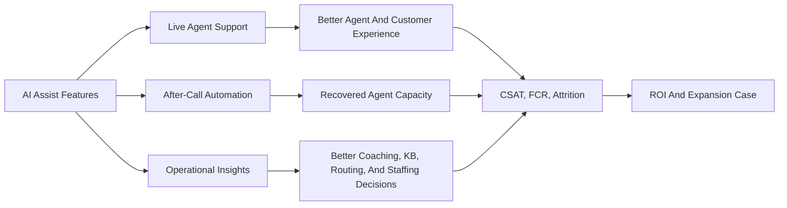

## Scenario Picker

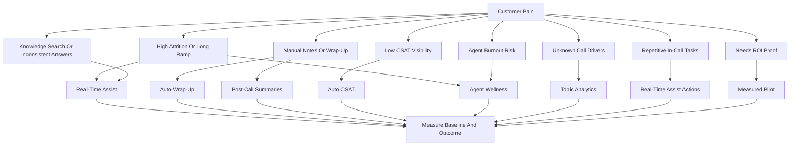

## Feature Bundle And Metric Map

| Customer Motion | Recommended Bundle | Why This Works | Core Metrics | How To Validate |
| --- | --- | --- | --- | --- |
| Agent productivity | Real-Time Assist | Helps agents answer faster with approved knowledge and response guidance during the interaction | AHT, FCR, agent ramp time, cost per contact | Compare AHT, repeat contacts, escalations, new-agent productivity, and cost per contact before and after the pilot |
| In-call workflow automation | Real-Time Assist Actions, Real-Time Assist, real-time transcription | Detects the right moment, proposes a configured action, and lets the agent complete work without leaving the interaction workflow | Task time, action acceptance, successful completion, error rate | Compare task duration, action acceptance, completion success, and manual errors |
| After-call automation | Real-time transcription, post-call summaries, auto wrap-up | Reduces manual work after the call and improves note quality | ACW, occupancy, note completeness, rework | Measure ACW by queue and agent group, then review note quality and downstream rework |
| Customer experience visibility | Auto CSAT, topic analytics, post-call summaries | Finds satisfaction patterns and the topics behind them | CSAT coverage, low-score trends, complaint rate, repeat contacts | Compare survey-only coverage with AI-assisted coverage and review low-score trends |
| Agent experience | Agent Wellness, Real-Time Assist, auto wrap-up | Supports agents while reducing repetitive work | Attrition, absenteeism, burnout indicators, agent satisfaction | Track attrition, absenteeism, wellness signals, and agent survey results |
| Operational intelligence | Topic analytics, transcription, summaries, Auto CSAT | Converts interactions into signals leaders can act on | Reporting completeness, top topics, repeat drivers, transfer rate | Review reporting coverage, topic usefulness, emerging trends, and resulting operational actions |

## ROI And Cost Validation

Start with a model the customer already understands: agent minutes, call volume, cost per productive minute, and measurable improvement.

| Input | Example |
| --- | --- |
| Agents | 100 |
| Calls per agent per day | 50 |
| Average handle time | About 7 minutes |
| AI Assist time saved | About 70 seconds per call |
| Cost per productive minute | About $0.65 |

### Easy Daily Calculation

| Step | Calculation | Result |
| --- | --- | --- |
| Total calls per day | 100 agents x 50 calls | 5,000 calls |
| Time saved per agent | 50 calls x 70 seconds | About 58 minutes |
| Total time saved | 5,000 calls x 70 seconds | 350,000 seconds |
| Recovered hours | 350,000 seconds / 3,600 | About 97 hours per day |
| Productive cost per hour | $0.65 x 60 minutes | $39 per hour |
| Daily capacity value | 97.2 hours x $39 | About $3,792 per day |
| Monthly capacity value | $3,792 x 22 working days | About $83,400 per month |

The 70 seconds saved reduces the example average handle time from 7 minutes to about 5 minutes 50 seconds, an improvement of approximately 16.7%.

> Capacity value is not automatically a cash saving. It represents productive time that can be used to handle more contacts, reduce customer wait times, improve service, complete follow-up work, or reduce overtime. Validate the 70-second assumption with actual before-and-after pilot data.

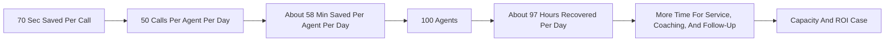
For more on ROI  visit -- [https://demointeractive.org/](https://demointeractive.org/discovery/call-center-analysis)
## Fast Qualification Questions

| Question | What It Reveals |
| --- | --- |
| What is your average handle time by queue? | Time-saving opportunity |
| How much after-call work do agents perform? | Wrap-up and summary opportunity |
| How do agents find answers today, and where do they need live guidance? | Real-Time Assist opportunity |
| Which routine tasks require agents to leave the desktop or switch applications during a live interaction? | Real-Time Assist Actions opportunity |
| How long does new-agent training take? | Real-Time Assist opportunity |
| Are summaries or dispositions consistent? | Summary and wrap-up quality opportunity |
| How much of your customer feedback comes from surveys? | Auto CSAT opportunity |
| Which queues show the highest agent stress or attrition? | Agent Wellness opportunity |
| Do you know the top reasons customers contact you? | Topic Analytics opportunity |
| Which calls create the most repeat contacts or escalations? | FCR and customer experience opportunity |
| Who consumes the notes after the call? | Downstream workflow and analytics opportunity |

## Pilot Design

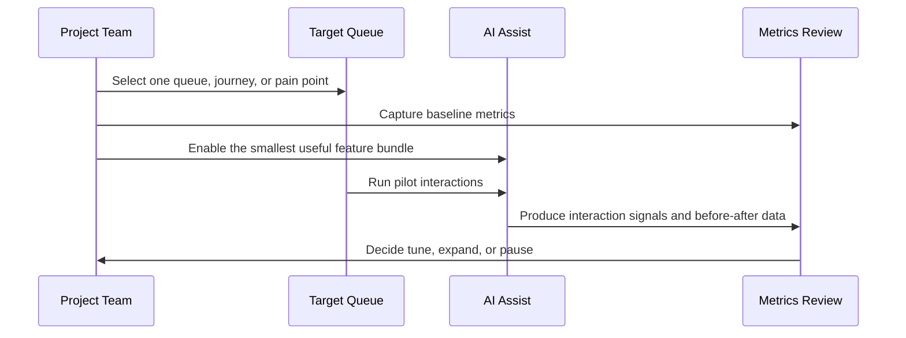

| Pilot Step | What To Do | Output |
| --- | --- | --- |
| Pick the use case | Choose one queue, call type, or business outcome | Clear pilot scope |
| Capture baseline | Measure AHT, ACW, volume, FCR, CSAT, attrition, and cost where relevant | Before view |
| Select features | Choose the smallest feature bundle tied to the pain | Controlled pilot |
| Validate quality | Review real-time guidance, action triggers and results, summaries, Auto CSAT patterns, wellness signals, and topics | Trust validation |
| Compare results | Measure before-and-after changes | ROI evidence |
| Decide next step | Tune, expand, or pause based on data | Expansion plan |

## Implementation Checklist

| Phase | Checklist |
| --- | --- |
| Discover | Pick the pain point, queue, business owner, and target outcome |
| Baseline | Capture AHT, ACW, FCR, CSAT, volume, attrition, and agent cost where relevant |
| Design | Choose the smallest feature bundle that maps to the pain |
| Pilot | Run a focused pilot with clear start and end dates |
| Review | Validate quality of real-time guidance, action triggers and results, summaries, Auto CSAT, wellness signals, and topic outputs |
| Measure | Compare before-and-after results and convert time savings into recovered capacity |
| Expand | Scale to more queues only after value is proven |

## Key Takeaway

AI Assist is easiest to sell when each feature is tied to a customer scenario and a measurable metric. The headline message:

> AI Assist gives the contact center recovered capacity, better agent experience, cleaner operational data, and clearer customer insights. Start with one measurable use case, prove value, then expand.

## FAQ

### Q1. Is AI Assist only about reducing handle time?

No. Handle time is one metric. AI Assist also improves after-call work, agent ramp, answer consistency, summary quality, CSAT visibility, agent wellness, and business insight.

### Q2. Which feature should come first?

Start with the customer's pain point. If the pain is training, knowledge search, or inconsistent answers, lead with Real-Time Assist. If agents repeatedly switch applications or manually perform routine in-call tasks, lead with Real-Time Assist Actions. If the pain is manual notes, lead with auto wrap-up and summaries. If the pain is low satisfaction visibility, lead with Auto CSAT. If the pain is unknown call drivers, lead with Topic Analytics.

### Q3. How should ROI be calculated?

Use the customer's fully burdened agent cost, convert it to cost per productive minute, estimate time saved per interaction, multiply by contact volume, and subtract AI usage cost. Then add measurable quality gains such as repeat-contact reduction, better CSAT visibility, or lower attrition risk only when the customer can validate the data.

### Q4. How do we explain this to executives?

Explain it as recovered capacity, better service quality, better agent experience, and better business visibility. Tie the ROI to measurable operational improvement instead of staffing reduction.

### Q5. What makes a good pilot?

A good pilot has one target queue, clear baseline metrics, a small feature bundle, before-and-after reporting, supervisor review, and an expansion decision.

## Scenario Cards

### 1. High Agent Attrition And Long Training Time

| Field | Guidance |
| --- | --- |
| Problem | New agents take too long to become productive and supervisors spend too much time helping during live calls |
| Best-fit features | Real-Time Assist, agent wellness |
| Use case | Help new agents during live interactions with contextual guidance, approved knowledge, and response suggestions |
| Business value | Shorter ramp time, fewer supervisor assists, better consistency, lower agent frustration |
| Measures | Training time, new-agent AHT, FCR, supervisor assists, early-tenure attrition |

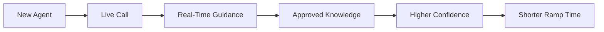

### 2. Heavy After-Call Work

| Field | Guidance |
| --- | --- |
| Problem | Agents spend too much time typing notes, selecting dispositions, and completing wrap-up tasks |
| Best-fit features | Auto wrap-up, post-call summaries, real-time transcription |
| Use case | Reduce manual work after the interaction and improve case-note quality |
| Business value | Faster agent availability, cleaner records, less rework for downstream teams |
| Measures | ACW, occupancy, calls handled per agent, note completeness, rework |

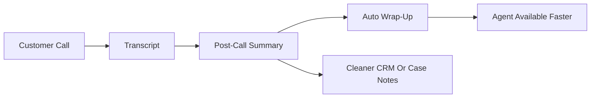

### 3. Complex Knowledge And Inconsistent Answers

| Field | Guidance |
| --- | --- |
| Problem | Agents search across multiple sources and response quality varies by agent |
| Best-fit features | Real-Time Assist |
| Use case | Bring approved knowledge and response guidance into the agent workflow during live interactions |
| Business value | Faster answers, fewer holds, better consistency, fewer escalations |
| Measures | Hold time, search time, answer accuracy, repeat contacts, escalation rate |

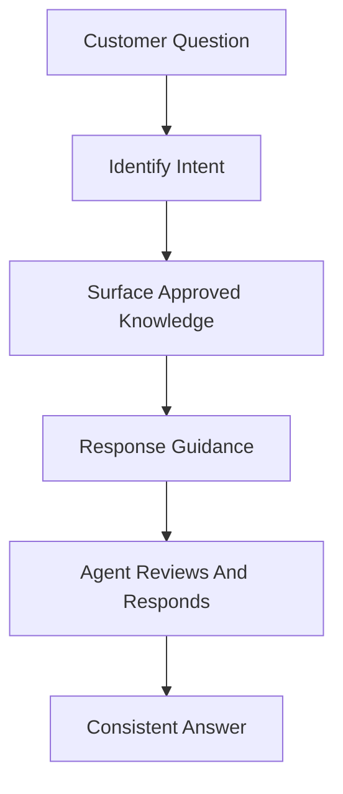

### 4. Low CSAT Visibility

| Field | Guidance |
| --- | --- |
| Problem | Only a small percentage of customers respond to surveys, so leaders lack a full view of customer satisfaction |
| Best-fit features | Auto CSAT, post-call summaries, topic analytics |
| Use case | Use interaction signals to estimate satisfaction trends and prioritize follow-up, coaching, and process fixes |
| Business value | Better CX coverage, faster detection of dissatisfied customers, more targeted supervisor review |
| Measures | CSAT coverage, low-score detection, complaint rate, repeat contact, review coverage |

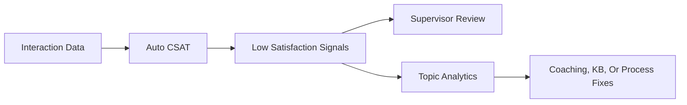

### 5. Agent Burnout Or Wellness Risk

| Field | Guidance |
| --- | --- |
| Problem | Agents handle repeated difficult conversations and leaders do not see stress signals early enough |
| Best-fit features | Agent Wellness, Real-Time Assist, auto wrap-up |
| Use case | Identify wellness risk signals and reduce repetitive work that contributes to burnout |
| Business value | Better agent support, lower attrition risk, improved morale, more sustainable performance |
| Measures | Attrition, absenteeism, adherence, agent satisfaction, wellness alerts, ACW |

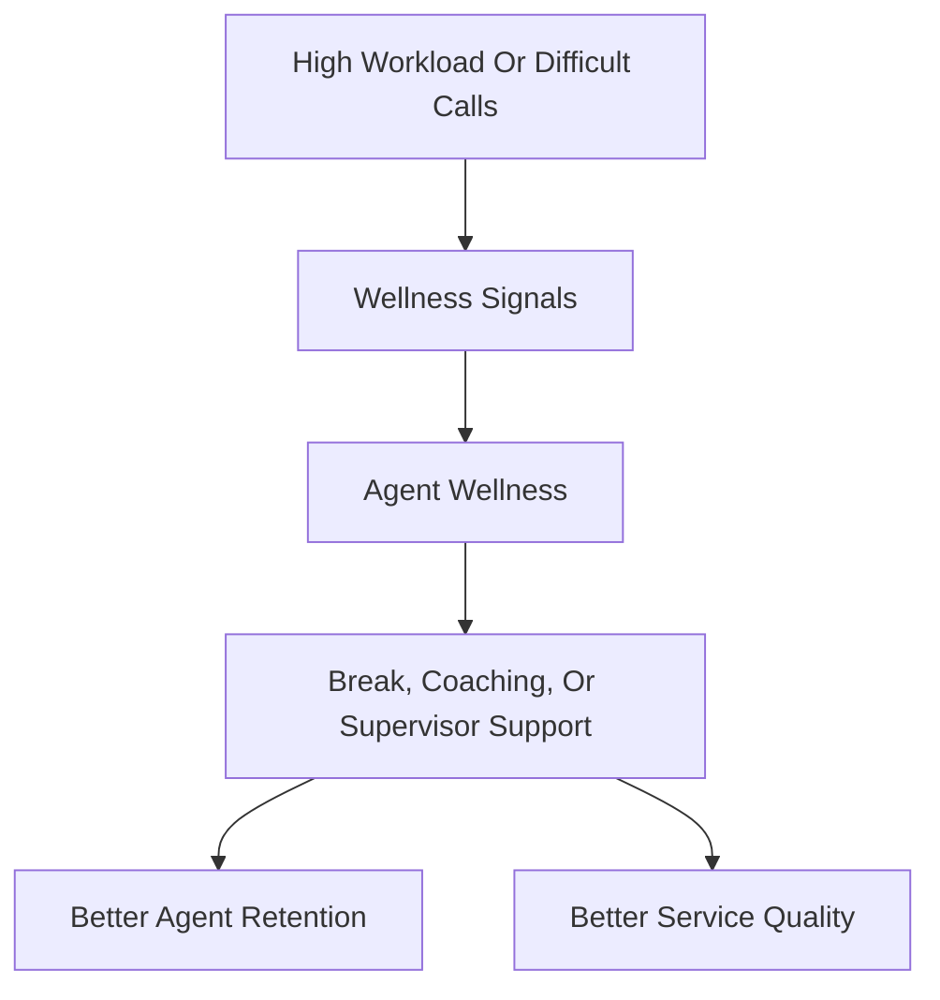

### 6. Unknown Contact Drivers

| Field | Guidance |
| --- | --- |
| Problem | Leaders know call volume is high, but do not clearly know which topics are driving demand |
| Best-fit features | Topic Analytics, post-call summaries, real-time transcription |
| Use case | Identify recurring topics, emerging issues, and deflection or automation candidates |
| Business value | Better staffing, better knowledge content, better routing, better process improvement |
| Measures | Top topics, emerging trends, repeat contacts, deflection candidates, queue transfer rate |

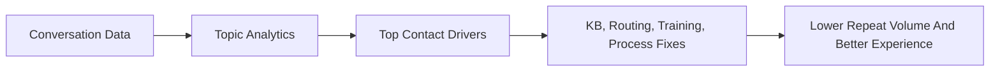

### 7. Repetitive In-Call Tasks And Application Switching

| Field | Guidance |
| --- | --- |
| Problem | Agents must recognize the next step, switch applications, and manually complete routine tasks while speaking with the customer |
| Best-fit features | Real-Time Assist Actions, Real-Time Assist, real-time transcription |
| Trigger | The AI Assistant skill detects relevant customer intent and conversation context, then proposes a configured action |
| Use case | Present the next-best action in Agent Desktop so the agent can review and execute a workflow such as retrieving information, updating a record, or initiating a business process |
| Business value | Less application switching, faster task completion, fewer manual errors, lower handle time, and more consistent process execution |
| Measures | Action suggestion rate, agent acceptance rate, successful action completion, task time, error rate, AHT, FCR |

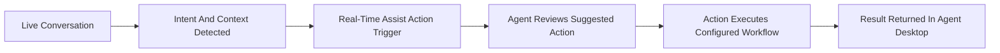
