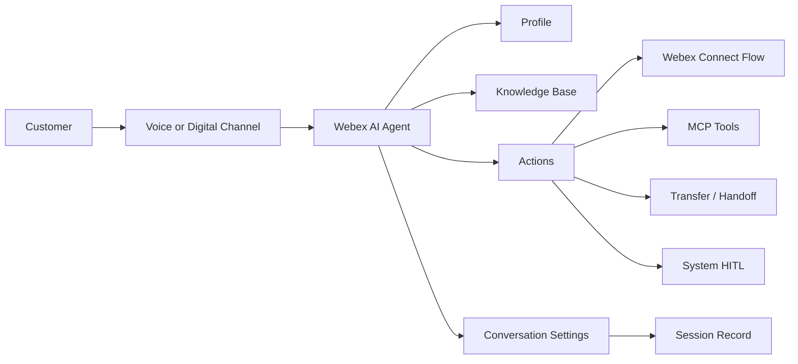

# Webex AI Agent Architecture

This chapter explains the practical architecture of a Webex AI Agent: what the agent is, how its profile shapes behavior, how knowledge is ingested, how actions connect the agent to work, and how conversations become auditable sessions.

## What Is Webex AI Agent

Webex AI Agent is a Webex Contact Center AI capability used to create, manage, deploy, and analyze automated agents for customer service and support workflows. The agent can answer questions, retrieve information, collect details from the customer, perform approved actions, and hand off to a human when needed.

Webex AI Agent Studio supports two main agent patterns:

| Agent Type | Purpose |
| --- | --- |
| Autonomous AI Agent | Works toward defined goals, uses knowledge, understands intent, and invokes configured actions with less rigid scripting |
| Scripted AI Agent | Follows predefined rules, scripts, intents, responses, and training examples for more controlled workflows |

For production contact center design, the architecture usually has these layers:

The profile gives the agent identity and operating instructions. Knowledge gives it trusted content. Actions let it do work. Conversation settings control language, voice, interruptions, and timing. Sessions capture what happened for audit, troubleshooting, and improvement.

## Profile

The profile is the agent's identity and behavioral contract. It defines how the agent appears, what goal it is trying to achieve, what AI engine it uses, and what instructions guide its responses.

| Profile Item | What It Controls |
| --- | --- |
| Agent name | Human-readable name shown in Studio and operational views |
| System ID | Unique identifier used by the platform and integrations |
| Profile image URL | Visual identity or logo for the agent |
| Time zone | Time context for the agent |
| AI engine | Determines available language, voice, DTMF, interruption, and vocabulary options |
| Welcome message | First message or prompt used to start the interaction |
| Agent goal | The business outcome the agent is designed to complete |
| Instructions | Behavioral guidance, constraints, tone, and task rules |

Profile design guidance:

- Keep the goal narrow and measurable.
- Keep instructions concise and aligned to the action list.
- Use one agent for one clear journey or module.
- Create multiple focused agents instead of one broad agent with a complex scope.
- Make the welcome message channel-appropriate and language-specific.

## Knowledge

Knowledge is the trusted content the AI Agent can use to answer customer questions. For autonomous agents, a knowledge base acts as a central repository that the LLM-powered agent can use to generate more grounded and relevant responses.

Webex AI Agent Studio supports three main ways to create knowledge sources:

| Knowledge Source | How It Works | Best For |
| --- | --- | --- |
| Upload files | Upload supported static files into the knowledge base | Policies, FAQs, forms, guides, spreadsheets, process documents |
| Create articles | Write and maintain article content directly in Studio | Short curated answers, manually authored procedures, quick updates |
| Extract website | Crawl owned public website content and convert it into knowledge | Public help pages, published support content, web-based documentation |

### Ingesting Static Content

Static content is usually the best first step because it is controlled, reviewable, and easier to govern. Examples include PDFs, Word documents, Excel files, CSV files, text files, Markdown files, internal FAQs, approved policy documents, and customer service procedures.

Recommended flow for static content:

1. Collect approved source documents.
2. Remove stale, duplicate, sensitive, or contradictory content.
3. Split large documents into smaller topic-focused files when needed.
4. Use descriptive filenames because the file name becomes part of source management.
5. Upload files to the knowledge base.
6. Review processing status and edit or delete sources as needed.
7. Map the knowledge base to the AI Agent.
8. Test customer questions in preview before publishing.

Design considerations:

- Keep one topic or policy area per file where possible.
- Use clear headings and tables that are easy to retrieve.
- Avoid uploading payment card data, PHI, PII, credentials, or other regulated data unless the workflow and controls explicitly allow it.
- Match the knowledge base language to the AI Agent language for better performance.
- Treat knowledge updates as a governed content lifecycle, not a one-time upload.

## Actions

Actions are the work layer of the AI Agent. An action is a task the agent performs after understanding the customer's intent. Actions can collect required slots, invoke fulfillment, call MCP tools, or transfer the interaction.

The basic building blocks are:

| Building Block | Meaning |
| --- | --- |
| Action | A task the AI Agent performs based on user intent |
| Entity or slot | Required information the agent collects before executing an action |
| Fulfillment | The backend execution path that completes the action |

### Action Types

| Action Type | Meaning | Current Design Note |
| --- | --- | --- |
| Flow | Uses Webex Connect Flow Builder for fulfillment | Good for API orchestration, business logic, and workflow integration |
| Transfer | Transfers to another bot, AI Agent, human agent, queue, voicemail, hunt group, or destination | Use for ownership changes or escalation |
| MCP | Uses Model Context Protocol tools | Best for structured tool, data, and system access |
| System | System default HITL action | Default human handoff / agent handover capability |
| A2A | Agent-to-Agent | Work in progress; WxCC AI Agent does not currently support native A2A |

### Flow Action

Flow actions use Webex Connect. They are useful when fulfillment needs API calls, branching logic, validation, notifications, backend updates, or integration with an existing Webex Connect flow.

Use Flow when:

- The integration already exists in Webex Connect.
- You need orchestration across multiple systems.
- The workflow needs conditional business logic.
- You need controlled fulfillment instead of direct tool access.

### Transfer Action

Transfer actions move the conversation to another destination. That destination can be another AI Agent, a human agent, a queue, voicemail, a hunt group, or another configured endpoint. Transfers can be announced or silent, depending on the customer experience.

Use Transfer when:

- Another agent or human should own the next step.
- The customer needs live support.
- The current agent's scope is complete.
- Compliance, sentiment, uncertainty, or risk requires escalation.

### MCP Action

MCP actions allow an autonomous AI Agent to connect to third-party tools and services through MCP. MCP can retrieve real-time data, invoke tools during live conversations, and perform approved actions without building a one-off API integration for every tool.

Use MCP when:

- The target is a tool, data source, API, EHR, CRM, ticketing system, or enterprise system.
- You want reusable and governed tool definitions.
- You want the MCP server to own backend translation and access controls.

### System HITL Action

The system handover action is available by default and lets the AI Agent escalate the conversation to a human agent. Treat this as the baseline human-in-the-loop control.

Use System HITL when:

- The customer is frustrated.
- Identity, billing, eligibility, or policy confidence is low.
- The request is sensitive or irreversible.
- The agent reaches a failure or unsupported path.

### A2A Action

A2A means Agent-to-Agent. It is the forward-looking pattern for structured collaboration between agents. However, WxCC AI Agent does not currently support native A2A. Treat A2A as a work-in-progress architecture concept and design modular agents, payloads, correlation IDs, and transfer readiness so the implementation can migrate later.

## Conversation

Conversation settings control how the AI Agent speaks, listens, waits, and responds during the customer interaction. These settings are influenced by the selected AI engine.

| Conversation Area | What It Controls |
| --- | --- |
| Language | Language or locale available for the selected AI engine |
| Response style | Whether the agent gives quick acknowledgments before substantive answers or responds more directly |
| Voice | Voice used for voice interactions |
| Speaking rate | Speed of generated speech |
| Custom vocabulary | Names, terms, or domain-specific words the agent should recognize better |
| Delays and interruptions | Barge-in, end-of-speech sensitivity, fulfillment timeout, caller turn timeout, and no-input timeout |
| DTMF | Digit timeout, termination character, and maximum input length |

Conversation design guidance:

- Tune response style to the use case. Healthcare and support flows often benefit from short acknowledgments before substantive answers.
- Add custom vocabulary for provider names, clinic names, product names, acronyms, and domain terms.
- Enable interruption handling where callers naturally speak over prompts.
- Set fulfillment and no-input timeouts so the journey fails cleanly instead of hanging.
- Test voice and chat previews before publishing.

## Session

A session is the record of an interaction between a customer and the AI Agent. Sessions are important for audit, troubleshooting, analytics, and continuous improvement.

Session records can include:

| Session Field | Purpose |
| --- | --- |
| Session ID | Unique room or session identifier |
| Consumer ID | User or customer identifier |
| Channel | Voice or digital channel used for the interaction |
| Updated At | Time the room or session was closed or updated |
| Room Metadata | Additional room or interaction context |
| Transcript | Chronological interaction history when the viewer has decrypt access |
| Agent responses | Responses generated by the AI Agent |
| Handover marker | Indicates whether the interaction was handed to a human agent |
| Error/downvote markers | Helps identify sessions needing review |

Use sessions to answer operational questions:

- Did the customer complete the journey?
- Did the agent hand off to a human?
- Did fulfillment fail or time out?
- Did the caller interrupt the agent?
- Which knowledge source or action needs improvement?
- Are there recurring intents that need a new action or specialist agent?

## FAQ

### Q1. What is Webex AI Agent?

Webex AI Agent is an AI-powered contact center agent that can support customers through voice or digital channels. It can answer questions, use knowledge, collect details, invoke configured actions, and hand off to a human when needed.

### Q2. What is the difference between the profile and knowledge?

The profile defines the agent's identity, goal, instructions, engine, welcome message, and operating behavior. Knowledge provides the approved content the agent can use to answer questions.

### Q3. What are the three ways to ingest knowledge?

The three main knowledge-source options are uploading files, creating articles, and extracting website content.

### Q4. What is static content ingestion?

Static content ingestion means uploading controlled documents or authoring fixed articles so the agent can use them as trusted knowledge. This is useful for policy documents, FAQs, approved procedures, forms, and support guides.

### Q5. When should I use Flow actions?

Use Flow actions when fulfillment should run through Webex Connect, especially when you need API orchestration, business logic, validation, notifications, or backend workflow control.

### Q6. When should I use MCP actions?

Use MCP when the agent needs structured access to tools, data, APIs, or enterprise systems through a reusable MCP server.

### Q7. What is the System action?

The System action is the default human-in-the-loop handover path. It lets the AI Agent escalate to a human agent when automation should stop.

### Q8. Does WxCC AI Agent support A2A today?

No. A2A is work in progress for WxCC AI Agent. Design modular agent boundaries and structured handoff payloads now, but do not assume native A2A support is available today.

### Q9. What is the difference between a conversation and a session?

The conversation is the live customer interaction. The session is the stored record of that interaction, including metadata, messages, responses, handover indicators, and review signals.

### Q10. Why do sessions matter?

Sessions let teams audit conversations, inspect transcripts when they have decrypt access, identify failures, analyze handovers, and improve the agent's knowledge, instructions, actions, and conversation settings.

## References

- Webex AI Agent Studio Administration guide: <https://help.webex.com/en-us/article/ncs9r37>
- Related chapter: [Multi Agent Strategy](multi-agent-strategy.md)
- Related chapter: [Model Context Protocol](model-context-protocol.md)
- Related chapter: [A2A](a2a.md)
