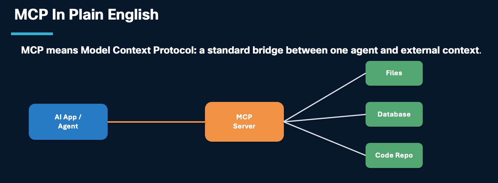
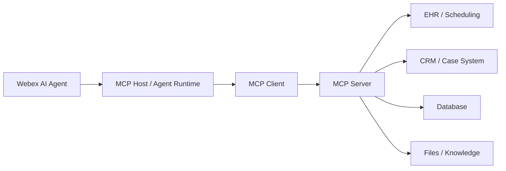
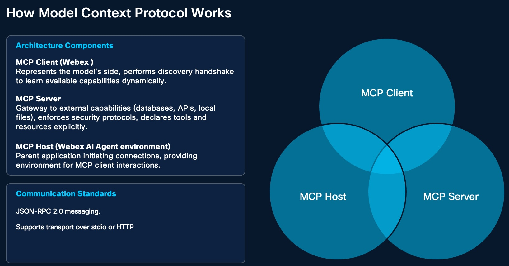
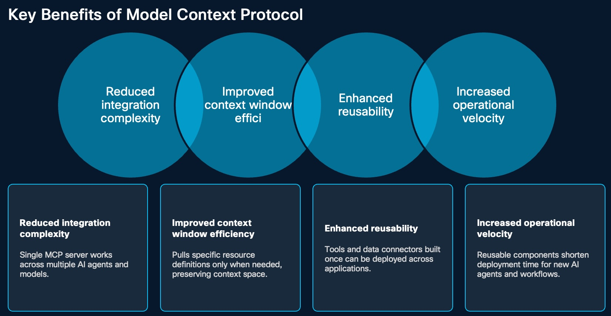
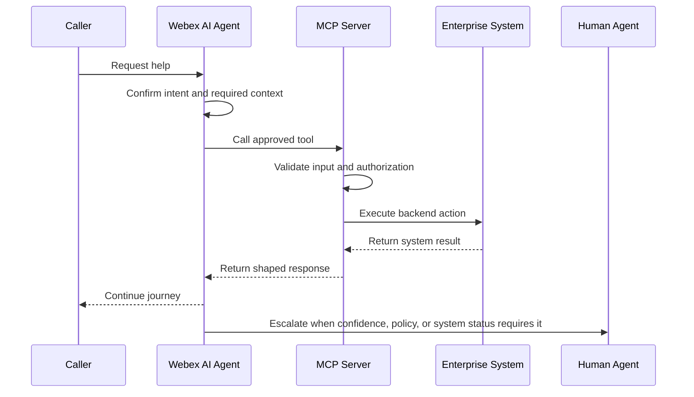

# Model Context Protocol

MCP stands for Model Context Protocol that helps AI applications connect to outside systems in a consistent and reliable way. It is an open standard initial built to improve Claude's abiliity to interact with external systems, Anthropic open-sourced MCP in early 2024 to encourage industry-wide adoption.

In simple terms, MCP gives AI agents a standard method to get information from external tools and take approved actions when needed. Instead of building a different integration pattern for every tool, MCP creates one shared standard. This makes integrations cleaner, easier to govern, and more scalable.

## What

In a Webex AI Agent architecture, MCP is the structured access layer that lets agents use approved tools, data, and enterprise systems without hardcoding every backend detail into the agent prompt.

 The AI agent should not need to understand every backend API. It should ask an MCP server for an approved capability, such as appointment lookup, patient validation, billing status, case creation, or queue availability. The MCP server translates that structured request into the system-specific action and returns a result the agent can use.

### Core Components

MCP has three main parts.

| Component | Role |
| --- | --- |
| MCP Host | The main application environment where the AI agent is running |
| MCP Client | The AI-side client that discovers available tools and decides when to use them |
| MCP Server | The secure bridge that exposes approved tools, resources, prompts, and system access |
| External systems | Databases, files, APIs, code repositories, CRM, EHR, ticketing, or other business systems |

The important idea is separation of responsibility. The AI agent invokes the capability. The MCP server handles backend translation, policy controls, system access, and response shaping.

### Where MCP Fits

Use MCP when the target is a tool, data source, API, database, file store, knowledge source, or enterprise system.

Use A2A when the target is another agent.

| Need | Best Fit |
| --- | --- |
| Look up appointments in an EHR or scheduling system | MCP |
| Create or update a case in CRM | MCP |
| Check queue availability before handoff | MCP |
| Retrieve approved knowledge from controlled sources | MCP |
| Ask a billing agent to review billing intent | A2A |
| Transfer a caller to a scheduling agent | A2A |

## Why

Before MCP, many AI integrations used a prompt-based approach. Developers had to explain tools, workflows, schemas, and data formats directly inside the prompt. That meant the AI had to read long technical instructions again and again.

That approach becomes fragile as workflows grow. Even a small wording change can create confusion, break behavior, or consume more of the model's context window.

what is Context window?

In AI, the context window is the "RAM" of the conversation. It is the total amount of information (in the form of "tokens," or chunks of text) that the AI can hold in its active memory at any given moment.

The Active Workspace: Just as RAM holds the files you are currently editing, the context window holds the current conversation history, the documents you’ve uploaded, and the instructions you’ve given the AI. This is what allows the AI to "remember" what you said three messages ago.

Capacity Limits: Every AI model has a fixed limit for its context window (e.g., 32,000 tokens or 128,000 tokens). If your conversation or the documents you provide exceed that limit, the AI begins to "drop" the earliest parts of the conversation from its active memory to make room for new information. It essentially "forgets" the beginning of the chat, just as a computer crashes or slows down when RAM is overwhelmed.

Efficiency: Just as you don't keep every file you own open in RAM at once, an AI performs best when you provide only the relevant information needed for the current task. If you provide a massive amount of irrelevant data, you are "filling up the RAM" with clutter, which can sometimes make it harder for the AI to focus on the specific request you are making.

MCP improves this by moving tool definitions outside the prompt and into a structured protocol layer. Tools and resources are defined once, and the AI can discover them when needed.

| Prompt-Heavy Integration | MCP-Based Integration |
| --- | --- |
| Tool behavior is described in agent instructions | Tools are declared by the MCP server |
| Repetitive schemas consume context | Metadata is discovered at runtime |
| Small wording changes can break behavior | Tool contracts are more explicit |
| Each agent may need duplicated integration logic | One MCP capability can be reused |
| Backend payloads may become too large | Tool output can be shaped for the next step |

### Key Benefits of Model Context Protocol

MCP offers several important benefits for enterprise AI design.

| Benefit | Why It Matters |
| --- | --- |
| Reduced integration complexity | One MCP server can support multiple AI agents, models, and workflows |
| Better context efficiency | Tool details do not need to be loaded into every prompt |
| Stronger reusability | A tool or connector can be reused across different applications |
| Faster delivery | Teams can launch new AI use cases faster by reusing existing MCP capabilities |
| Improved governance | Tool contracts, ownership, access rules, and audit patterns are easier to define |
| Better scalability | MCP supports modular designs instead of one-off integrations for every system |

Overall, MCP helps organizations build AI integrations that are more flexible, efficient, reusable, and scalable.

### Challenges and Considerations for MCP (If the customer wants to host their own MCP Server)

MCP creates a cleaner integration model, but it still needs careful planning.

| Challenge | Consideration |
| --- | --- |
| Security | MCP reduces ad hoc integration risk, but organizations still need guardrails for prompt injection, data exposure, and unauthorized access|
| Implementation complexity | Building and operating MCP servers may require skilled teams, infrastructure planning, testing, and monitoring |
| Evolving ecosystem | MCP is still maturing, so early adopters may need custom development or hybrid API/MCP patterns |
| Operational ownership | Teams must define who owns the MCP server, backend API changes, uptime, incident response, and support |
| Healthcare compliance | MCP can support healthcare compliance needs only when access policies, logging, identity, and data controls are implemented properly |

Use MCP where the reuse, governance, security, or scalability value justifies the effort. Keep simpler API-based fulfillment where it is already stable and supportable.

### Why Security Matters

If a customer builds or hosts their own MCP server, they own the operational guardrails. MCP should be treated as a production integration surface, not as a lightweight prompt helper.

Key risk areas:

- Over-permissioned tools.
- Sensitive data exposure.
- Prompt-injection attacks against tool outputs or retrieved content.
- Unvalidated inputs passed into backend systems.
- Large responses that leak unnecessary data.
- Missing audit trails for tool calls.
- No fallback path when the MCP server or backend system fails.

## How

Design MCP around small, governed capabilities that match the customer journey. Start with the action the agent needs, define the input and output contract, apply least privilege, and return only the data needed for the next step.

MCP uses structured messaging such as JSON-RPC 2.0 so systems can communicate in a predictable way. Depending on the host, server, and deployment model, MCP can run through local or HTTP-based transports.

### Recommended Design Pattern

### Design Each MCP Tool

### Why Not One Giant MCP Server

A single large MCP server may look simple at first, but it can become a new monolith. Use the same modularity principle from the multi-agent strategy: split MCP servers when the domains have different risk, ownership, uptime, or lifecycle needs.

| MCP Boundary | Why Split It |
| --- | --- |
| Scheduling MCP | Different uptime, payload, and validation requirements |
| Billing MCP | Sensitive data and stronger approval controls |
| Insurance MCP | Coverage exceptions may need human review |
| CRM or case MCP | Different system owner and lifecycle |
| Knowledge MCP | Read-only access and lower operational risk |

This makes the architecture easier to operate. If a vendor later releases a stronger production-ready MCP server, the customer can migrate one function without rebuilding the whole AI journey.

### Connect MCP To Multi-Agent Design

Align MCP boundaries with specialist-agent boundaries.

| Specialist Agent | Likely MCP Capabilities |
| --- | --- |
| Identity verification | Patient search, demographic match, verification status update |
| Scheduling | Appointment search, booking, cancellation, rescheduling |
| Insurance | Eligibility lookup, coverage validation, exception flagging |
| Billing | Balance lookup, payment preparation, dispute case creation |
| Escalation | Queue lookup, callback creation, case note creation |

This keeps each agent focused and prevents unnecessary access. A scheduling agent should not need billing tools. A billing agent should not need broad appointment-management permissions.

### Migration Strategy

Do not wait for every vendor MCP server to be mature before starting the design work. Use MCP where it creates clear value, and keep existing API-based fulfillment where it is already stable.

A practical path:

1. Start with API-based fulfillment or existing flow-based fulfillment where needed.
2. Keep AI agents and workflows modular.
3. Wrap stable functions in customer-owned or partner-owned MCP servers when there is enough reuse, governance, or resilience value.
4. When a vendor MCP becomes production-ready, migrate one function at a time.
5. Keep API-based fulfillment as a fallback where it is already working and supportable.

## FAQ: MCP in Healthcare

Now let's go through some common customer questions, especially for healthcare environments.

### Integration

**Q1. Do I need to use Webex Connect to do fulfillment?**

No. Once the MCP is available, the Webex AI Agent can integrate with the MCP directly. Webex Connect is not required just to perform fulfillment through MCP.

**Q2. How does MCP securely integrate with Electronic Health Record systems like Epic?**

MCP servers work as secure integration layers between AI agents and EHR platforms. They expose only approved tools and functions through a standard protocol. Access can be protected with token-based authentication and OAuth so only authorized requests are allowed.

In a healthcare workflow, this can support capabilities such as patient context, call screen pop-ups, and telehealth session support while keeping integration boundaries controlled.

**Q3. How does MCP work with third-party tools like Citrix?**

MCP is designed to work across many systems. It can connect securely to third-party environments and expose approved capabilities as standard tools for AI workflows.

In healthcare, this can help AI interact with applications running through Citrix or other hosted environments without forcing users to manually switch across systems, while still keeping operational boundaries in place.

**Q4. Can I build my own MCP, or do I have to wait for every vendor to provide MCP?**

Yes. Customers can build their own MCP servers. This gives them complete control and makes customization easier, especially when vendor-provided MCP support is not yet available but Customer should take care of Security and other issue outline at Challenges and Considerations

**Q5. Can Cisco or a partner build an MCP server for us?**

Cisco do not have such practices as of today, but it depends on scope, ownership, and system access. -- Reach out to SCG team for the latest 

### Security

**Q6. Can MCP handle sensitive patient data and still support healthcare compliance requirements?**

Yes, when implemented properly. MCP servers can apply strong authentication, authorization, detailed logging, and access controls. They can also work with multi-factor authentication solutions such as Cisco Duo.

This helps limit access to approved users and approved actions. In this model, MCP acts as a controlled gateway so AI agents only reach the data and functions they are allowed to use.

**Q7. How does Webex AI Agent support secure authorization and auditing when using MCP in healthcare systems?**

Webex AI Agent can use token-based authorization methods such as OAuth to connect securely to MCP servers. Each request can be validated before it is accepted.

MCP servers can also log interactions, including who accessed data, what tool was called, when the request happened, and what result or failure branch occurred. When combined with enterprise identity systems and multi-factor authentication, this creates a stronger security and audit framework for healthcare environments where traceability is critical.

**Q8. Should we use one MCP server or many?**

A single MCP server may be enough in a simple environment where systems are centralized. It is easier to manage and can reduce operational overhead.

In a complex healthcare environment, multiple MCP servers are often better. Separate servers can be used for different functions such as EHR access, imaging, pharmacy systems, billing, or knowledge retrieval. This improves scalability, isolates problems, and supports stronger security segmentation. The best choice depends on the size, complexity, and compliance needs of the organization.

**Q9. If Customer build their own MCP, who owns security and operations?**

The customer owns the operational guardrails unless those responsibilities are explicitly assigned to Cisco, a partner, or a managed service provider. That includes authentication, authorization, resiliency, monitoring, access control, validation, logging, support, and API lifecycle management.

### Operations

**Q10. When should API-based fulfillment be used instead of MCP?**

API-based access may be better when very direct or low-latency access is needed, or when working with systems that do not support MCP. It can also make sense for legacy systems, special workflows, or quick one-time integrations.

MCP is best when the goal is a reusable, standard, and scalable integration model. APIs remain useful when flexibility or direct access is more important.

**Q11. If we go live with API-based fulfillment and later our vendor provides MCP, how do we migrate?**

This is exactly why a multi-agent design is important. Keep agent workflows modular so one fulfillment function can move from API-based integration to MCP without redesigning the whole journey. Migrate one capability at a time, keep the API path as a fallback until the MCP path is stable, and validate logging, security, and failure behavior before cutting over.

## Put It All Together — Takeaway

MCP gives AI models a standardized and scalable way to connect to tools and data. Compared with prompt-based integration, it offers better reliability, stronger structure, and more efficient use of the model's context.

It also supports reusable and modular design, which is especially important in enterprise environments like healthcare. At the same time, successful adoption depends on strong security, the right level of investment, clear ownership, and awareness that the technology is still evolving.

In platforms like Webex AI Agent, MCP can play an important role in building secure, reusable, and scalable AI integrations as long as organizations apply the right security controls, access policies, and governance practices.

## Related Chapters

- [Multi Agent Strategy](multi-agent-strategy.md)
- [A2A](a2a.md)
- Please watch below Demo Vidcast of AI Agent Integrated to Saleforce and ServiceNow using MCP
  

## References

- MCP specification: <https://modelcontextprotocol.io/specification/latest>

