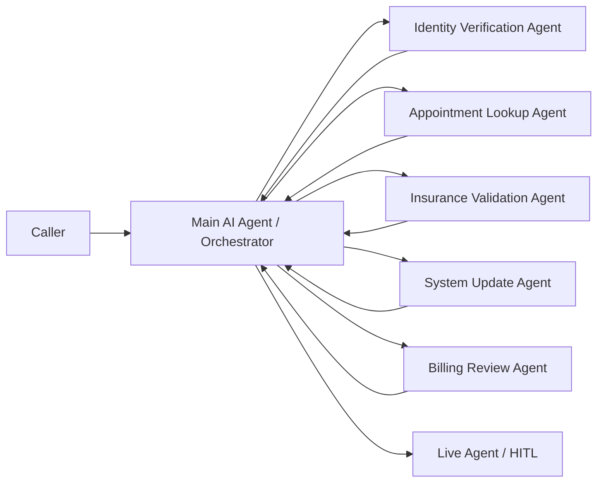
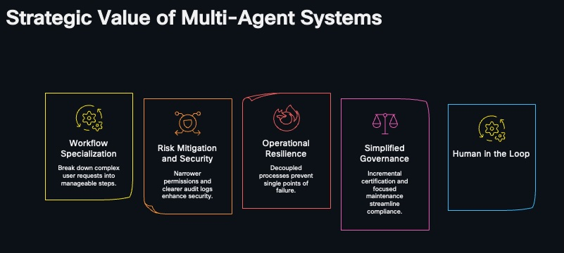
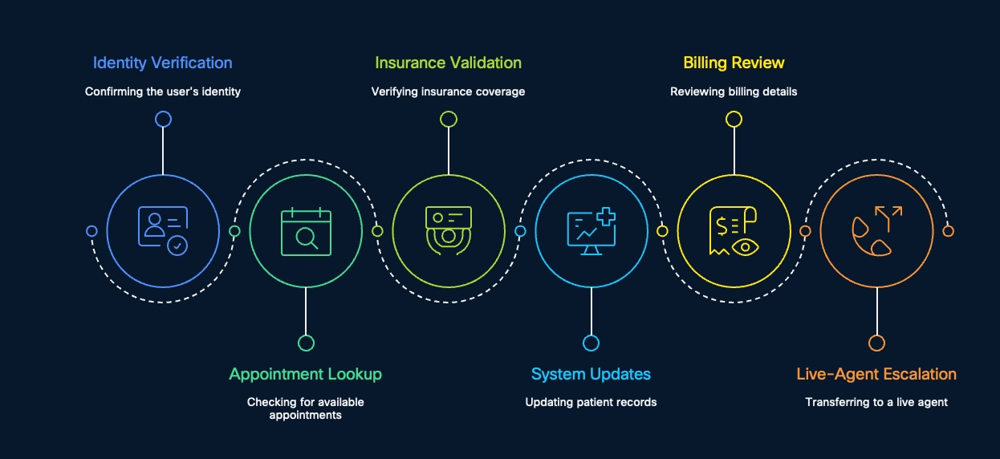
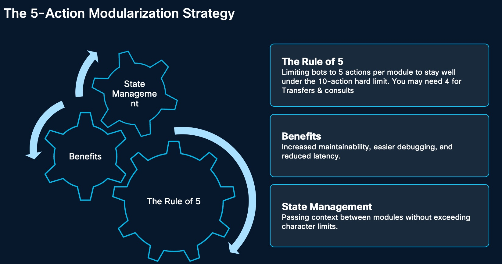
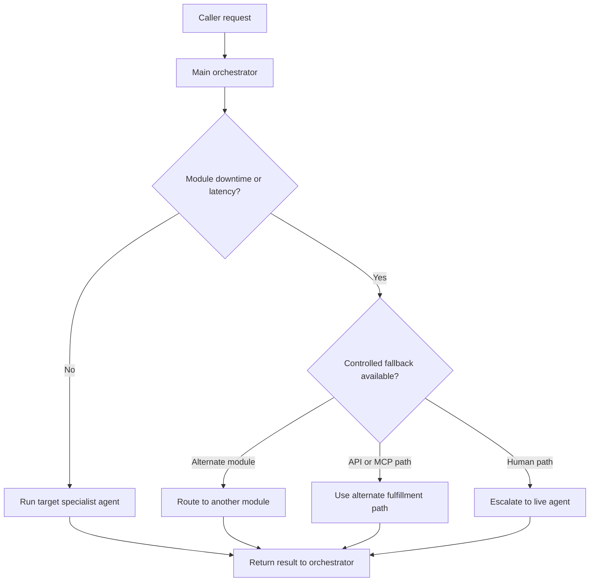
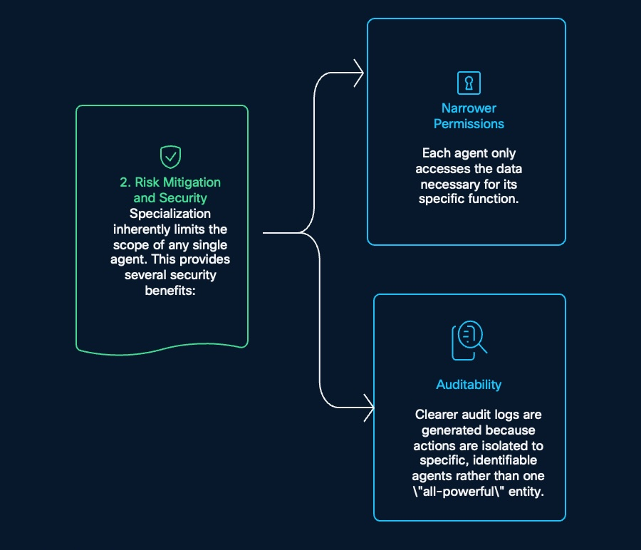
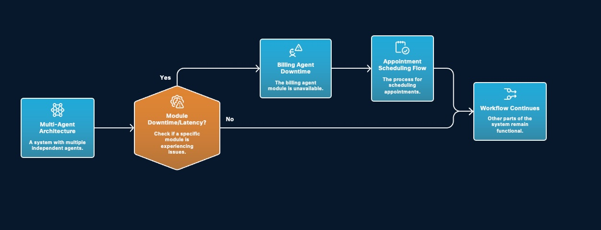
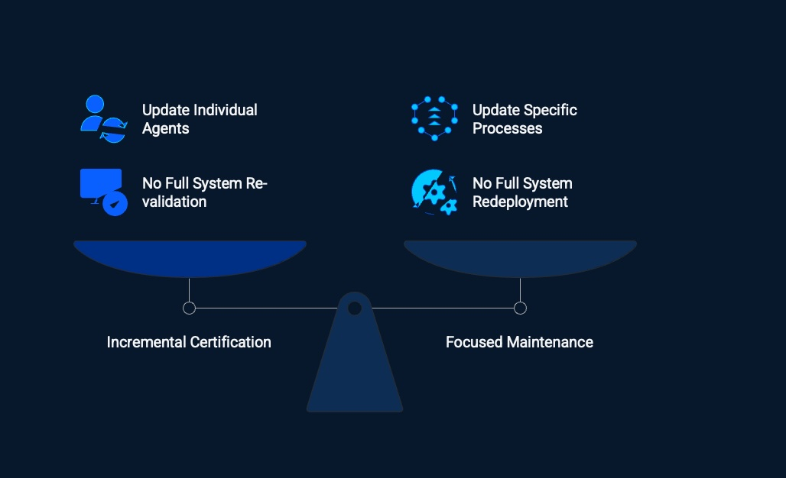
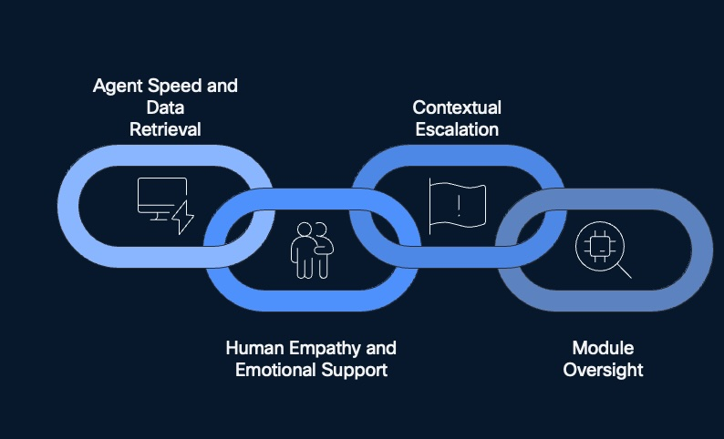

# Multi Agent Strategy

This chapter explains how to design a multi-agent Webex AI Agent architecture for contact center workflows, focusing on strategic value, workflow specialization, security, resilience, governance, human-in-the-loop operations, action design, and platform thresholds.

## What

A multi-agent strategy breaks a large customer journey into smaller, focused AI agents. Instead of building one large bot that owns every instruction, action, system, and exception path, the architecture uses specialist agents that each own a clear part of the workflow.

In a healthcare contact center, a single caller journey may include several distinct tasks:

| Workflow Step | Specialist Responsibility |
| --- | --- |
| Identity verification | Confirm the user's identity |
| Appointment lookup | Check for available appointments |
| Insurance validation | Verify insurance coverage |
| System updates | Update patient records, for example in Epic |
| Billing review | Review billing details |
| Live-agent escalation | Transfer to a live agent when automation should stop |

The usual pattern is a hub-and-spoke model. The orchestrator owns the overall journey. Specialist agents own specific modules such as verification, scheduling, insurance, billing, system updates, or escalation.

The goal is not to create more agents for the sake of it. The goal is to make each agent easier to test, secure, update, monitor, and escalate.

## Why

Contact center operations are rarely single tasks. They are chains of events. A patient may start with identity verification, move into appointment lookup, require insurance validation, trigger a patient-record update, ask about billing, and then need live-agent help.

If one AI agent owns all of that, it becomes difficult to manage. The prompt grows. The action list grows. Permission boundaries become blurry. Testing becomes harder. One broken function can affect the whole journey.

Multi-agent design solves this by making each module smaller and more accountable.

| Strategic Value | Why It Matters |
| --- | --- |
| Workflow specialization | Break down complex user requests into manageable steps |
| Risk mitigation and security | Narrower permissions and clearer audit logs enhance security |
| Operational resilience | Decoupled processes prevent single points of failure |
| Simplified governance | Incremental certification and focused maintenance streamline compliance |
| Human-in-the-loop | Human oversight adds empathy, judgment, and final approval where needed |

The main design principle is simple: each agent should have a clear start state, a clear end state, a narrow set of actions, and a known fallback path.

## How

Start by mapping the full customer journey, then split it into modules that naturally begin and end at clean boundaries.

### Design Around Workflow Boundaries

Do not start by asking, "How many bots do we need?" Start by asking, "Where does this work naturally begin and end?"

| Agent | Start State | End State |
| --- | --- | --- |
| Identity verification | Caller provides identifying information | Identity is confirmed, rejected, or sent for human approval |
| Appointment lookup | Caller is verified and has scheduling intent | Available appointment options are returned |
| Insurance validation | Required patient and coverage data are known | Coverage is verified or exception review is requested |
| System updates | Approved update data is collected | Patient record is updated or exception is escalated |
| Billing review | Caller is verified and billing intent is confirmed | Billing details are explained or a dispute is escalated |
| Live-agent escalation | Automation reaches a sensitive, uncertain, or emotional point | Human receives context and owns the next step |

If a module has no clear endpoint, it is probably too broad.

### Use Actions Deliberately

In Webex AI Agent design, actions are the building blocks that let the agent do work. 

| Action Area | What It Does |
| --- | --- |
| Create new action: Transfer | Move the conversation to another agent, queue, or live agent |
| Create new action: Fulfillment | Call backend logic, APIs, MCP tools, or other integrations |

Use transfer actions for ownership changes. Use fulfillment actions for system work. Keep those separate so the flow is easier to understand, test, and audit.

### Respect Technical Thresholds

There are  three important design thresholds:

| Threshold | Value | Design Meaning |
| --- | --- | --- |
| Agent instruction character limit | 5.1K | Keep instructions concise and module-specific |
| Fulfillment limit | 16.0K | Treat backend integration payloads as bounded and shape the response |
| Action threshold | 10 | Do not overload one agent with too many business actions |

Use the action threshold as an architecture signal. Even if the platform allows up to 10 actions, keep each autonomous specialist agent near **five business actions when possible**. Reserve the remaining capacity for transfer, fulfillment, fallback, and human escalation.

### Build For Downtime And Latency

Each module should expose health, timeout, and fallback behavior. If a billing agent is unavailable, appointment scheduling should still continue. If one module has latency or downtime, other parts of the multi-agent system should remain functional.

### Add Human-In-The-Loop Oversight

Human-in-the-loop is not a failure path. It is part of the design. Agents are strong at speed and data retrieval, but humans are still needed for empathy, emotional support, exception review, and final approval.

| Module | Agent Responsibility | Human-in-the-Loop Role |
| --- | --- | --- |
| Verification | Data matching | Final approval of identity match |
| Insurance | Policy lookup | Reviewing coverage exceptions |
| Billing | Calculation or review | Authorizing final charges |
| Escalation | Sentiment analysis | Providing empathetic resolution |

If a module detects frustration, a sensitive situation, uncertainty, or risk, the HITL protocol should trigger a contextual handoff to a live agent who is trained to handle the emotional or compliance complexity of the interaction.

## Benefits

### Workflow Specialization

Workflow specialization breaks a complex request into manageable steps. a healthcare inquiry can be separated into identity verification, appointment lookup, insurance validation, Epic or system updates, billing review, and live-agent escalation.

This makes each agent easier to prompt, test, and operate because it owns a smaller job.

### Risk Mitigation And Security

Specialization limits the scope of any single agent.

| Security Benefit | Detail |
| --- | --- |
| Narrower permissions | Each agent only accesses the data necessary for its specific function |
| Better auditability | Logs are tied to specific, identifiable agents instead of one "all-powerful" entity |
| Smaller blast radius | A mistake in one module is less likely to expose unrelated tools or data |
| Cleaner access control | Tools and MCP capabilities can be granted per specialist |

This is especially important in healthcare, where patient data, insurance data, billing data, and operational routing should not all be available to every automation path.

### Operational Resilience

Decoupled processes prevent single points of failure, for example, if the billing module is unavailable, the appointment scheduling flow can still continue.

The orchestrator should check whether a specific module is experiencing downtime or latency. If yes, it should isolate that failure and select a fallback. If no, it should continue the normal workflow.

### Simplified Governance

Multi-agent design makes governance easier because individual agents and specific processes can be updated independently.

| Governance Need | Multi-Agent Benefit |
| --- | --- |
| Update individual agents | Change one module without rewriting the full journey |
| Update specific processes | Adjust identity, insurance, billing, or escalation logic independently |
| No full system re-validation | Validate the affected module instead of the entire system |
| No full system redeployment | Release focused changes with lower operational risk |
| Incremental certification | Certify one workflow or module at a time |
| Focused maintenance | Assign clear owners and keep support scoped |

### Human-In-The-Loop Collaboration

The best contact center experience is not purely automated. It is a collaborative intelligence ecosystem where AI handles repeatable work quickly and humans step in for emotional support, judgment, compliance, and final approval.

This balance matters because healthcare calls often involve sensitive information, patient anxiety, coverage exceptions, billing disputes, or identity uncertainty.

## Key Takeaway

Multi-agent strategy turns one large, fragile bot into a modular contact center architecture. Each agent owns a clear job, uses narrower permissions, logs cleaner actions, and has an explicit fallback or human escalation path.

For Webex AI Agent design, the practical guidance is:

- Split workflows by clear start and end states.
- Keep specialist agents small and focused.
- Use transfer actions for handoff and fulfillment actions for backend work.
- Pass structured output variables instead of raw transcripts.
- Respect instruction, fulfillment, and action thresholds.
- Add human-in-the-loop oversight for sensitive, uncertain, or emotional moments.

The result is an AI architecture that is easier to secure, easier to govern, easier to update, and more resilient when one module has trouble.

## FAQ

### Q1. What is a multi-agent strategy?

A multi-agent strategy uses several focused AI agents instead of one all-purpose bot. The orchestrator manages the journey, while specialist agents handle tasks such as identity verification, appointment lookup, insurance validation, system updates, billing review, and escalation.

### Q2. Why not build one large AI agent?

One large agent becomes hard to prompt, test, secure, and update. It may need too many actions, too much data access, and too many exception paths. Multi-agent design keeps each module smaller and easier to govern.

### Q3. How does this improve security?

Each agent receives only the tools and data needed for its function. That creates narrower permissions, clearer audit logs, and a smaller blast radius if something goes wrong.

### Q4. How does multi-agent design improve resilience?

Because processes are decoupled, one module can fail without stopping the full journey. If the billing agent is down, appointment scheduling can still continue. The orchestrator can detect downtime or latency and route to a fallback path.

### Q5. How does human-in-the-loop fit into this architecture?

Human-in-the-loop is built into each module boundary. Humans approve uncertain identity matches, review insurance exceptions, authorize final billing actions, and provide empathetic resolution when sentiment or risk requires escalation.

### Q6. What is the difference between transfer and fulfillment actions?

Transfer actions move ownership to another agent, queue, or live agent. Fulfillment actions perform backend work such as API calls, MCP tool calls, database lookups, or system updates.

### Q7. What technical limits should I design around?

  5.1K character limit for agent instructions, a 16.0K fulfillment limit for backend integrations, and an action threshold of 10. Use those limits as design signals and keep specialist agents focused.

### Q8. Should each agent use all 10 available actions?

No. Keep each specialist near five business actions when possible. Reserve capacity for transfer, fulfillment, fallback, and human escalation actions.

### Q9. What context should be passed between modules?

Pass structured context such as escalation trigger, first name, last name, mobile number, patient ID, address, primary provider ID, and primary department ID. These values should come from validated fulfillment outputs, not from a raw transcript alone.

### Q10. How does this help governance?

Teams can update individual agents or specific processes without full system redeployment. They can also perform focused maintenance, incremental certification, and targeted re-validation.

### Q11. Where should we start?

Start with workflows that have high volume, clear state, narrow data needs, and visible pain when transfer context is lost. Prove one hub-and-spoke journey first, then expand.

## Related Chapters

- [Model Context Protocol](model-context-protocol.md)
- [A2A](a2a.md)

