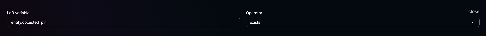
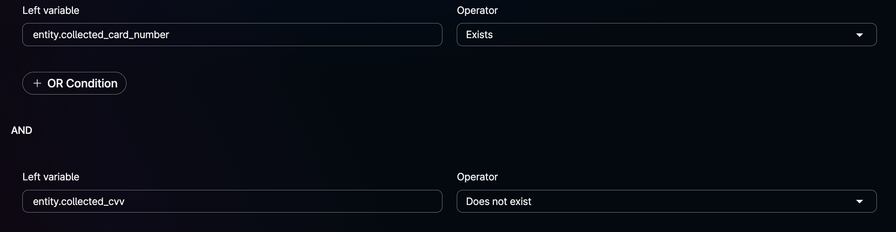
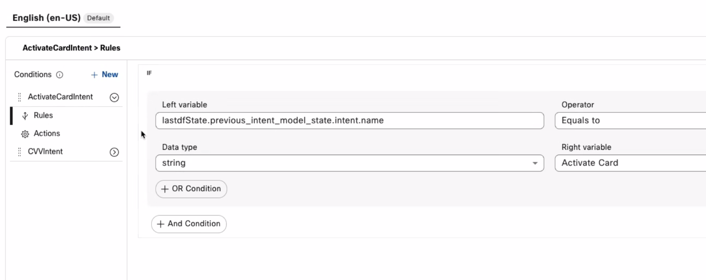
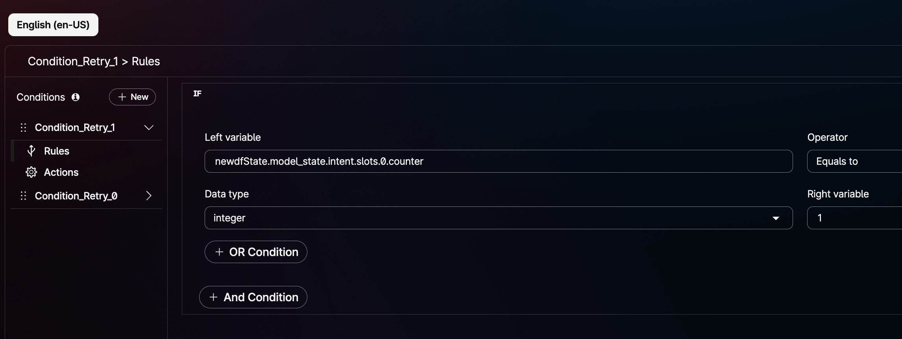
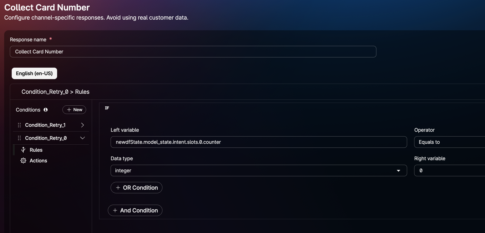
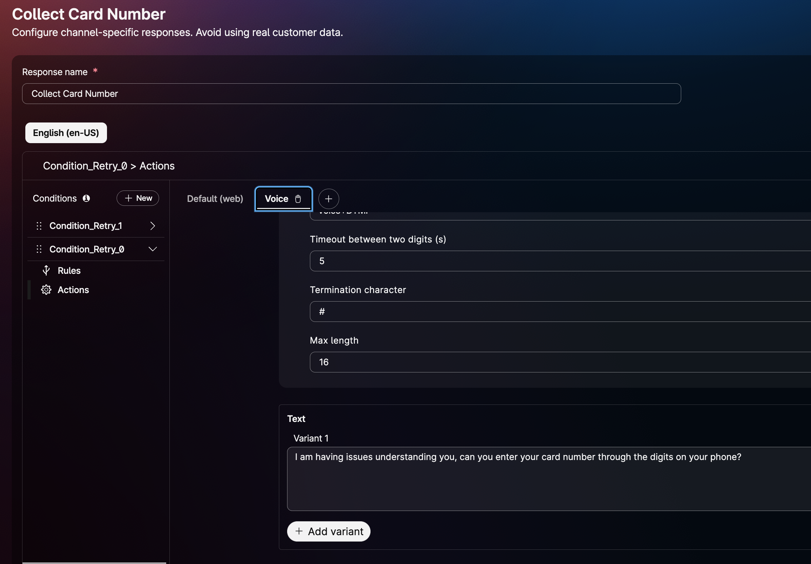

# Scripted AI Agent Design

## When to use a scripted AI agent

A scripted AI agent is best suited for:

- **Straightforward, repetitive tasks** with well-defined steps, or use cases where exact repeatability and predictability are required.
- **Highly technical questions and answers** where responses must be precise.
- **Strict use cases** that require specific responses with limited variation.
- **Sensitive data handling**, because the agent operates under predefined rules and cannot misuse or misconstrue data.
- **Consistency of experience**, where the same input must always produce the same response. (LLMs can return different results for the same prompt.)

## Configuring the AI engine

**Training Engine** — Choose the required AI engine from the drop-down list.

**Inference** — Specify the following information.

### Score below which fallback is shown

The minimum confidence required to display a response. Below this threshold, a fallback response is shown. Note that switching the AI engine changes the default value of this setting.

| AI Engine | Range of Values | Default Value | Input method |
| --- | --- | --- | --- |
| Webex AI Pro 2.0 (with Swiftmatch) | -0.1, -0.05, 0.0, 0.05, 0.1, 0.15, 0.2 | 0.05 | Choose a predefined value from the drop-down list. |
| Webex AI Pro 1.0 (with Swiftmatch) | 0 to 1 | 0.3 | Enter a valid value in the text box. |

### Difference in score for partial match

The minimum gap between the confidence levels of two responses required to clearly display the best match. Below this gap, a partial-match template is shown. Switching the AI engine changes the default value of this setting. For both engines, the score range is 0–1.

| AI Engine | Range of Values | Default Value | Input method |
| --- | --- | --- | --- |
| Webex AI Pro 2.0 (with Swiftmatch) | 0–1 | 0.02 | Enter a valid value in the text box. |
| Webex AI Pro 1.0 (with Swiftmatch) | 0–1 | 0.05 | Enter a valid value in the text box. |

For more details, refer to the [Webex AI Agent Studio Administration guide](https://help.webex.com/en-us/article/ncs9r37/Webex-AI-Agent-Studio-Administration-guide#Set-up-scripted-AI-agent) before proceeding.

## When *not* to use a scripted AI agent

Avoid using a scripted AI agent for use cases that require collecting names or addresses (nouns). However, scripted flows work well for use cases that involve collecting numeric information.

## Reporting on a scripted AI agent

### Add the global variable to the flow

1. Sign in to your customer organization using **Control Hub**.
2. Navigate to **Contact Center > Customer Experience > Flows**. The Flows page appears.
3. Click the **Go to Flow Designer** icon beside the flow. The Flow Designer window opens.
4. In the **Global Flow Properties** pane, scroll down to **Variable Definition > Predefined Variables**.
5. In the **Global Variables** section, click **Add Global Variables** and add the global variable `CustomAIAgentInteractionOutcome` to your flow.
6. Use the **Set Variable** activity to assign the value `ABANDONED` to `CustomAIAgentInteractionOutcome`.
7. Configure your **Virtual Agent V2** activity in the flow.
8. Connect the **Handled** outcome of the Virtual Agent V2 activity and use the **Set Variable** activity to assign the value `HANDLED` to `CustomAIAgentInteractionOutcome`.
9. Connect the **Escalated** outcome of the Virtual Agent V2 activity and use the **Set Variable** activity to assign the value `ESCALATED` to `CustomAIAgentInteractionOutcome`.
10. Connect the **Errored** path of the Virtual Agent V2 activity and use the **Set Variable** activity to assign the value `ERRORED` to `CustomAIAgentInteractionOutcome`.
11. Complete the rest of the flow based on your business logic and publish it. Any call that goes through this flow will have `CustomAIAgentInteractionOutcome` set to `ABANDONED`, `HANDLED`, `ESCALATED`, or `ERRORED`, depending on the path the call takes.

## Best practices by scenario

### 1. Take an action based on whether an entity exists

In a Yes/No intent, you can play a message and trigger a particular action based on whether an entity has been filled. This is achieved by adding conditions to the responses.

For example, to play a specific message when the `setPIN` entity is filled, use the condition shown below and play "Let me check if the PIN is correct" from **Actions**.



Similarly, to check whether both the **CVV** and **Card Number** entities exist before playing a custom message and performing fulfilment, use an **AND** condition and define a rule.



### 2. Replay the previous response from the AI agent

If the caller says something like "Can you repeat that?", you can replay the previous response.

To enable this, create a **Repeat** intent with utterances that capture the caller's intent to hear the message again. Then pass a custom event to the voice flow with the payload:

```json
{ "previous_response": "${lastdfState.last_template_key}" }
```

in the voice flow, you can then use `{{previous_response}}` in the Event Name field, to replay the response that was last played.

### 3. Custom fallback message

Consider a scenario in which the agent falls back to a generic fallback message.

For example, the caller says "I want to activate card". You collect the PIN and card details, perform fulfilment in the voice flow, return to the AI agent, and play a confirmation message. Now suppose the caller says something that is not recognised correctly and the agent triggers a fallback response.

Instead of playing a generic message such as *"Sorry, I am unable to understand your message. Could you please rephrase it?"*, you can play a contextual message based on the previous intent. In this case, because the previous intent was **Activate Card**, you can check for it and play *"Do you want to set a PIN?"*.

This avoids a single generic fallback message for every fallback case.



### 4. Play different responses when an entity slot is not filled correctly

When collecting an entity — for example, a 16-digit card number — the first prompt might be:

> "Please say or enter your 16-digit card number."

Based on the number of retries configured on the entity, you can use a counter to play a different message on each attempt.

For example, if you set retries to **2**, the first message can be played using the condition below.



If slot filling is unsuccessful, you may want to play a different message such as:

> "I'm having trouble understanding you. Could you enter your card number via DTMF on the phone?"

This can be achieved by checking the counter value `0`.





### 5. Collecting slots vs. intent

If you want to identify the caller's intent, play an opening message such as "How can I help you?" by passing the response name that carries "How can I help you?" in Event name field from the voice flow.

However, if you want to collect a slot directly when the call connects — for example, capturing a Zip code as soon as the caller calls in — follow these steps:

1. Create the intent and entity as usual. For example, name the intent `ZipCode`.
2. From the voice flow, pass the event name `state_update` with the following event data:

   ```json
   { "intent": "ZipCode" }
   ```

This triggers the Zip code entity response and fills the slot directly based on the caller's response.

You can also pass slots, context, and other data from the voice flow. For example, the value `5` in `random` below ensures that the `random` context persists for 5 turns of the conversation:

```json
{
  "intent": "Help",
  "slots": {},
  "context": {
    "random": 5
  }
}
```


