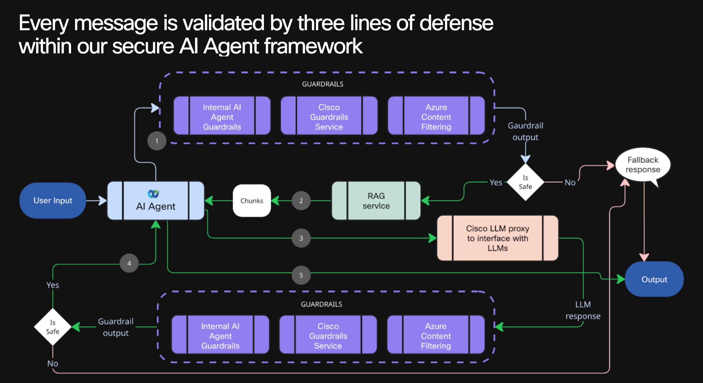
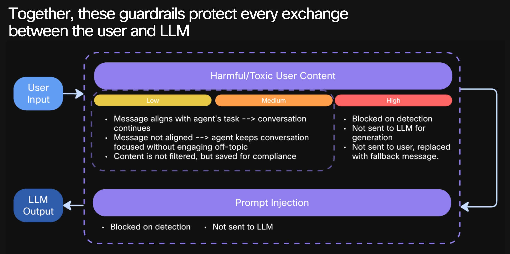
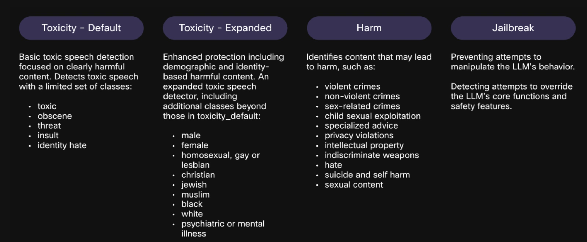
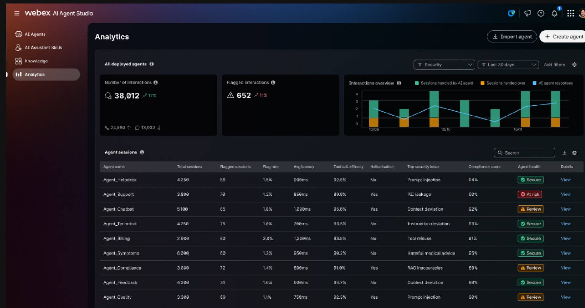
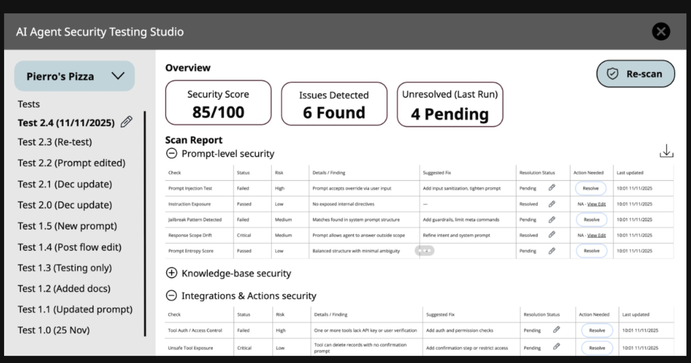
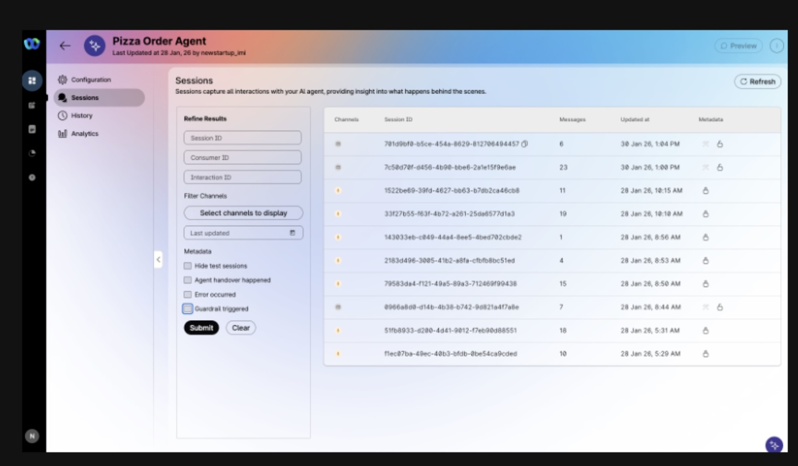

# Security

Security for AI agents in Webex Contact Center is not just about blocking unsafe prompts. It is about protecting the full interaction lifecycle: inputs, prompts, knowledge, actions, outputs, logs, and operational controls.

A secure AI agent should not only respond safely. It should also be designed, tested, monitored, and governed in a way that reduces risk before, during, and after deployment.

## Why Security Matters

AI agents introduce a broader attack surface than traditional scripted bots or fixed workflows. In a contact center environment, that risk can include:

- prompt injection
- jailbreak attempts
- harmful or toxic outputs
- data leakage
- unsafe tool usage
- weak tenant isolation
- poor observability
- compliance failures
- multi-turn manipulation across a conversation

This means AI agent security must be treated as an end-to-end discipline rather than a single moderation step.

## Current Security Foundations

The current Webex AI Agent security posture is built around several core layers.

### Responsible AI Governance

AI-powered features are reviewed through Cisco's Responsible AI framework and AI Impact Assessment process. This is intended to ensure that trust, safety, and risk evaluation are part of the product lifecycle.

### Tenant Isolation and Ephemeral LLM Calls

The current architecture emphasizes tenant isolation and short-lived LLM interactions.

Key design ideas include:

- customer data is isolated in Cisco cloud environments
- LLM requests are scoped using tenant identifiers
- LLM calls are ephemeral rather than long-lived sessions
- conversation artifacts are retained on the Cisco side, not persisted at the LLM provider layer

This reduces the chance of cross-tenant bleedover and limits data persistence outside Cisco-managed systems.

### Runtime Guardrails Available Today

Current runtime protections include standard guardrails that screen inputs and outputs for common classes of unsafe behavior.

Examples shown in the current security material include:

- `Toxicity - Default`
- `Toxicity - Expanded`
- `Harm`
- `Jailbreak`

These are intended to catch clearly unsafe content and attempts to manipulate or override the model.

### Runtime Visibility and Analytics

A major part of security is visibility. The current product direction includes richer analytics so admins can review:

- flagged interactions
- agent health
- top security issues
- compliance-related indicators
- session-level details

### Design-Time Security Testing

One of the strongest security directions is shifting validation earlier in the lifecycle.

Instead of discovering problems only after launch, design-time testing is intended to help catch issues such as:

- prompt injection
- prompt manipulation
- harmful content generation
- privacy and data security issues
- integration and action risks

### Security Guardrail Filter

A planned filter will help teams isolate sessions where a security or safety rail was triggered instead of manually reviewing the full session list.

### AI Defense Integration

The long-term direction is not to rely only on baseline built-in guardrails. The product strategy points toward pairing standard protections with Cisco AI Defense as an optional advanced layer.

Current framing suggests:

- Webex AI or Collab AI remains the default
- AI Defense is offered as an advanced security option
- packaging and pricing are still evolving
- deeper platform integration is part of the longer-term plan

## Security Best Practices

Even with strong platform controls, customers still own important parts of the final security posture.

### 1. Minimize Exposure

Only expose the data, tools, and actions the agent truly needs.

- reduce unnecessary context
- avoid broad tool permissions
- keep knowledge sources scoped and curated

### 2. Separate Conversation From Control

Prompts should define behavior, but critical workflow control should not rely on natural-language instructions alone.

Use structured logic, validated tools, or workflow controls when reliability matters.

### 3. Validate Exact Values Outside the Model

For exact matches such as site names, policy values, IDs, or approved actions, use a trusted system of record or tool call instead of asking the model to infer from text.

### 4. Assume Adversarial Inputs Will Happen

Design for:

- jailbreak attempts
- role confusion
- indirect prompt injection through retrieved content
- harmful or manipulative user behavior
- gradual multi-turn steering

### 5. Test Before Deploying

Do not wait for live traffic to reveal weaknesses.

Before deployment, test for:

- prompt injection
- unsafe tool invocation
- policy violations
- hallucinated outputs
- escalation failures
- disclosure or compliance gaps

### 6. Monitor After Deploying

Security is not complete at launch.

Review:

- flagged sessions
- recurring attack patterns
- false positives
- model drift or output quality issues
- escalation and containment behavior

### 7. Keep Human Escalation Available

A secure system should know when not to continue autonomously.

Use escalation when:

- the request is ambiguous
- the user is frustrated
- policy restrictions apply
- the model is uncertain
- the action is high risk

## Recommended Operating Model

A practical way to think about Webex Contact Center AI agent security is:

- use built-in platform guardrails as a baseline
- keep prompts, tools, and knowledge narrow
- test aggressively before deployment
- monitor continuously after deployment
- plan for stronger controls as roadmap features mature

## Practical Takeaway

The most important lesson is this:

A secure AI agent is not created by one guardrail, one prompt, or one moderation check. It is created by combining safe architecture, constrained actions, design-time testing, runtime monitoring, and clear governance.

For Webex Contact Center AI agents, the current platform provides a strong starting point. The next wave of product improvements is focused on making that security posture more observable, more tunable, and better suited for real production risk

# Security FAQ

This FAQ summarizes common security, privacy, governance, and compliance questions that teams may ask when evaluating Webex Contact Center AI agents.

## 1. How are the models tested and validated?

Webex AI Agent is validated through Cisco’s Responsible AI governance process, including an AI Impact Assessment for AI-powered capabilities, along with ongoing human-led testing, review, and quality assurance.

For autonomous AI agents, models such as GPT-4o and GPT-4.1-mini have been selected based on Cisco research and benchmarking across factors such as:

- conversational quality
- latency
- cost efficiency

Cisco continues to evaluate third-party models over time to maintain and improve performance. However, the platform does not currently provide a fixed tested-version matrix or explicit pass/fail threshold documentation for the full end-to-end solution.

## 2. What third-party providers are involved?

Autonomous AI agents use Microsoft Azure OpenAI Service for large language model capabilities.

Depending on the AI engine selected, additional providers may be used for speech-related services. For example:

- ElevenLabs for text-to-speech
- Deepgram for speech-to-text

Cisco applies vendor review, security assessment, and safety evaluation processes when working with these providers. Cisco also states that customer data sent to these providers is not permitted to be used for model training or improvement, and is not retained beyond the immediate transaction.

For U.S.-based deployments, supported speech services are processed in U.S. regions.

## 3. How is model behavior monitored?

Cisco uses telemetry to monitor service performance, availability, and operational health of the underlying AI infrastructure. In some cases, requests can be rerouted when technical issues such as latency or regional degradation occur.

However, Webex AI Agent Studio is a platform that allows customers to define their own:

- goals
- prompts
- instructions
- knowledge sources
- actions

Because of that, customers remain responsible for validating and monitoring the behavior of the agents they configure.

Today, the platform provides visibility through session review and analytics capabilities, but it does not currently offer a formal Cisco-managed cadence for proactively reporting issues such as:

- hallucinations
- model drift
- safety degradation

Additional observability and analytics capabilities are planned on the roadmap.

## 4. How are fairness and bias handled?

Fairness and bias are considered within Cisco’s broader AI safety and governance framework.

For autonomous agents, the underlying third-party models may still reflect societal bias. For that reason, fairness-related review should include the transparency and responsible AI materials provided by the model provider.

For more deterministic or scripted agents, the risk of biased language generation is generally reduced because those experiences rely more heavily on customer-defined intents, rules, and training data.

Cisco’s governance framework applies to the platform, but there is not currently a published recurring bias-reporting cadence or statistical bias report specific to each autonomous or scripted deployment.

## 5. Where does processing happen and what about data locality?

Webex AI Agent can be deployed in supported regions, including U.S. deployments such as `produs1`.

For the use case covered in this material:

- speech-to-text and text-to-speech are U.S.-only
- telemetry and logs are stored in the U.S.

At the same time, Cisco operates as a global cloud service organization, so authorized support and engineering personnel outside the U.S. may access logs for support and operational purposes where needed.

Teams with strict residency requirements should confirm locality and support-access expectations during final security and privacy review.

## 6. How transparent are the inputs, outputs, and system behavior?

Customers can control important parts of the agent experience, including:

- business logic
- agent instructions
- allowed actions
- grounding content
- escalation design

However, customers do not currently have full visibility into system-level prompts or the ability to override guardrails directly.

The platform roadmap indicates that additional features are planned to help customers:

- manage safety and compliance policies
- control guardrails more directly
- define enterprise-level policies
- enforce agent-level security posture more consistently

## 7. What are the retention and deletion policies?

Retention depends on the service component.

For AI Agent Studio specifically:

- the default retention period is 90 days

For Contact Center-related content, retention may depend on the applicable customer setup, contractual policy, and service configuration.

In some cases, retention can be configured at the organization level. In other cases, changes may require Cisco support rather than self-service administration.

When deletion is requested, Cisco states that it endeavors to delete requested data from its systems within 30 days unless retention is required for legitimate business purposes.

For third-party model providers, Cisco states that customer data processed through those services is not used for model training or improvement and is not retained beyond the immediate transaction. If a deployment requires explicit zero-retention confirmation for every provider involved, that should be validated as part of the final security and privacy review.

## 8. Q and A

1. Is vLLM Engine support available for models to be deployed in an on-premise environment?		

vLLM Engine support for on-premise model deployment is not currently available for this solution. The AI/LLM capability is delivered through managed cloud-based model services rather than customer-hosted inference infrastructure.

The platform is designed around Cisco-managed cloud services and managed LLM provider integration. It does not provide a customer-operated model-serving layer where vLLM could be installed, configured, patched, scaled, or governed by the customer.

2. Is a RAG (Retrieval-Augmented Generation) architecture planned? If so, which vector database solutions (e.g., Elasticsearch, Milvus, Qdrant, FAISS) are supported, and what are their minimum infrastructure requirements?	

The solution supports knowledge-grounded responses, where the agent can use configured knowledge sources such as uploaded files, authored articles, and extracted website content to generate more relevant answers. This provides RAG-like behavior from a user and security perspective. 

Vector database support: Customer-managed vector database options such as Elasticsearch, Milvus, Qdrant, or FAISS are not exposed as supported deployment choices.
Minimum infrastructure requirements: Not applicable for customer-managed vector databases, because the retrieval layer is managed by the platform rather than deployed and operated by the customer.

3. In terms of model performance and scalability, what are the TTFT (Time to First Token), end-to-end latency, and per-token latency metrics (P50 / P95 / P99), as well as throughput metrics (tokens/sec, requests/sec)?

The platform monitors model performance, availability, and operational health, and model selection considers latency, quality, and cost efficiency. However, fixed customer-facing values for TTFT, end-to-end latency, per-token latency percentiles, tokens/sec, or requests/sec are not provided as standard static metrics.

4. What data classes are sent to the LLM and how is data minimization ensured? (Please provide information about the data sent to the model, including prompts, RAG context, files/attachments, and logs.)

Only the data needed to process the interaction is sent to the LLM. The exact data depends on the configured agent, channel, knowledge sources, and actions.
Data sent to the LLM may include:
User message or voice transcript
Conversation history needed for context
Agent goal and instructions
System instructions and guardrails
Relevant knowledge/RAG context from approved knowledge sources
Action or tool descriptions and required input parameters
Contextual information such as prior interaction details or user preferences, where configured
Interim response or query-generation context, where applicable
Files/attachments: Uploaded files are not generally sent wholesale to the LLM during every request. They are used as governed knowledge sources, and only relevant retrieved content may be included as context when needed.
Logs: Operational logs are used for monitoring, troubleshooting, analytics, audit, and service improvement. They are not treated as default prompt context for the LLM unless specifically part of a configured workflow or review process.
Data minimization controls: Data minimization is ensured by scoping the agent to a specific purpose, limiting knowledge sources, exposing only required actions, reducing unnecessary prompt context, and using tenant isolation. Sensitive data should be removed or masked where possible before being sent to the model.

5. What are the prompt security and guardrail layers? (jailbreak/prompt injection) (If the text, code, or commands generated by the LLM are passed to downstream systems without any validation or filtering (guardrail), security vulnerabilities caused by prompt injection and hallucination may occur. Outputs must be sanitized and passed through content safety filters before use.)

The solution uses multiple prompt security and guardrail layers to reduce jailbreak, prompt injection, unsafe content, and hallucination risks.
Controls include:
System instructions and platform guardrails to keep the agent within its intended role and scope
Runtime input and output screening for unsafe behavior
Guardrail categories such as toxicity, harm, and jailbreak detection
Content filtering for unsafe or inappropriate generated content
Scoped agent goals, instructions, knowledge sources, and actions
Design-time testing for prompt injection, prompt manipulation, unsafe tool invocation, hallucinated outputs, privacy issues, and escalation failures
Runtime monitoring of flagged sessions and recurring attack patterns
Human handoff/escalation when the request is ambiguous, sensitive, high-risk, or outside the agent’s confidence/scope
Downstream system protection: LLM outputs should not be trusted as executable instructions by default. Any text, code, commands, or action parameters generated by the model should be validated before being passed to downstream systems.
Required safeguards: Downstream actions should use allowlisted tools, structured parameter schemas, authorization checks, business-rule validation, rate limits, and content safety filtering. High-risk or irreversible actions should require human approval.

6. What data is accessed in the RAG system and is this access authorized? (In a Retrieval-Augmented Generation (RAG) architecture, queries made to vector/RDBMS databases must be filtered and restricted based on user identity and authorization.)

The agent can access configured knowledge sources that have been made available to it, such as uploaded files, authored articles, approved documents, FAQs, procedures, and extracted website content.
Access model: Access is governed at the platform, tenant, and agent configuration level. The agent should only retrieve from knowledge sources that are explicitly assigned to that agent and intended for that tenant/use case.
Authorization: Retrieval access should be restricted to approved knowledge bases and scoped to the agent’s purpose. User-specific or role-specific retrieval filtering is not exposed as a customer-managed vector/RDBMS authorization layer.
Security controls: Customers should ensure that only approved, current, and appropriately classified content is ingested into the knowledge base. Sensitive, stale, contradictory, or unauthorized content should be removed before ingestion.

7. How is tool calling / function calling security managed? (Please provide information about the tools the LLM can call (allowlist), parameter schema validation, unauthorized action triggering, prompt injection, rate limiting, and "human approval" controls for critical actions.)

Tool/function calling is managed through configured agent actions and controlled fulfillment paths rather than unrestricted model access to backend systems.
Available action types may include:
Flow actions for controlled workflow/API orchestration
Transfer actions for handoff to another bot, AI agent, queue, or human agent
MCP actions for structured access to tools, APIs, data sources, or enterprise systems
System human-in-the-loop handoff actions
Allowlist: The LLM can only use actions/tools that are explicitly configured for the agent. It does not receive unrestricted access to arbitrary systems or APIs.
Parameter validation: Actions should define required inputs/entities before execution. For security-sensitive use cases, parameters should be validated by structured workflow logic, backend systems, or MCP/tool schemas before fulfillment.
Unauthorized action prevention: Critical actions should not rely on natural-language model output alone. Fulfillment should enforce authorization, business rules, tenant boundaries, and permitted action scopes outside the model.
Prompt injection protection: Prompt-injected requests should not be able to expand the agent’s tool permissions. The agent should be tested for unsafe tool invocation, and retrieved/user-provided content should not be treated as trusted control instructions.
Rate limiting: Rate limits and abuse controls should be enforced at the platform, API, workflow, or backend-service layer. Specific rate-limit values are deployment/service dependent.
Human approval: High-risk, ambiguous, sensitive, irreversible, or policy-restricted actions should use human handoff or approval before execution.

8. Are LLM requests/responses and tool actions logged? (Please provide information about sensitive data retention in prompt/response logs, log redaction, and audit trail.)

Yes, interaction and operational records are logged for audit, troubleshooting, analytics, and service monitoring, but sensitive-data retention depends on the service component and configuration.
Logged data may include:
Session ID and interaction metadata
Channel information
Consumer/customer identifier
Transcript, where the viewer has decrypt access
Agent responses
Handover markers
Error or downvote markers
Flagged interactions
Compliance or safety indicators
Tool/action execution outcomes where part of the workflow
Operational telemetry for service health, availability, and performance
Prompt/response retention: LLM provider calls are designed to be ephemeral/stateless and are not retained by the LLM provider for training or model improvement. Cisco-side retention depends on the product component, customer configuration, and applicable retention policy.
Sensitive data handling: Sensitive data should be minimized before entering prompts, knowledge sources, or action parameters. Entity masking/redaction may be used for sensitive data such as PII, PHI, and PCI, depending on the feature/configuration.
Log redaction: Detailed log-redaction behavior is service/configuration dependent. Customers should confirm which fields are redacted, masked, encrypted, or retained for their specific deployment and compliance requirements.
Audit trail: Session records and analytics provide an audit trail for reviewing conversations, handovers, failures, flagged sessions, and operational issues. Tool/action auditability should also be enforced in the downstream workflow or backend system.

9. If agents are used, how are "agent trust boundaries" defined? (authorization, memory, planning (Please provide information about which components/channels are considered trusted in the system, and where and how data coming from untrusted parties is controlled, sanitized, and validated.)

Agent trust boundaries are defined by separating trusted platform controls and configured enterprise resources from untrusted user input, retrieved content, and model-generated output.
Trusted components may include:
Cisco-managed platform services
Tenant isolation and tenant-scoped processing
System instructions and platform guardrails
Approved agent profile, goal, and instructions
Approved knowledge sources assigned to the agent
Configured actions and fulfillment workflows
MCP/tool servers with their own access controls
Backend systems of record
Human handoff or approval paths
Session/audit controls
Untrusted or lower-trust inputs include:
Customer/user messages
Voice transcripts generated from user speech
Uploaded or extracted content before review
Retrieved knowledge content that may contain indirect prompt injection
External website content
Files or attachments supplied by users
LLM-generated output before validation
Tool/action parameters inferred by the model
Authorization boundary: The model should not be treated as an authorization authority. Access decisions should be enforced outside the LLM by tenant boundaries, configured action scopes, backend authorization, workflow rules, and role-based access controls.
Memory/context boundary: Conversation history and contextual data should be limited to what is needed for the current interaction. Sensitive or unnecessary data should be minimized, masked, or excluded from prompts and retrieval context.
Planning boundary: The LLM may help interpret intent or propose the next step, but critical workflow execution should be handled through structured actions, validated parameters, business rules, and backend systems.
Validation and sanitization: Data from untrusted sources should be controlled through prompt guardrails, content filtering, knowledge-source curation, schema validation, entity masking/redaction, authorization checks, and human approval for high-risk actions.

10. How are governance mechanisms implemented in the development, deployment, and lifecycle management processes of AI/LLM solutions to ensure data quality, model accuracy, performance monitoring, ethical compliance, and regulatory compliance?

Governance is implemented through a combination of responsible AI review, secure development practices, model evaluation, runtime monitoring, data controls, and customer-configurable operational oversight.
Development governance: AI-powered features are reviewed against responsible AI principles such as transparency, fairness, accountability, privacy, security, and reliability. These reviews are incorporated into the product development lifecycle alongside security, privacy, and human-rights design processes.
Data quality controls: Data used by the AI solution should be approved, relevant, current, and scoped to the intended use case. Knowledge sources should be curated before ingestion, with stale, duplicate, sensitive, contradictory, or unauthorized content removed.
Model accuracy controls: Models are evaluated through benchmarking, testing, human review, quality assurance, and ongoing assessment. Outputs are monitored for hallucinations, unsafe behavior, escalation failures, and quality issues. Customers are also responsible for validating agent behavior based on their configured prompts, knowledge sources, and actions.
Performance monitoring: Operational telemetry is used to monitor model/service performance, availability, latency, and regional health. Session analytics and review tools support investigation of failed interactions, handoffs, flagged sessions, and recurring issues.
Ethical compliance: Ethical governance includes AI impact assessment, safety and fairness review, bias consideration, vendor security/safety assessment, guardrails, content filtering, and human escalation for sensitive or high-risk interactions.
Regulatory compliance: Compliance is supported through tenant isolation, data minimization, retention controls, encryption, access control, audit/session records, vendor governance, and alignment with applicable security and privacy frameworks. Specific regulatory obligations depend on the customer’s industry, region, configuration, and contractual requirements.

11. What policies, standards, and controls are defined to prevent risks related to model design, data and content management (copyright/license compliance), authorization, monitoring, and output accuracy in AI/LLM usage?

Controls are defined across responsible AI governance, secure development, data protection, access control, monitoring, and human oversight.
Model design controls: AI features are reviewed through responsible AI, security, privacy, and safety processes. Model selection and deployment consider quality, latency, cost, safety, fairness, and reliability. Models are tested before deployment and assessed over time for performance and accuracy.
Data and content management: Knowledge sources should be approved, current, relevant, and scoped to the intended use case. Stale, duplicate, contradictory, sensitive, or unauthorized content should be removed before ingestion. Customer content is not used to train or improve general LLM models unless explicitly permitted for a specific governed purpose.
Copyright/license compliance: Only content that the customer owns, licenses, or is authorized to use should be uploaded, connected, or extracted into knowledge sources. Public website extraction should be limited to approved owned or permitted content. Copyright and licensing validation remains a customer content-governance responsibility.
Authorization controls: Access should be enforced through tenant isolation, role-based access, scoped agent configuration, approved knowledge sources, and allowlisted actions/tools. The LLM should not be treated as the authorization authority; backend systems and workflows should enforce permissions.
Tool/action controls: Actions should be explicitly configured and limited to the agent’s purpose. Parameters should be validated through schemas, workflows, or backend systems before execution. Sensitive, irreversible, or high-risk actions should require human approval or handoff.
Monitoring controls: Runtime monitoring includes telemetry, session analytics, flagged interactions, health indicators, handoff/error markers, and review workflows. These controls help detect unsafe behavior, recurring failures, prompt attacks, hallucinations, and quality degradation.
Output accuracy controls: Accuracy is managed through curated knowledge, narrow agent goals, grounding, testing, content filtering, human review, session review, and escalation when the model is uncertain or the request is outside scope.