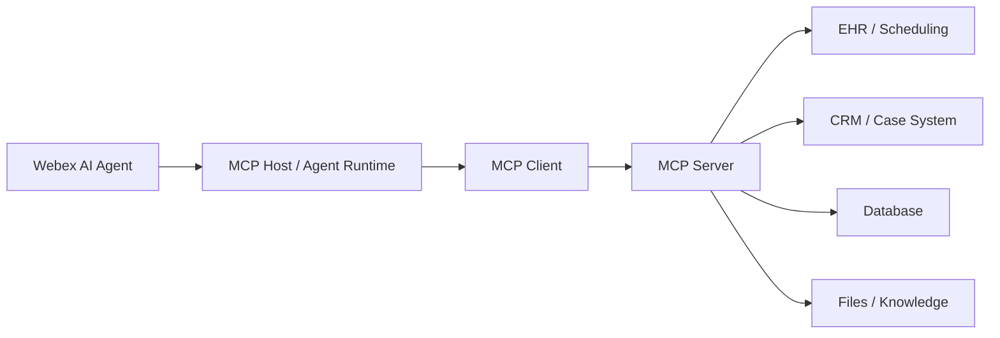

# Model Context Protocol

MCP stands for Model Context Protocol. This chapter explains where MCP fits, how it differs from prompt-heavy integrations, and how to design MCP servers without creating a new monolith.

> Image note: The images in this chapter were extracted as standalone picture objects from `MGB (1).pptx`. They are not full-slide screenshots.

## Plain-English Definition

MCP is a standard way for an AI application or agent to access tools, resources, and contextual data from external systems.

In contact center terms, the AI agent should not need to understand every backend API. It should ask an MCP server for an approved capability, such as appointment lookup, patient validation, billing status, or case creation. The MCP server translates that structured request into the system-specific action.

## Where MCP Fits in Webex AI Agent Design

In the workshop framing:

| Component | Role |
| --- | --- |
| MCP Host | The AI agent environment that initiates tool and context access |
| MCP Client | The client-side connection configured through the Webex environment |
| MCP Server | The external server that exposes tools, resources, prompts, and system access |
| External systems | Databases, files, APIs, code repositories, CRM, EHR, ticketing, or other business systems |

The AI agent invokes the capability. The MCP server handles the backend translation and returns only the result the agent needs.

## Why MCP Helps

Prompt-based integration can work, but it often pushes too much operational detail into agent instructions. That increases context-window usage, makes wording changes riskier, and can cause instruction drift.

MCP moves tool definitions and access patterns into a structured protocol layer.

| Prompt-Heavy Integration | MCP-Based Integration |
| --- | --- |
| Tool behavior is described in agent instructions | Tools are declared by the MCP server |
| Repetitive schemas consume context | Metadata is discovered at runtime |
| Small wording changes can break behavior | Tool contracts are more explicit |
| Each agent may need duplicated integration logic | One MCP capability can be reused |
| Backend payloads may become too large | Tool output can be shaped for the next step |

## Common MCP Use Cases

For healthcare and contact center workflows, MCP is a good fit for:

- Patient lookup after identity verification.
- Appointment search, booking, cancellation, and rescheduling.
- Insurance eligibility or coverage validation.
- Billing balance lookup.
- Case creation and update.
- Queue or agent availability lookup before transfer.
- Callback scheduling.
- Knowledge retrieval from controlled sources.

## One MCP Server or Many?

Use the same modularity principle from the multi-agent strategy. A single large MCP server may look simple at first, but it can become a single point of failure.

Prefer functionally scoped MCP servers when the domains have different risk, ownership, or resilience needs.

| MCP Boundary | Why Split It |
| --- | --- |
| Scheduling MCP | Different uptime, payload, and validation requirements |
| Billing MCP | Sensitive data and stronger approval controls |
| Insurance MCP | Coverage exceptions may need human review |
| CRM or case MCP | Different system owner and lifecycle |
| Knowledge MCP | Read-only access and lower operational risk |

This also makes migration easier. If a vendor later releases a stronger production-ready MCP server, you can migrate one function without rebuilding the whole AI journey.

## Security and Resilience

If a customer builds or hosts their own MCP server, they own the operational guardrails. Treat MCP as a production integration surface.

Minimum controls:

- Strong authentication and authorization.
- Least-privilege access per tool.
- Input validation and output shaping.
- Prompt-injection and data-exfiltration defenses.
- Rate limits and abuse controls.
- Audit logging for every tool call.
- Timeouts, retries, circuit breakers, and fallback paths.
- Separate production and sandbox configurations.
- Clear ownership for API lifecycle changes.

## Migration Strategy

Do not wait for every vendor MCP server to be mature before starting the design work.

A practical path:

1. Start with API-based fulfillment or existing flow-based fulfillment where needed.
2. Keep the AI agents and workflows modular.
3. Wrap stable functions in customer-owned or partner-owned MCP servers only when there is enough value.
4. When a vendor MCP becomes production-ready, migrate one function at a time.
5. Keep API-based fulfillment as a fallback where it is already working and supportable.

## Design Checklist

- Define the exact tool capability and its input/output schema.
- Return only the data needed by the agent.
- Separate read-only tools from write or state-changing tools.
- Add human confirmation for sensitive or irreversible actions.
- Decide where the MCP server is hosted and who operates it.
- Design failover before production.
- Log request ID, tool name, caller context, response status, latency, and failure branch.
- Align MCP boundaries with multi-agent module boundaries.

## Key Takeaway

MCP is not magic middleware. It is most valuable when it creates a reusable, governed, and resilient access layer between agents and enterprise systems. Build it with the same discipline used for any production API gateway.

## Related Chapters

- [Multi Agent Strategy](multi-agent-strategy.md)
- [A2A](a2a.md)

## References

- MCP specification: <https://modelcontextprotocol.io/specification/latest>
- Workshop transcript: `AI Strategic Partner Tech Workshop-20260518 1705-1.vtt`
- Slide deck: `MGB (1).pptx`
