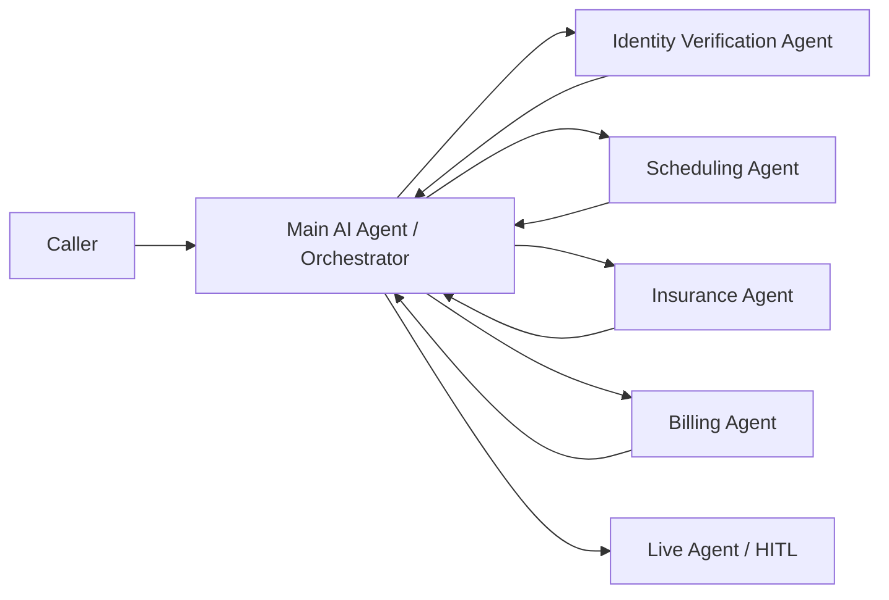

# Multi Agent Strategy

This chapter explains how to break a large customer journey into focused AI agents that can be tested, secured, updated, and escalated independently.

> Image note: The images in this chapter were extracted as standalone picture objects from `MGB (1).pptx`. They are not full-slide screenshots.

## What You Are Building

A multi-agent design uses one main orchestrator plus specialist agents. The orchestrator owns the customer journey. Specialist agents own narrow jobs such as identity verification, appointment lookup, insurance validation, billing review, cancellation, rescheduling, or live-agent escalation.

The goal is not to create more bots for the sake of it. The goal is to avoid one all-purpose agent with too many instructions, too many actions, and too much access.

## Why It Matters

The workshop recommendation was clear: keep agents small, modular, and functionally scoped. In healthcare and contact center workflows, a single caller journey may touch several domains:

| Domain | Specialist Agent Responsibility | Human-in-the-Loop Role |
| --- | --- | --- |
| Verification | Match caller identity and required slots | Approve uncertain identity matches |
| Scheduling | Book, cancel, or reschedule appointments | Resolve exceptions or unavailable slots |
| Insurance | Validate policy and coverage data | Review coverage exceptions |
| Billing | Retrieve balances and process approved actions | Authorize disputed or sensitive charges |
| Escalation | Detect routing, sentiment, or risk triggers | Provide empathy and final resolution |

## Recommended Pattern

Use a hub-and-spoke pattern.

The orchestrator should re-evaluate state after every specialist module returns. That gives the flow one reliable place to reset state, choose the next module, or move to a human.

## The Rule of 5

Use the platform action threshold as an architecture signal, not just a limit. The practical recommendation from the workshop was to keep each autonomous AI agent near five business actions.

Reserve the rest of the capacity for transfer, consult, fallback, and human escalation.

| Design Item | Recommendation |
| --- | --- |
| Business actions | Keep near five per specialist agent |
| Transfer and consult | Reserve capacity for agent handoffs |
| Human escalation | Keep a clear escalation route at every endpoint |
| Instructions | Keep concise to reduce context-window pressure |
| Fulfillment payloads | Return only the data the next step needs |

## Design Each Agent Around a Start and End State

Do not start by asking, "How many bots do we need?" Start by asking, "Where does this work naturally begin and end?"

Good boundaries:

| Agent | Start State | End State |
| --- | --- | --- |
| Appointment cancellation | Caller is verified and appointment ID is known | Appointment is cancelled or exception is escalated |
| Appointment booking | Caller is verified and appointment intent is confirmed | Appointment is booked or alternatives are offered |
| Billing review | Caller is verified and billing intent is confirmed | Balance is explained, payment path is offered, or dispute is escalated |
| Insurance validation | Required patient and coverage data are known | Coverage result is returned or human review is requested |

If an agent has no clear endpoint, it is probably too broad.

## Consult vs Transfer

Use consult when the primary agent should remain the owner and only needs help.

Use transfer when another agent, queue, or human should own the next part of the conversation.

| Pattern | Use When | Result |
| --- | --- | --- |
| Consult | The orchestrator needs validation, lookup, or routing readiness | The specialist returns data and the orchestrator keeps control |
| Transfer | The caller has a confirmed intent that belongs to a specialist | Ownership moves to the target agent or human |
| Human-in-the-loop | The request is sensitive, uncertain, emotional, or high risk | A human receives a warm handoff with context |

## Resilience Strategy

A modular design lets one function fail without bringing down the entire journey. If billing is unavailable, scheduling can still work. If booking is down, cancellation or rescheduling can continue. If an audit freezes one queue, that specific function can move to a human route while other functions stay automated.

Build each module with:

- Timeout and retry limits.
- A fallback route to the orchestrator.
- A human escalation path.
- Clear logging of source agent, target agent, reason, latency, and outcome.
- A short context payload, not the whole transcript.

## Implementation Checklist

- Define the orchestrator and its routing rules.
- List the top customer intents by volume and failure rate.
- Split specialist agents by clear start and end state.
- Keep each specialist agent near five business actions.
- Grant each specialist only the tools and data it needs.
- Use MCP for tool, data, and system access.
- Use A2A or native transfer mechanics for agent-to-agent collaboration.
- Add human escalation at every module boundary.
- Log correlation IDs across agent, MCP, and contact center events.
- Measure containment, transfer completion, latency, fallback rate, and repeat-contact rate.

## Field Guidance

Start with the customer journeys that fail most often. Do not try to redesign the entire contact center at once. Move one workflow into the hub-and-spoke model, prove the handoff quality, then expand.

The best first candidates are workflows with high volume, clear state, narrow data needs, and visible pain when transfer context is lost.

## Related Chapters

- [Model Context Protocol](model-context-protocol.md)
- [A2A](a2a.md)

## Sources

- Workshop transcript: `AI Strategic Partner Tech Workshop-20260518 1705-1.vtt`
- Slide deck: `MGB (1).pptx`
