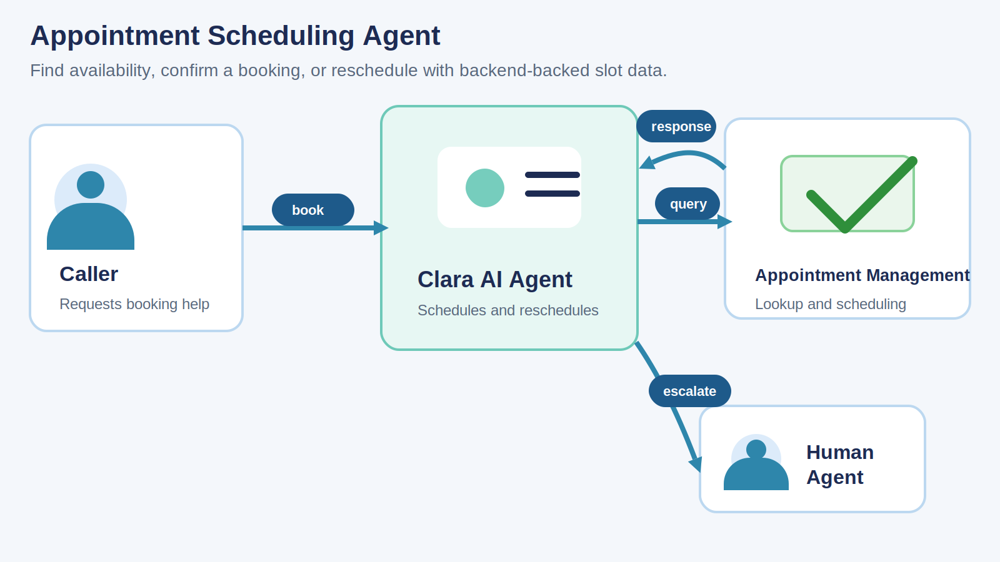
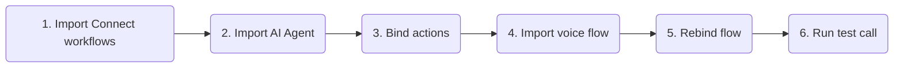
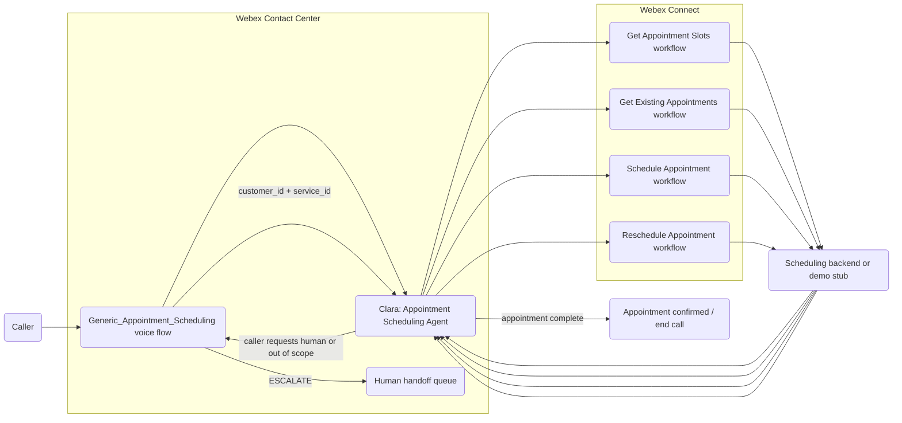
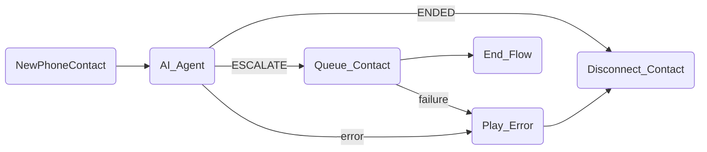

# Appointment Scheduling - Webex Contact Center Autonomous AI Agent

A reference implementation of an autonomous voice AI agent built on Webex Contact Center that helps callers schedule a new appointment, review existing appointments, and reschedule an existing booking.

The agent is **Clara**, a polite and professional appointment scheduling concierge. Clara checks live availability for a preferred date, presents returned appointment options, confirms the selected slot, and uses Webex Connect workflows to schedule or reschedule the booking.

---

## Try It Fast

| Step | Do this | Where |
|---|---|---|
| 1 | Import and publish [Get_Appointment_Slots.workflow](exports/Get_Appointment_Slots.workflow), [Get_Existing_Appointments.workflow](exports/Get_Existing_Appointments.workflow), [Schedule_Appointment.workflow](exports/Schedule_Appointment.workflow), and [Reschedule_Appointment.workflow](exports/Reschedule_Appointment.workflow). | Webex Connect |
| 2 | Import [Appointment_Scheduling.json](exports/Appointment_Scheduling.json). | AI Agent Studio |
| 3 | Update `get_available_appointment_slots`, `get_existing_appointments`, `schedule_appointment`, and `reschedule_appointment` fulfillment to point at the imported Webex Connect workflows, then publish the agent. | AI Agent Studio |
| 4 | Import [Generic_Appointment_Scheduling.json](exports/Generic_Appointment_Scheduling.json). | Flow Designer |
| 5 | Rebind the `AI_Agent` activity to the imported Appointment Scheduling agent and replace the escalation queue with the target human support queue. | Flow Designer |
| 6 | Place a test call and verify slot lookup, new appointment booking, existing appointment lookup, rescheduling, no-slot handling, error handling, and requested human handoff. | Phone |

---

## What The Agent Does

The Appointment Scheduling agent handles a voice scheduling journey:

1. Greets the caller as Clara and offers help with scheduling or rescheduling an appointment.
2. Uses `get_available_appointment_slots` when the caller wants to book or change an appointment and provides a preferred date.
3. Presents only returned slot options and asks the caller to choose one.
4. Uses `schedule_appointment` after the caller selects a slot and provides a reason for the appointment.
5. Uses `get_existing_appointments` when the caller wants to review or reschedule an existing booking.
6. Confirms which existing appointment the caller means before attempting a change.
7. Uses `reschedule_appointment` after the caller confirms the existing appointment and selects a new returned slot.
8. Escalates to a human agent when the caller asks for a person, cannot complete the scheduling task, or needs help outside appointment scheduling.

---

## Scheduling Pattern

This template demonstrates how to implement an AI Agent that coordinates appointment booking against runtime backend availability and appointment records.

The agent uses action results as the source of truth for:

- Available appointment slots for the selected service and preferred date.
- Existing appointment records for the caller.
- Appointment identifiers needed for rescheduling.
- Booking and rescheduling confirmations returned by the backend.

Clara is designed to ask for one piece of information at a time over voice, avoid asking callers to speak dates in a strict format, and only confirm a booking after the corresponding backend workflow returns a success result.

`service_id` is the reuse mechanism that allows the same AI Agent pattern to manage appointments for different services without rebuilding the conversation logic. For example, the same agent could be deployed for a specific clinic, a vaccination programme, a home repair visit, or another appointment-based service simply by changing the `service_id` passed in from the voice flow.

`customer_id` is expected to be available before the scheduling journey begins. In this sample pattern, the caller has already been identified by a separate upstream process, and the voice flow injects the trusted `customer_id` into the AI Agent when the `AI_Agent` activity starts.

The included Webex Connect workflows should be treated as simple fulfilment stubs that utilize fixed or generated dummy data. In a production implementation, these workflows would typically integrate with systems such as appointment platforms, CRM records, patient scheduling systems, service calendars, or internal line-of-business booking APIs.

---

## Test Script

| Scenario | Caller says | Expected behavior |
|---|---|---|
| Slot lookup | "I'd like an appointment next Tuesday." | Agent calls `get_available_appointment_slots` with the configured `service_id` and the caller's preferred date, then presents only returned slots. |
| New appointment | "I need to book an appointment to see my doctor." | Agent captures the reason, offers returned slots, confirms the selected slot, and calls `schedule_appointment` only after the caller chooses an available time. |
| Existing appointments | "What appointments do I already have?" | Agent calls `get_existing_appointments`, presents the returned bookings clearly, and does not invent appointment details or IDs. |
| Reschedule | "I need to move my appointment." | Agent looks up existing appointments, confirms which booking to change, gets new availability for the preferred date, and calls `reschedule_appointment` after the caller selects a returned slot. |
| No availability | Ask for a date with no returned slots. | Agent explains that no slots are available for that date, asks for another preferred date, or offers transfer to a human agent. |
| Human request | "I want to speak to someone." | Agent uses `Agent handover`; the voice flow routes `ESCALATE` to `Queue_Contact`. |
| Backend unavailable | A Connect workflow or backend returns an error or unclear result. | Agent apologizes, avoids exposing internal details, offers another attempt where appropriate, or follows the configured handoff path. |

---

Files In This Playbook

| File | Type | Purpose |
|---|---|---|
| [Appointment_Scheduling.json](exports/Appointment_Scheduling.json) | Webex CC Autonomous AI Agent export | Clara's instructions, voice settings, and tools: `get_available_appointment_slots`, `get_existing_appointments`, `schedule_appointment`, `reschedule_appointment`, and `Agent handover`. |
| [Generic_Appointment_Scheduling.json](exports/Generic_Appointment_Scheduling.json) | Webex CC Voice Flow export | Main inbound voice flow that invokes the AI Agent, injects `customer_id` plus `service_id`, handles normal completion, routes escalation, and plays an error prompt on failures. |
| [Get_Appointment_Slots.workflow](exports/Get_Appointment_Slots.workflow) | Webex Connect workflow export | Fulfillment workflow that returns available appointment slots for the selected service and preferred date. |
| [Get_Existing_Appointments.workflow](exports/Get_Existing_Appointments.workflow) | Webex Connect workflow export | Fulfillment workflow that retrieves the caller's current appointments. |
| [Schedule_Appointment.workflow](exports/Schedule_Appointment.workflow) | Webex Connect workflow export | Fulfillment workflow that books a new appointment after the caller selects a returned slot. |
| [Reschedule_Appointment.workflow](exports/Reschedule_Appointment.workflow) | Webex Connect workflow export | Fulfillment workflow that moves an existing appointment to a new returned slot. |

Architecture

The voice flow owns telephony, routing, disconnect, queue escalation, and injection of context such as `customer_id` and `service_id`. The AI Agent owns the conversation, slot selection, and appointment confirmation logic. Webex Connect owns fulfillment for availability lookup, existing-appointment lookup, booking, and rescheduling.

AI Agent Behavior Guide

The included AI Agent export uses these behavior rules:

- Ask for one piece of information at a time over voice.
- Use `get_available_appointment_slots` only after the caller provides a preferred date for booking or rescheduling.
- Present only slot options returned by the backend.
- Use the action results as the source of truth for appointment ids, dates, availability, and confirmations.
- Do not ask callers to use a rigid date format; convert the input as needed and clarify only when the date is ambiguous.
- Confirm key appointment details before calling `schedule_appointment` or `reschedule_appointment`.
- Escalate to a human agent when the caller asks for one, cannot complete the scheduling task, or needs help outside appointment scheduling.

Included tools:

| Tool | Purpose | Required inputs |
|---|---|---|
| `get_available_appointment_slots` | Fetch available appointment slots for the selected service and preferred date. | `service_id`, `preferred_date` |
| `get_existing_appointments` | Retrieve current appointments for the caller. | `customer_id` |
| `schedule_appointment` | Book a new appointment after the caller selects a returned slot. | `customer_id`, `reason`, `requested_date` |
| `reschedule_appointment` | Move an existing appointment to a new returned slot. | `customer_id`, `appointment_id`, `requested_date` |
| `Agent handover` | Escalate to a human agent when the caller asks for a person or the journey cannot be completed safely. | None |

Import And Rebind Notes

### Webex Connect

- Import [Get_Appointment_Slots.workflow](exports/Get_Appointment_Slots.workflow).
- Import [Get_Existing_Appointments.workflow](exports/Get_Existing_Appointments.workflow).
- Import [Schedule_Appointment.workflow](exports/Schedule_Appointment.workflow).
- Import [Reschedule_Appointment.workflow](exports/Reschedule_Appointment.workflow).
- Connect each workflow to the target scheduling backend or use the demo stubs as is.
- Publish the workflows.

**Note**: The demo stubs use placeholder nodes alongside hard coded and/or generated data. They are not intended for production use.

### AI Agent Studio

- Import [Appointment_Scheduling.json](exports/Appointment_Scheduling.json).
- Confirm  are enabled.
- Rebind `get_available_appointment_slots`, `get_existing_appointments`, `schedule_appointment`, and `reschedule_appointment` fulfillment actions to the corresponding imported Webex Connect workflow.
- Publish the agent.

### Flow Designer

- Import [Generic_Appointment_Scheduling.json](exports/Generic_Appointment_Scheduling.json).
- Rebind `AI_Agent` to the imported Appointment Scheduling agent.
- Set `service_id` for the target appointment type either directly in the voice flow variable or with a variable override from Channel configuration. This is what lets the same AI Agent pattern support different services such as a clinic, vaccination programme, or home repair visit.
- Ensure `customer_id` is injected into the `AI_Agent` activity from an upstream identification step or trusted lookup before the appointment conversation begins.
- Replace the imported escalation queue with the target human support queue.
- Publish to a test entry point before routing production traffic.

Flow Designer Details

The included voice flow is [Generic_Appointment_Scheduling.json](exports/Generic_Appointment_Scheduling.json).

| Activity | Purpose |
|---|---|
| `NewPhoneContact` | Starts the inbound voice flow. |
| `AI_Agent` | Invokes the Appointment Scheduling AI Agent and passes the injected `customer_id` plus the configured `service_id`. |
| `Queue_Contact` | Escalates to the configured human queue when the agent emits `ESCALATE`. |
| `Play_Error` | Plays a system-error message before disconnecting. |
| `Disconnect_Contact` | Disconnects after normal agent completion or error handling. |
| `End_Flow` | Ends after queue handling. |

Security, Privacy, And Publishing Notes

### Security Notes

- Treat caller phone numbers, appointment reasons, appointment dates, appointment ids, and customer identifiers as sensitive where customer policy requires it.
- Review whether appointment details can be stored, logged, replayed, or displayed to human agents.
- Use secure variables for sensitive fields where supported.
- Define cancellation, no-show, retry, escalation, and fallback handling before production use.

### Known Limitations

- The sample workflows do not provide data consistency as they use generated data, with no data persistence. Production flows would need to integrate with an external service.
- `service_id` is currently a deployment variable and must be set correctly for the target service or appointment type.
- `customer_id` is expected to come from a separate upstream identification or lookup process before the AI Agent is invoked.
- This template covers scheduling, appointment lookup, and rescheduling. Cancellation is not included in this version.

### Publishing Notes

Before publishing externally:

1. Replace demo backend references with the supported backend or approved customer-hosted scheduling pattern.
2. Consider introducing missing functionality, such as appointment cancellation.

---

## License And Attribution

This is a reference playbook for Webex Contact Center AI Agent solution design. Add the preferred repository license and attribution before publishing.
