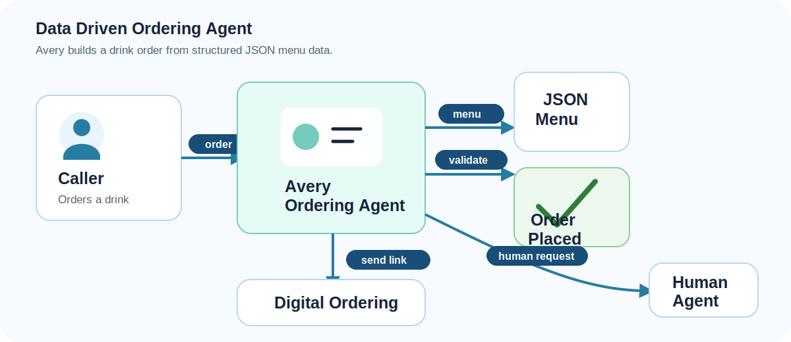
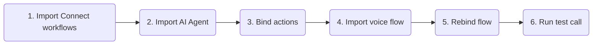
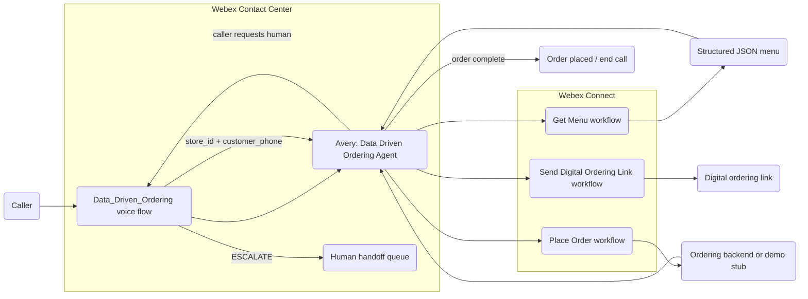
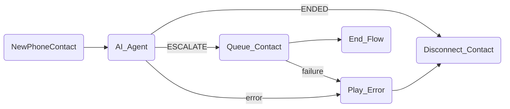

# Data Driven Ordering - Webex Contact Center Autonomous AI Agent

A reference implementation of an autonomous voice AI agent built on Webex Contact Center that helps a caller place an order from a structured JSON catalogue.

The agent is **Avery**, a cheerful virtual barista. Avery fetches the available menu, follows the catalogue structure to ask the right questions, validates the caller's choices against the menu data, places the order, and can send a digital ordering link if the caller needs another path.

---

## Try It Fast

| Step | Do this | Where |
|---|---|---|
| 1 | Import and publish [Get_Menu.workflow](exports/Get_Menu.workflow), [Place_Order.workflow](exports/Place_Order.workflow), and [Send_Digital_Ordering_Link.workflow](exports/Send_Digital_Ordering_Link.workflow). | Webex Connect |
| 2 | Import [Data_Driven_Ordering_Agent.json](exports/Data_Driven_Ordering_Agent.json). | AI Agent Studio |
| 3 | Update `get_menu`, `place_order`, and `send_link` fulfillment to point at the imported Webex Connect workflows, then publish the agent. | AI Agent Studio |
| 4 | Import [Data_Driven_Ordering.json](exports/Data_Driven_Ordering.json). | Flow Designer |
| 5 | Rebind the `AI_Agent` activity to the imported Data Driven Ordering agent, set `store_id` for the target menu, and replace the escalation queue with the target human support queue. | Flow Designer |
| 6 | Place a test call and verify menu lookup, order validation, order placement, digital-link fallback, error handling, and requested human handoff. | Phone |

---

## What The Agent Does

The Data Driven Ordering agent handles a one-drink voice ordering journey:

1. Greets the caller as Avery, the virtual barista.
2. Calls `get_menu` to fetch the structured JSON menu for the configured `store_id`.
3. Guides the caller through drink selection and required configurable options.
4. Validates requested items against the menu data.
5. Reads the order back and asks for confirmation.
6. Collects the caller's name for the order.
7. Calls `place_order` with the validated order details.
8. Ends the journey after a successful order placement.
9. Offers `send_link` if the caller repeatedly has trouble completing the voice order.
10. Escalates to a human agent only when the caller requests a person during the voice call.

---

## Structured Menu Pattern

This template demonstrates how to implement an AI Agent that lets users place orders based on a catalogue of items and associated options defined in a JSON data structure.

The menu is fetched at runtime by `get_menu`. The agent follows the returned structure as the source of truth for:

- Available drinks.
- Required questions for the selected drink.
- Valid option combinations, such as caffeine choice, milk and syrups.
- Recommendations based only on current menu data.
- Order validation before calling `place_order`.

The agent should ask every appropriate question needed to build a valid order, then call the `place_order` Webex Connect workflow with the validated order details.

This makes the same agent pattern reusable for cafes, food counters, retail order capture, parts ordering, supplies, appointment add-ons, or any catalog-like experience.

The included Webex Connect workflows are dummy workflows that use hard-coded data for demo purposes. In a real implementation, replace them with workflows that integrate with backend systems, such as a menu/catalogue service and a point-of-sale system. The included digital ordering link is also a hard-coded dummy link and should be replaced with a real webpage or digital channel entry point.

---

## Test Script

| Scenario | Caller says | Expected behavior |
|---|---|---|
| Menu lookup | "What drinks can I order?" | Agent calls `get_menu` and gives a short menu summary without listing every sub-option unless asked. |
| Complete order | "I'd like a latte with caramel syrup." | Agent checks the menu data, asks only for missing required options, confirms the order, collects the caller's name, and calls `place_order`. |
| Invalid option | Ask for an option that is not valid for the selected drink. | Agent explains that the requested combination is unavailable and offers valid alternatives from the menu data. |
| Digital fallback | Caller struggles to complete the voice order. | Agent offers to send a digital ordering link and calls `send_link` if accepted. |
| Successful order | Confirm the completed order. | Agent calls `place_order`, shares the order result, says goodbye, and ends the voice journey. |
| Human request | "I want to talk to someone." | Agent uses `Agent handover`; the voice flow routes `ESCALATE` to `Queue_Contact`. This handoff only happens when requested during the voice call. |
| Backend unavailable | A Connect workflow or backend returns an error. | Agent apologizes, avoids exposing internal details, and follows the configured fallback path. |

---

Files In This Playbook

| File | Type | Purpose |
|---|---|---|
| [Data_Driven_Ordering_Agent.json](exports/Data_Driven_Ordering_Agent.json) | Webex CC Autonomous AI Agent export | Avery's instructions, voice settings, and tools: `get_menu`, `place_order`, `send_link`, and `Agent handover`. |
| [Data_Driven_Ordering.json](exports/Data_Driven_Ordering.json) | Webex CC Voice Flow export | Main inbound voice flow that invokes the AI Agent, passes `store_id` and `customer_phone`, handles normal completion, routes escalation, and plays an error prompt on failures. |
| [Get_Menu.workflow](exports/Get_Menu.workflow) | Webex Connect workflow export | Fulfillment workflow that returns structured menu data for the configured store. |
| [Place_Order.workflow](exports/Place_Order.workflow) | Webex Connect workflow export | Fulfillment workflow that submits the caller's validated order. |
| [Send_Digital_Ordering_Link.workflow](exports/Send_Digital_Ordering_Link.workflow) | Webex Connect workflow export | Fulfillment workflow that sends the caller a digital ordering link. |

Architecture

The voice flow owns telephony, routing, disconnect, and queue escalation. The AI Agent owns the conversation and menu-driven order validation. Webex Connect owns fulfillment for menu lookup, order placement, and digital-link delivery.

AI Agent Behavior Guide

The included AI Agent export uses these behavior rules:

- Start by calling `get_menu` and tell the caller Avery is checking today's menu.
- Use only the menu data returned by `get_menu` when deciding what is available.
- Ask for missing drink options one at a time unless the caller already provided them.
- Validate menu items before placing the order.
- Read the order back and ask for confirmation.
- Collect the caller's name before calling `place_order`.
- Support one drink per order.
- Offer `send_link` when the caller repeatedly has trouble completing the voice order.
- End the journey after successful order placement.
- Escalate to a human agent only when the caller asks for a person during the voice call.

Included tools:

| Tool | Purpose | Required inputs |
|---|---|---|
| `get_menu` | Fetch structured menu data for the store. | `store_id` |
| `place_order` | Submit the validated voice order. | `store_id`, `channel`, `channel_id`, `customer_name`, `order_details` |
| `send_link` | Send a digital ordering link to the caller. | `store_id`, `customer_name`, `phone_number` |
| `Agent handover` | Escalate to a human agent when the caller asks for a person during the voice call. | None |

Import And Rebind Notes

### Webex Connect

- Import [Get_Menu.workflow](exports/Get_Menu.workflow).
- Import [Place_Order.workflow](exports/Place_Order.workflow).
- Import [Send_Digital_Ordering_Link.workflow](exports/Send_Digital_Ordering_Link.workflow).
- Connect each workflow to the target menu/order backend or demo stub.
- Publish the workflows.

### AI Agent Studio

- Import [Data_Driven_Ordering_Agent.json](exports/Data_Driven_Ordering_Agent.json).
- Confirm `get_menu`, `place_order`, and `send_link` are enabled.
- Rebind each action fulfillment to the corresponding imported Webex Connect workflow.
- Publish the agent.

### Flow Designer

- Import [Data_Driven_Ordering.json](exports/Data_Driven_Ordering.json).
- Rebind `AI_Agent` to the imported Data Driven Ordering agent.
- Set `store_id` for the target menu either directly in the voice flow variable or with a variable override from Channel configuration.
- Replace the imported escalation queue with the target human support queue.
- Publish to a test entry point before routing production traffic.

Flow Designer Details

The included voice flow is [Data_Driven_Ordering.json](exports/Data_Driven_Ordering.json).

| Activity | Purpose |
|---|---|
| `NewPhoneContact` | Starts the inbound voice flow. |
| `AI_Agent` | Invokes the Data Driven Ordering AI Agent and passes `store_id` plus `customer_phone`. |
| `Queue_Contact` | Escalates to the configured human queue when the agent emits `ESCALATE`. |
| `Play_Error` | Plays a system-error message before disconnecting. |
| `Disconnect_Contact` | Disconnects after normal agent completion or error handling. |
| `End_Flow` | Ends after queue handling. |

Security, Privacy, And Publishing Notes

### Security Notes

- Treat phone numbers, names, order details, and store identifiers as sensitive where customer policy requires it.
- Review whether ordering data is stored, logged, replayed, or displayed to human agents.
- Use secure variables for sensitive fields where supported.
- Define retry, cancellation, order modification, and escalation behavior before production use.

### Known Limitations

- The included Webex Connect workflows use hard-coded demo data.
- The included digital ordering link is a dummy hard-coded link.
- The demo is currently focused on one drink per order.
- Orders cannot be modified once placed unless the fulfillment workflow/backend supports that behavior.
- The Webex Connect workflows must be connected to the target backend or approved demo stubs.
- Recommendations are only as good as the structured menu returned by `get_menu`.

### Publishing Notes

Before publishing externally:

1. Replace hard-coded demo workflow data with backend integrations for menu/catalogue lookup and order placement.
2. Replace the dummy digital ordering link with a real webpage or digital channel entry point.

---

## License And Attribution

This is a reference playbook for Webex Contact Center AI Agent solution design. Add the preferred repository license and attribution before publishing.
