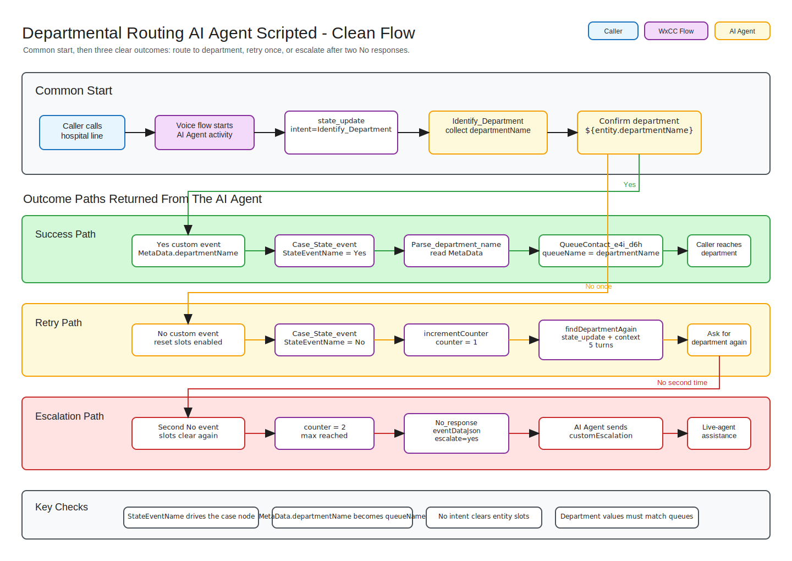
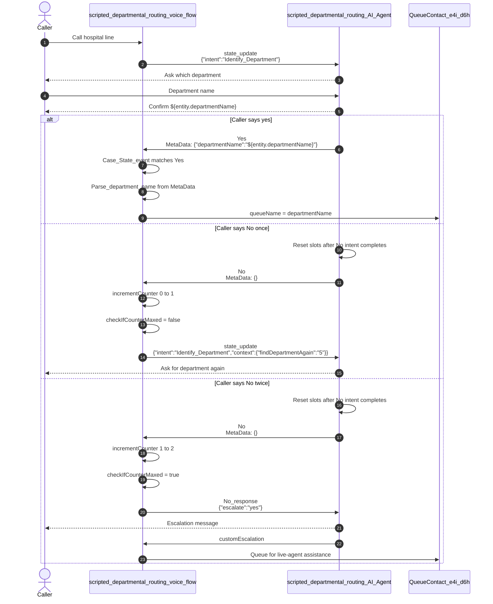

# Departmental Routing AI Agent Scripted

## 1. Introduction Of Use Case

This playbook contains a scripted Webex Contact Center AI Agent use case for hospital departmental routing. The caller tells the AI Agent which department they want to reach, confirms the detected department, and is then routed by the Webex CC voice flow to the matching queue.

The scripted AI Agent owns the conversation, department-name collection, confirmation prompts, retry behavior, and escalation message. The Webex CC voice flow owns operational routing: it starts the AI Agent with `state_update`, checks the returned `StateEventName`, parses `departmentName` from `MetaData`, increments retry counters, and queues the call.

At a high level, the flow supports three caller journeys:

- Caller confirms the department on the first attempt and is queued to that department.
- Caller rejects the department once, is prompted again, then confirms the corrected department.
- Caller rejects the department twice and is escalated to live-agent assistance.

## 2. Files And Their Use

| File | What it is | Use it for |
|---|---|---|
| [exports/scripted_departmental_routing_AI_Agent.json](exports/scripted_departmental_routing_AI_Agent.json) | Scripted Webex CC AI Agent export | Import into AI Agent Studio. |
| [exports/scripted_departmental_routing_voice_flow_Draft.json](exports/scripted_departmental_routing_voice_flow_Draft.json) | Main Webex CC voice flow export | Import into Flow Designer as a flow. |
| [docs/departmental_routing.md](docs/departmental_routing.md) | Detailed functionality notes | Use as the full step-by-step reference. |
| [assets/departmental-routing-scripted-flow.svg](assets/departmental-routing-scripted-flow.svg) | Rendered architecture diagram | Use in GitHub or documentation previews. |
| [assets/departmental-routing-scripted-flow.excalidraw](assets/departmental-routing-scripted-flow.excalidraw) | Editable diagram source | Open in Excalidraw to adjust the diagram. |

## 3. Import Order

| Step | Import file | Where |
|---|---|---|
| 1 | `exports/scripted_departmental_routing_AI_Agent.json` | AI Agent Studio |
| 2 | `exports/scripted_departmental_routing_voice_flow_Draft.json` | Flow Designer > Flows |

After import, rebind the Virtual Agent V2 / AI Agent activity in the voice flow to the imported `scripted_departmental_routing_AI_Agent`.

Also confirm the target queues exist in the tenant. The flow uses `queueName` to route callers, so department names returned by the AI Agent must match the intended queue names.



Editable diagram source: [departmental-routing-scripted-flow.excalidraw](assets/departmental-routing-scripted-flow.excalidraw)

## 4. Key Events

| Event | Direction | Purpose |
|---|---|---|
| `state_update` | Voice flow to AI Agent | Starts or restarts the `Identify_Department` intent. |
| `Yes` | AI Agent to voice flow | Confirms the department and returns `departmentName` in `MetaData`. |
| `No` | AI Agent to voice flow | Tells the voice flow the caller rejected the detected department. |
| `No_response` | Voice flow to AI Agent | Sends escalation data back to the AI Agent after retries are maxed. |
| `customEscalation` | AI Agent to voice flow | Sends the call to live-agent assistance after retry exhaustion. |

## 5. Further Details On Architecture Deep Dive

### Component Roles

| Component | Role |
|---|---|
| `scripted_departmental_routing_AI_Agent` | Handles department collection, confirmation, retry prompts, and escalation messaging. |
| `scripted_departmental_routing_voice_flow` | Starts the AI Agent, routes returned state events, manages retry count, and queues the call. |
| `Identify_Department` | Intent that collects `departmentName` and sets the `departmentIdentified` exit context. |
| `Yes` | Confirmation intent that requires `departmentIdentified` as entry context. |
| `No` | Rejection intent that requires `departmentIdentified` as entry context and has reset slots after completion enabled. |
| `Case_State_event` | Voice-flow case node that evaluates `scripted_departmental_routing_AI_Agent.StateEventName`. |
| `Parse_department_name` | Parses `departmentName` from `scripted_departmental_routing_AI_Agent.MetaData` using `$.departmentName`. |
| `incrementCounter` | Increments the retry counter after a `No` response. |
| `checkIfCounterMaxed` | Checks whether the retry counter equals `2`. |
| `QueueContact_e4i_d6h` | Queues the call using the extracted `queueName`. |

### Detailed Event Sequence



### Initial AI Agent Start

The voice flow starts the scripted AI Agent by sending:

```text
eventName - state_update
eventDataJson - {"intent":"Identify_Department"}
```

This triggers the `Identify_Department` intent and the `departmentName_entity_response` response:

```text
Hello, Welcome to SCG hospital. which department would you like to talk to ?
```

The `Identify_Department` intent sets the exit context:

```text
departmentIdentified
```

That context allows the `Yes` and `No` confirmation intents to run only after a department has been collected.

### Successful Department Routing Path

1. Caller provides a department, such as `Cardiology`.
2. AI Agent fills the `departmentName` slot.
3. AI Agent plays `Identify_Department_Response`:

   ```text
   you would like to talk to ${entity.departmentName} department. is that right ?
   ```

4. Caller says `yes`.
5. The `Yes` intent runs because `departmentIdentified` is active.
6. AI Agent plays `Yes_response`:

   ```text
   Thank you, transferring you to ${entity.departmentName} now.
   ```

7. AI Agent sends the `Yes` custom event with:

   ```json
   {"departmentName":"${entity.departmentName}"}
   ```

8. Voice flow routes the `Yes` path in `Case_State_event`.
9. `Parse_department_name` extracts `departmentName` from `scripted_departmental_routing_AI_Agent.MetaData`.
10. The extracted department is inserted into `queueName`.
11. `QueueContact_e4i_d6h` queues the call to the matching department queue.

### Retry Path After Caller Says No

When the caller says `No`, reset slots after completion is enabled in the `No` intent, so the entity slots are cleared when `No` intent execution completes.

1. The `No` intent runs because `departmentIdentified` is active.
2. AI Agent plays `No_response`:

   ```text
   Let's try again.
   ```

3. AI Agent sends the `No` custom event with an empty payload:

   ```json
   {}
   ```

4. Voice flow routes the `No` path in `Case_State_event`.
5. `incrementCounter` increments the counter.
6. `checkIfCounterMaxed` checks whether the counter is `2`.
7. If the counter is `1`, the false path triggers `findDepartmentAgain`.
8. `findDepartmentAgain` sends the caller back to `Identify_Department` with retry context:

   ```json
   {
     "intent":"Identify_Department",
     "context":{"findDepartmentAgain":"5"}
   }
   ```

9. Because `lastdfState.context.findDepartmentAgain` exists, the AI Agent plays the retry prompt:

   ```text
   Could you tell me the department you would like to be transferred to?
   ```

### Escalation Path After Two No Responses

If the caller says `No` a second time, reset slots after completion is enabled again, so the entity slots are cleared when the `No` intent execution completes.

1. `incrementCounter` increments the counter from `1` to `2`.
2. `checkIfCounterMaxed` evaluates true.
3. The `Escalate` set-variable node sets:

   ```text
   eventName - No_response
   eventDataJson - {
     "escalate":"yes"
   }
   ```

4. The call goes back to the AI Agent and triggers `No_response`.
5. The `retryExceeded` condition checks whether `eventStore.escalate` equals `Yes`.
6. Since the condition is true, the AI Agent plays:

   ```text
   Sorry we are unable to identify your department, Let me transfer you to live agent to assist.
   ```

7. AI Agent exits to the voice flow with custom event name `customEscalation`.
8. `Case_State_event` matches the `customEscalation` path.
9. The call is queued for live-agent assistance.

### Quick Test Phrases

| Scenario | Caller says |
|---|---|
| Confirm first department | "Cardiology", then "yes" |
| Retry once | "Cardiology", "no", "Pediatrics", then "yes" |
| Escalate after retries | "Cardiology", "no", "Pediatrics", then "no" |

### Notes

- `Parse_department_name` must read from `scripted_departmental_routing_AI_Agent.MetaData`, not `StateEventName`.
- `Case_State_event` should continue to use `scripted_departmental_routing_AI_Agent.StateEventName` for routing.
- `departmentName` values should align with queue names configured in the tenant.
- The `No` intent uses reset slots after completion so the next department attempt starts cleanly.
- Review queue names and escalation routing before using this outside a demo environment.
