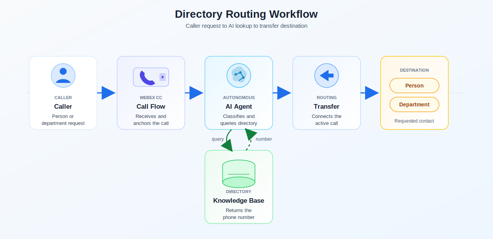
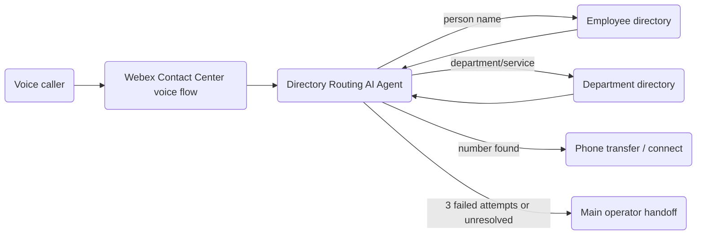

# Directory Routing - Webex Contact Center Autonomous AI Agent

A reference playbook for a Children's Medical Center of Dallas phone directory agent. The agent quickly classifies each caller request as either a person-name lookup or a department/service lookup, searches the correct directory, and connects the caller to the right number.

The exports in this folder are sanitized working examples. Rebind tenant-specific IDs, queues, functions, knowledge bases, phone numbers, and agent references before importing into another environment.

## Architecture Diagram

---

## Try It Fast

| Step | Do this | Where |
|---|---|---|
| 1 | Review the architecture diagram and export file table so you know what each artifact controls. | README |
| 2 | Import [Directory_Routing_Agent.json](exports/Directory_Routing_Agent.json). | AI Agent Studio |
| 3 | Ingest [Departments.csv](resources/Departments.csv) and [Employees.csv](resources/Employees.csv) into the AI Agent knowledge base. | AI Agent Studio |
| 4 | Import or recreate [Extract_Phone_Function.json](exports/Extract_Phone_Function.json). | Flow Designer / Functions |
| 5 | Import [Directory_Routing_Flow.json](exports/Directory_Routing_Flow.json). | Flow Designer |
| 6 | Rebind the agent reference, knowledge base, `Extract_Phone` function, transfer target, queue fallback, language, and environment-specific IDs. | Studio / Flow Designer |
| 7 | Publish to a test entry point and run person, department, ambiguous, emergency, and failed-lookup tests. | Phone |

---

## What The Agent Does

The Directory Routing agent handles hospital phone-directory requests over Webex Contact Center voice:

1. Classifies the caller's request as either a person name or a department/service before searching.
2. Searches the employee directory for person-name requests and the department directory for service requests.
3. Clarifies ambiguous requests with short questions about spelling, location, department, or intent.
4. Provides the phone number and transfers immediately when a matching destination is found.
5. Gives approved emergency guidance when the caller describes a medical emergency.
6. Hands off to the main operator after three failed lookup or clarification attempts.

The agent does not provide medical advice, diagnose conditions, access patient medical records, or perform scheduling unless that capability is explicitly integrated later.

---

## Query Classification Guide

| Caller request type | Classify as | Example utterances |
|---|---|---|
| First and last name, title plus name, hyphenated surname, or "speak to..." phrasing | Person name | "Dr. Patel", "Heather Galbraith", "Weidmer-Mikhail Elizabeth" |
| Medical specialty, operational term, or terms such as clinic, department, unit, center, lab, office, service, or group | Department / service | "Cardiology", "Billing", "Continuity of Care", "Children's Pediatric Group" |
| Two or three proper nouns with no medical or department terms | Person name by default | "Margaret Wang French" |
| Still unclear after classification rules | Clarify | "Are you looking for a person by that name or a department?" |

Never guess. Classify first, search the matching directory, then clarify only when needed.

---

## Test Script

| Scenario | Caller says | Expected behavior |
|---|---|---|
| Person lookup | "I need to speak to Dr. Patel." | Agent classifies as person name, searches employee directory, provides the number, and transfers if found. |
| Department lookup | "Transfer me to cardiology." | Agent classifies as department/service, searches department directory, provides the number, and transfers if found. |
| Proper-noun ambiguity | "Margaret Wang French." | Agent defaults to person-name lookup because there are proper nouns and no department terms. |
| Ambiguous request | "I need help with an appointment." | Agent asks a short clarification question, such as which department or clinic the caller needs. |
| Multiple similar names | "I am looking for Dr. Johnson." | Agent lists matching names briefly and lets the caller select. |
| Failed person lookup | "I need Heather Galbreth." | Agent asks for spelling before reclassifying or trying another lookup. |
| Emergency | "My child is having trouble breathing." | Agent tells the caller to hang up and dial 911, without triaging symptoms. |
| Three failed attempts | Caller cannot identify a destination after repeated clarifications. | Agent transfers to the main operator for further assistance. |

---

## Export Files

| JSON export file name | Detailed description |
|-----------------------|---|
| [`Directory_Routing_Agent.json`](exports/Directory_Routing_Agent.json) | AI Agent Studio autonomous virtual agent export for the Directory Routing voice experience. Defines the bot type, AI engine, language, time zone, welcome message, LLM behavior prompt, directory classification rules, emergency and privacy guardrails, voice settings, one knowledge-base reference, and Agent handover system tool. Rebind the knowledge base, handoff behavior, and tenant-specific references before reuse. |
| [`Directory_Routing_Flow.json`](exports/Directory_Routing_Flow.json) | Webex Contact Center Flow Designer export for the voice entry flow. Starts at `NewPhoneContact`, sets `Global_Language` to `en-US`, invokes the `Directory_Routing_Agent` Webex AI Agent activity, retrieves `{{ VirtualAgentV2_dir.TranscriptURL }}`, passes `aiTranscript` into the `Extract_Phone` function, maps `$.phoneNumber` into `phoneNumber`, checks whether a destination number was found, bridges the transfer to `{{phoneNumber}}`, disconnects successful contacts, and sends escalation, missing-number, function-error, or transfer-failure paths to the configured queue fallback with TTS messages. Rebind the virtual agent ID, `Extract_Phone` function reference, queue destination, transfer settings, phone variables, and tenant metadata. |
| [`Extract_Phone_Function.json`](exports/Extract_Phone_Function.json) | Webex Contact Center Python function export used by the flow after the AI Agent call ends. Runs on `python3.13`, accepts the call transcript as a `transcript` string input, finds the last sequence of spoken number words such as `two one four`, converts those words into digits, and returns the result as `phoneNumber`. Import or recreate this function before importing the flow, then rebind the Flow Designer `Extract_Phone` activity to the target tenant's function version. |

---

## Knowledge Base Resources

| Resource file | How it is used |
|---|---|
| [Departments.csv](resources/Departments.csv) | Mock department directory data for the AI Agent knowledge base. It includes `Department Name` and `Phone` columns so the agent can answer department or service lookup requests and return a routable phone number. |
| [Employees.csv](resources/Employees.csv) | Mock employee directory data for the AI Agent knowledge base. It includes `Employee Name` and `Phone` columns so the agent can answer person-name lookup requests and return a routable phone number. |

Ingest both CSV files into the knowledge base attached to `Directory_Routing_Agent` before validating the flow. The Flow Designer export expects the AI Agent transcript to include the spoken phone number that `Extract_Phone` converts into `phoneNumber` for the transfer step.

---

Architecture

Flow Designer owns voice entry, transfer, disconnect, and operator fallback. AI Agent Studio owns query classification, clarification, directory lookup decisions, and safety behavior. The directory lookup source can start as static demo data and later move to an approved knowledge base, Webex Connect workflow, MCP tool, or customer-hosted directory service.

AI Agent Behavior Guide

The prompt defines the agent as a concise phone directory service for Children's Medical Center of Dallas.

Key behavior:

- Classify before lookup: person name or department/service.
- Ignore middle initials during lookup.
- Prioritize primary or office numbers when multiple phone numbers exist.
- Ask for location when a contact is found at multiple sites.
- Ask for spelling if a person search fails before trying another interpretation.
- Provide the phone number if the caller asks for it.
- End the session immediately to connect or transfer the caller when a number is found.
- Use Agent Handoff only after three failed attempts or unresolved uncertainty.
- Keep wording brief, polite, professional, and efficient.

Restrictions:

- Do not provide medical advice or diagnoses.
- Do not access patient records.
- Do not schedule appointments unless scheduling is explicitly integrated.
- Do not speculate or provide unverified information.
- Collect only the information needed to route the call.

Import And Rebind Notes

### AI Agent Studio

- Import [Directory_Routing_Agent.json](exports/Directory_Routing_Agent.json) as the `Directory_Routing` agent export.
- Ingest [Departments.csv](resources/Departments.csv) and [Employees.csv](resources/Employees.csv) into the agent knowledge base.
- Rebind the agent's knowledge base reference to the KB that contains both CSV files.
- Confirm the prompt includes the person-vs-department classification rules.
- Confirm the emergency response uses the approved 911 wording.
- Rebind directory lookup actions, transfer behavior, and Agent Handoff.

### Flow Designer

- Import [Directory_Routing_Flow.json](exports/Directory_Routing_Flow.json) as the voice flow export.
- Rebind the AI Agent activity to the imported `Directory_Routing_Agent`.
- Rebind the `Extract_Phone` function activity to the imported or recreated function.
- Replace source-environment queues, transfer destinations, and main-operator fallback targets with target tenant destinations.
- Publish only to a test entry point until validation is complete.

### Function Export

- Import or recreate [Extract_Phone_Function.json](exports/Extract_Phone_Function.json) before validating the flow.
- Confirm the function input is named `transcript` and receives `aiTranscript` from the Flow Designer HTTP transcript step.
- Confirm the function output maps `$.phoneNumber` back to the flow variable `phoneNumber`.

### Directory Data

- For this demo, use [Departments.csv](resources/Departments.csv) and [Employees.csv](resources/Employees.csv) as the mocked phone-directory KB source files.
- In production, replace the mocked CSVs with approved employee and department directory sources before publishing externally.
- Keep phone numbers, internal extensions, and personnel details customer-safe in public docs.
- Do not publish private directory data unless explicitly approved.

Security, Privacy, And Publishing Notes

### Security Notes

- Maintain HIPAA-conscious communication and collect only routing-required information.
- Do not commit patient names, medical record numbers, phone numbers, appointment details, transcripts, or protected health information.
- Do not commit tenant IDs, queue IDs, org IDs, creator emails, tokens, auth headers, internal directory exports, or private URLs.
- Directory routing must not diagnose symptoms or replace emergency guidance.
- Treat employee directory details and direct numbers as publication-sensitive until approved.

### Known Limitations

- The included exports are sanitized working examples and require environment-specific rebinding before reuse.
- Queue names, transfer destinations, action IDs, function references, and entry points may not exist in the target tenant.
- This playbook does not include the full employee or department directory source.
- Production use needs approved directory sources, operator fallback, emergency wording, and data handling review.

### Publishing Notes

Before publishing externally:

1. Confirm each export remains sanitized for publication.
2. Review all exports for tenant-specific metadata and sensitive data.
3. Confirm the workflow SVG does not expose internal queue names, direct numbers, or private routing destinations.
4. Add screenshots or sanitized transcripts only after approval.
5. Confirm whether this playbook is internal-only, customer-facing, or both.

---

## License And Attribution

This is a reference playbook for Webex Contact Center AI Agent solution design. Add the preferred repository license and attribution before publishing.
