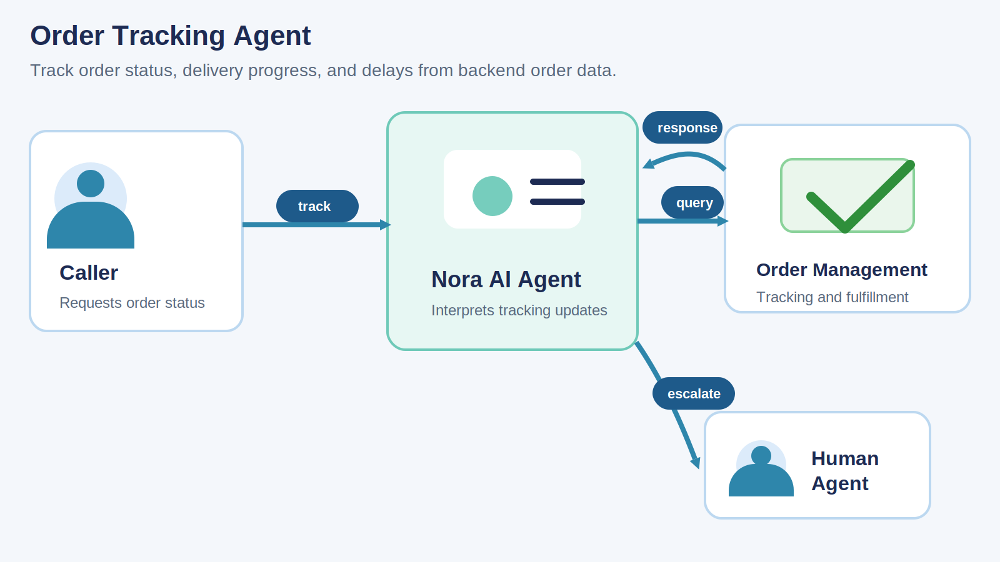
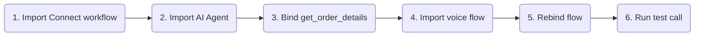
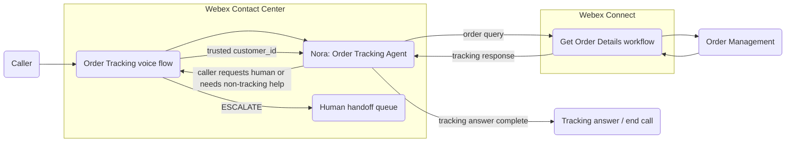
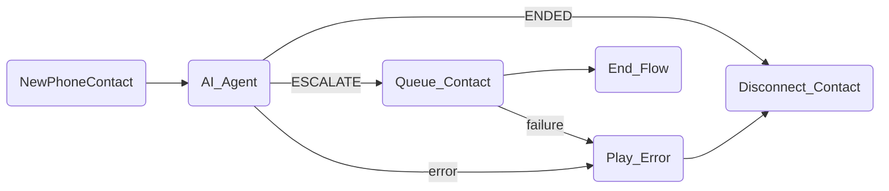

# Order Tracking - Webex Contact Center Autonomous AI Agent

A reference implementation of an autonomous voice AI agent built on Webex Contact Center that helps callers check the current state of an order using backend tracking, delivery, and fulfillment data.

The agent is **Nora**, a polite and efficient order tracking assistant. Nora retrieves order details from a backend workflow, explains the latest status in clear customer language, answers follow-up questions about delivery and delay information, and escalates to a human agent when tracking alone is not enough.

---

## Try It Fast

| Step | Do this | Where |
|---|---|---|
| 1 | Import and publish [Get_Order_Details.workflow](exports/Get_Order_Details.workflow). | Webex Connect |
| 2 | Import [Order_Tracking_Agent.json](exports/Order_Tracking_Agent.json). | AI Agent Studio |
| 3 | Update `get_order_details` fulfillment to point at the imported Webex Connect workflow, then publish the agent. | AI Agent Studio |
| 4 | Import [Order_Tracking_Voice_Flow.json](exports/Order_Tracking_Voice_Flow.json). | Flow Designer |
| 5 | Rebind the `AI_Agent` activity to the imported Order Tracking agent and replace the escalation queue with the target human support queue. | Flow Designer |
| 6 | Place a test call and verify successful tracking, not-found handling, delayed-order explanations, missing-detail handling, backend errors, and requested human handoff. | Phone |

---

## What The Agent Does

The Order Tracking agent handles a voice tracking journey:

1. Greets the caller as Nora and offers help with tracking an order.
2. Uses a trusted `customer_id` from the voice flow context.
3. Asks the caller for the order number.
4. Calls `get_order_details` when both `customer_id` and `order_number` are available.
5. Uses the returned backend payload as the source of truth for status, estimated delivery, latest tracking event, current location, carrier details, delay information, and customer-facing summary text.
6. Answers the caller's specific tracking question first, then adds only the most relevant supporting detail.
7. Retries politely when an order is not found or the order number is unclear.
8. Escalates to a human agent when the caller asks for one, tracking data is unavailable, or the request moves beyond tracking into changes, cancellations, returns, or exception handling that needs human support.

---

## Tracking Pattern

This template demonstrates how to implement an AI Agent that answers multiple order-status questions from one backend lookup contract rather than requiring separate tools for each question.

The same `get_order_details` response can support questions such as:

- What is the current order status?
- Where is the order now?
- When is it expected to arrive?
- Is it delayed?
- What was the latest tracking update?

`customer_id` is expected to be available before the order tracking journey begins. In this sample pattern, the customer has already been identified by a separate upstream process, and the voice flow injects the trusted `customer_id` into the AI Agent when the `AI_Agent` activity starts. The `order_number` is always collected by the AI Agent during the conversation.

The included Webex Connect workflow should be treated as a template export that needs to be rebound to the target order-management, shipment-tracking, or fulfillment backend. In a production implementation, this workflow would typically integrate with systems such as an OMS, retail order platform, carrier API, service-order system, or customer support backend.

---

## Workflow Response Contract

This playbook includes an example response-contract reference in [Workflow_Response_Contract.md](Workflow_Response_Contract.md).

The example `get_order_details` contract shows one way to use a stable response shape so the AI Agent can answer consistently across success, not-found, and error outcomes. Key response fields include:

- `order_found`
- `order_status`
- `status_description`
- `customer_message`
- `estimated_delivery_date`
- `estimated_delivery_window`
- `is_delayed`
- `delay_reason`
- `current_location`
- `carrier_name`
- `tracking_number`
- `latest_event`
- `tracking_history`
- `human_handover_recommended`

The example contract also shows a pattern where the workflow returns the same generic not-found style response when an order does not belong to the supplied `customer_id`, so the system does not reveal whether another customer's order exists.

---

## Test Script

| Scenario | Caller says | Expected behavior |
|---|---|---|
| Status lookup | "Where is my order?" | Agent asks for the order number, calls `get_order_details`, and gives a concise tracking summary based on the returned payload. |
| Delivery estimate | "When will it arrive?" | Agent answers using `customer_message`, `estimated_delivery_date`, and `estimated_delivery_window` only when those fields are returned. |
| Latest tracking update | "What's the latest update?" | Agent uses `latest_event` or other returned tracking details and does not invent shipment events. |
| Delayed order | Ask about an order with `is_delayed=true`. | Agent explains the delay only using the returned `delay_reason`, `status_description`, or `customer_message`. |
| Order not found | Give an incorrect or unauthorized order number. | Agent asks the caller to confirm or repeat the order number and may retry. It does not reveal whether the order exists for another customer. |
| Missing detail | Ask for a field that is not present in the returned payload. | Agent explains that the requested detail is not currently available instead of inferring it. |
| Human request | "I need to talk to someone." | Agent uses `Agent handover`; the voice flow routes `ESCALATE` to `Queue_Contact`. |
| Backend unavailable | The workflow returns an error or incomplete data. | Agent apologizes briefly and offers transfer to a human agent. |

---

Files In This Playbook

| File | Type | Purpose |
|---|---|---|
| [Order_Tracking_Agent.json](exports/Order_Tracking_Agent.json) | Webex CC Autonomous AI Agent export | Nora's instructions, voice settings, and tools: `get_order_details` and `Agent handover`. |
| [Order_Tracking_Voice_Flow.json](exports/Order_Tracking_Voice_Flow.json) | Webex CC Voice Flow export | Main inbound voice flow that invokes the AI Agent, injects trusted `customer_id`, handles normal completion, routes escalation, and plays an error prompt on failures. |
| [Get_Order_Details.workflow](exports/Get_Order_Details.workflow) | Webex Connect workflow export | Fulfillment workflow that returns backend order, shipment, delivery, and tracking details. |
| [Workflow_Response_Contract.md](Workflow_Response_Contract.md) | Reference contract | Example response shape and field guidance for the `get_order_details` fulfillment flow. |

Architecture

The voice flow owns telephony, routing, disconnect, queue escalation, and injection of trusted `customer_id`. The AI Agent owns the conversation, order-number collection, and interpretation of tracking data. Webex Connect owns fulfillment for the order lookup and any backend integration.

AI Agent Behavior Guide

The included AI Agent export uses these behavior rules:

- Ask for one piece of information at a time over voice.
- Use the trusted `customer_id` injected by the voice flow and always ask the caller for the order number.
- Call `get_order_details` only when the required lookup inputs are available.
- Use `customer_message` or `status_description` as the primary explanation when returned.
- Answer the caller's specific tracking question first, then add only the most relevant supporting detail.
- Do not invent dates, locations, delays, carrier information, shipment events, or fulfillment progress.
- If a requested detail is not present in the payload, say that it is not currently available.
- Offer escalation for out-of-scope requests such as cancellations, returns, order changes, or unresolved tracking problems.

Included tools:

| Tool | Purpose | Required inputs |
|---|---|---|
| `get_order_details` | Retrieve backend order tracking details for the authorized customer and order number. | `customer_id`, `order_number` |
| `Agent handover` | Escalate to a human agent when the caller asks for a person or needs help outside order tracking. | None |

Import And Rebind Notes

### Webex Connect

- Import [Get_Order_Details.workflow](exports/Get_Order_Details.workflow).
- Connect it to the target order-management, tracking, or fulfillment backend.
- Keep the response contract stable, or update the AI Agent instructions if the returned field names differ.
- Publish the workflow.

### AI Agent Studio

- Import [Order_Tracking_Agent.json](exports/Order_Tracking_Agent.json).
- Rebind the action fulfillment to the imported Webex Connect workflow.
- Publish the agent.

### Flow Designer

- Import [Order_Tracking_Voice_Flow.json](exports/Order_Tracking_Voice_Flow.json).
- Rebind `AI_Agent` to the imported Order Tracking agent.
- Ensure `customer_id` is injected into the `AI_Agent` activity from an upstream authentication step or trusted lookup before the tracking conversation begins.
- Replace the imported escalation queue with the target human support queue.
- Publish to a test entry point before routing production traffic.

Flow Designer Details

The included voice flow is [Order_Tracking_Voice_Flow.json](exports/Order_Tracking_Voice_Flow.json).

| Activity | Purpose |
|---|---|
| `NewPhoneContact` | Starts the inbound voice flow. |
| `AI_Agent` | Invokes the Order Tracking AI Agent and passes injected `customer_id` through event data. |
| `Queue_Contact` | Escalates to the configured human queue when the agent emits `ESCALATE`. |
| `Play_Error` | Plays a system-error message before disconnecting. |
| `Disconnect_Contact` | Disconnects after normal agent completion or error handling. |
| `End_Flow` | Ends after queue handling. |

Security, Privacy, And Publishing Notes

### Security Notes

- Treat order numbers, customer identifiers, delivery locations, tracking numbers, and order details as sensitive where customer policy requires it.
- Use a trusted upstream process to establish `customer_id` before the tracking journey begins.
- Validate that the supplied `customer_id` is authorized to access the supplied `order_number`.
- Avoid revealing whether an order exists for another customer.
- Review whether order and tracking details can be stored, logged, replayed, or displayed to human agents.

### Known Limitations

- The Webex Connect workflow must be connected to the target order, shipment, or fulfillment backend.
- `customer_id` is expected to come from a separate upstream identification or lookup process before the AI Agent is invoked.
- This template covers order tracking only. Order changes, cancellations, returns, and shipping interventions are intentionally out of scope.
- The AI Agent instructions assume the workflow follows the included response-contract pattern or another stable equivalent.

### Publishing Notes

Before publishing externally:

1. Replace demo backend references with the supported OMS, tracking platform, or approved customer-hosted pattern.
2. Keep the contract reference aligned with the actual workflow response used in the example.

---

## License And Attribution

This is a reference playbook for Webex Contact Center AI Agent solution design. Add the preferred repository license and attribution before publishing.
