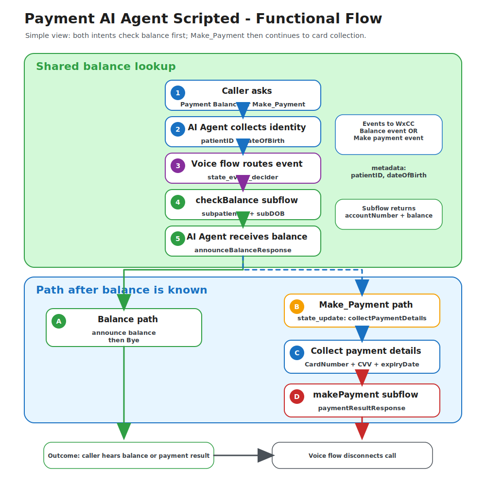
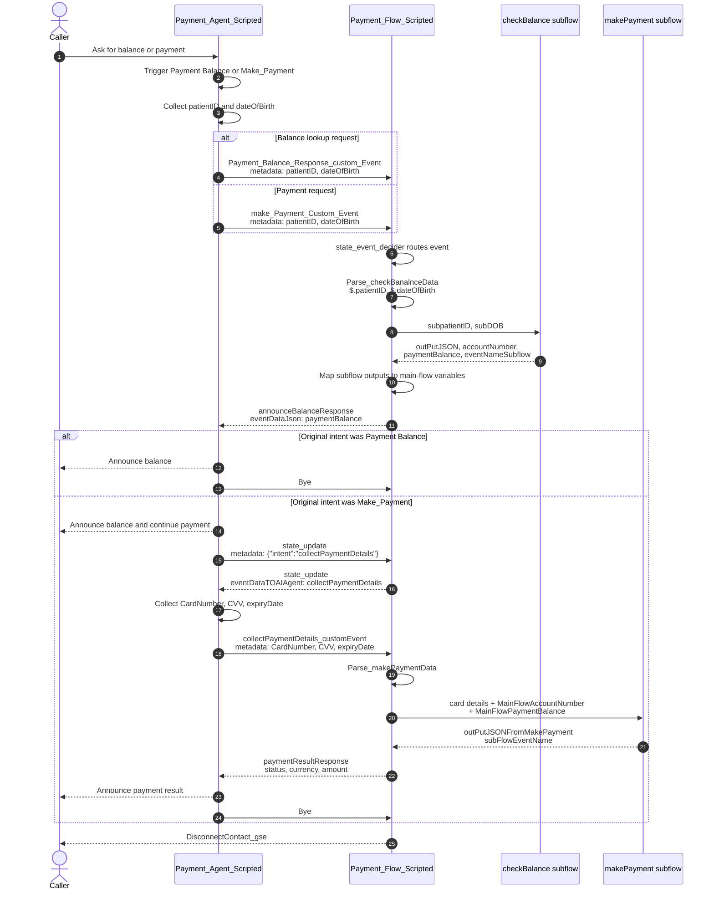

# Payment AI Agent Scripted

## 1. Introduction Of Use Case

This playbook contains a scripted Webex Contact Center AI Agent use case for a hospital payment line. It supports two caller journeys:

- Check an outstanding payment balance.
- Make a payment after the balance is confirmed.

The scripted AI Agent owns the caller conversation and slot collection. The Webex CC voice flow receives custom state events from the AI Agent, routes the request, and invokes the required subflows for balance lookup and payment processing.

At a high level, both journeys begin the same way: the caller identifies the intent, the AI Agent collects `patientID` and `dateOfBirth`, and the voice flow calls `checkBalance`. If the caller only wants the balance, the AI Agent announces it and ends the call. If the caller wants to make a payment, the AI Agent continues by collecting card details and the voice flow calls `makePayment`.

## 2. Files And Their Use

| File | What it is | Use it for |
|---|---|---|
| [Payment_AI_Agent_Scripted.json](exports/Payment_AI_Agent_Scripted.json) | Scripted Webex CC AI Agent export | Import into AI Agent Studio. |
| [Payment_Flow_Scripted_voiceFlow.json](exports/Payment_Flow_Scripted_voiceFlow.json) | Main Webex CC voice flow | Import into Flow Designer as a flow. |
| [checkBalance_subflow.json](exports/checkBalance_subflow.json) | Balance lookup subflow | Import into Flow Designer as a subflow. |
| [makePayment_subflow.json](exports/makePayment_subflow.json) | Payment processing subflow | Import into Flow Designer as a subflow. |
| [payment_scripted_functionality_details.md](docs/payment_scripted_functionality_details.md) | Detailed implementation notes | Use as the full step-by-step reference. |
| [payment-scripted-readable-flow.svg](assets/payment-scripted-readable-flow.svg) | Rendered architecture diagram | Use in GitHub or documentation previews. |
| [payment-scripted-readable-flow.excalidraw](assets/payment-scripted-readable-flow.excalidraw) | Editable diagram source | Open in Excalidraw to adjust the diagram. |

## 3. Import Order

| Step | Import file | Where |
|---|---|---|
| 1 | `Payment_AI_Agent_Scripted.json` | AI Agent Studio |
| 2 | `checkBalance_subflow.json` | Flow Designer > Subflows |
| 3 | `makePayment_subflow.json` | Flow Designer > Subflows |
| 4 | `Payment_Flow_Scripted_voiceFlow.json` | Flow Designer > Flows |

After import, rebind the AI Agent activity and both subflow activities in the main voice flow.

> Important: Import `checkBalance_subflow.json` and `makePayment_subflow.json` from **Subflows**, not from the regular Flows page.



Editable diagram source: [payment-scripted-readable-flow.excalidraw](assets/payment-scripted-readable-flow.excalidraw)

## 4. Key Events

| Event | Direction | Purpose |
|---|---|---|
| `Payment_Balance_Response_custom_Event` | AI Agent to voice flow | Starts the balance lookup path. |
| `make_Payment_Custom_Event` | AI Agent to voice flow | Starts the payment path by checking balance first. |
| `announceBalanceResponse` | Voice flow to AI Agent | Sends balance data back to the AI Agent. |
| `state_update` | AI Agent and voice flow handoff | Moves the AI Agent into payment-detail collection. |
| `collectPaymentDetails_customEvent` | AI Agent to voice flow | Sends collected card details to the voice flow. |
| `paymentResultResponse` | Voice flow to AI Agent | Sends payment result data back to the AI Agent. |
| `Bye` | AI Agent to voice flow | Ends the caller conversation and disconnects the call. |

## 5. Further Details On Architecture Deep Dive

### Component Roles

| Component | Role |
|---|---|
| `Payment_Agent_Scripted` | Handles scripted conversation, intent detection, entity collection, and caller-facing responses. |
| `Payment_Flow_Scripted` | Main Webex CC voice flow that receives AI Agent events and routes them to the correct flow path. |
| `AI_Agent_payment` | Voice-flow activity that hands control between Webex CC and the scripted AI Agent. |
| `state_event_decider` | Voice-flow decision node that routes custom events from the AI Agent. |
| `checkBalance` | Subflow that looks up the caller balance using `patientID` and `dateOfBirth`. |
| `makePayment` | Subflow that processes payment using card details, account number, and balance amount. |

### Detailed Event Sequence



### Shared Balance Lookup Details

Both `Payment Balance` and `Make_Payment` use the same first half of the flow.

| Step | Node or object | What happens |
|---|---|---|
| 1 | `Payment_Balance_Response` or `make_Payment_Response` | AI Agent confirms the request and sends a custom state event to the voice flow. |
| 2 | `AI_Agent_payment` handled path | Main flow receives `StateEventName` and metadata from the AI Agent. |
| 3 | `state_event_decider` | Routes either `Payment_Balance_Response_custom_Event` or `make_Payment_Custom_Event`. |
| 4 | `Parse_checkBanalnceData` | Extracts `patientID` and `dateOfBirth` from metadata using `$.patientID` and `$.dateOfBirth`. |
| 5 | `checkBalance` | Calls the balance API through `HTTPRequest_p83`. |
| 6 | `dataBacktoAI` | Sends `announceBalanceResponse` and balance data back to the scripted AI Agent. |

Balance subflow output mapping:

| Subflow output | Main-flow variable |
|---|---|
| `outPutJSON` | `eventDataTOAIAgent` |
| `accountNumber` | `MainFlowAccountNumber` |
| `paymentBalance` | `MainFlowPaymentBalance` |
| `eventNameSubflow` | `eventName` |

Example data sent back to the AI Agent:

```text
eventName - announceBalanceResponse
eventDataJson - {"paymentBalance":"247.85"}
```

### Payment Continuation Details

The payment path continues only after `checkBalance` completes and the AI Agent determines that the original intent was `Make_Payment`.

| Step | Node or object | What happens |
|---|---|---|
| 1 | `announceBalanceResponse` | AI Agent checks `checkIfPaymentIntent` and confirms `eventStore.paymentBalance` exists. |
| 2 | `state_update` | AI Agent sends `{"intent":"collectPaymentDetails"}` back to the voice flow. |
| 3 | `state_event_decider` | Voice flow takes the `state_update` path and sends the same intent data back to the AI Agent. |
| 4 | `collectPaymentDetails` | AI Agent collects `CardNumber`, `CVV`, and `expiryDate`. |
| 5 | `collectPaymentDetails_customEvent` | AI Agent sends card metadata to the voice flow. |
| 6 | `Parse_makePaymentData` | Voice flow extracts `cardNumber`, `CVV`, and `expiryDate`. |
| 7 | `makePayment` | Subflow receives card details, `MainFlowAccountNumber`, and `MainFlowPaymentBalance`. |
| 8 | `dataBackToAIAgent` | Voice flow sends `paymentResultResponse` and payment result data back to the AI Agent. |

Payment details payload:

```json
{"CVV":"${entity.CVV}","CardNumber":"${entity.CardNumber}","expiryDate":"${entity.expiryDate}"}
```

Payment result returned to the AI Agent:

```text
eventName
paymentResultResponse

eventDataJson
{"status":"succeeded","currency":"USD","amount":"247.85"}
```

### Balance Lookup Path

1. Caller asks to check the balance.
2. AI Agent triggers the `Payment Balance` intent.
3. AI Agent collects `patientID` and `dateOfBirth`.
4. AI Agent sends `Payment_Balance_Response_custom_Event` to the main voice flow.
5. Voice flow routes the event through `state_event_decider`.
6. Voice flow uses `Parse_checkBanalnceData` to extract `patientID` and `dateOfBirth`.
7. Voice flow calls `checkBalance`.
8. `checkBalance` returns balance data, account number, and `announceBalanceResponse`.
9. Main flow sends `announceBalanceResponse` back to the AI Agent.
10. AI Agent announces the balance and sends `Bye`.
11. Voice flow disconnects the call through `DisconnectContact_gse`.

### Make Payment Path

1. Caller asks to make a payment.
2. AI Agent triggers the `Make_Payment` intent.
3. AI Agent collects `patientID` and `dateOfBirth`.
4. AI Agent sends `make_Payment_Custom_Event` to the main voice flow.
5. Voice flow routes the event through `state_event_decider`.
6. Voice flow uses `Parse_checkBanalnceData` and calls `checkBalance`.
7. Main flow receives `MainFlowAccountNumber` and `MainFlowPaymentBalance`.
8. AI Agent receives `announceBalanceResponse` and continues the payment journey.
9. AI Agent sends `state_update` with `{"intent":"collectPaymentDetails"}`.
10. AI Agent collects `CardNumber`, `CVV`, and `expiryDate`.
11. AI Agent sends `collectPaymentDetails_customEvent` to the voice flow.
12. Voice flow uses `Parse_makePaymentData` and calls `makePayment`.
13. `makePayment` returns payment result data.
14. Main flow sends `paymentResultResponse` back to the AI Agent.
15. AI Agent announces the payment result and sends `Bye`.
16. Voice flow disconnects the call through `DisconnectContact_gse`.

### Quick Test Phrases

| Scenario | Caller says |
|---|---|
| Check balance | "I want to check my balance." |
| Make payment | "I want to make a payment." |

### Notes

- The payment path always checks balance before collecting payment details.
- The main flow stores balance and account details from `checkBalance` for use by `makePayment`.
- Review logging, masking, and secure handling for patient ID, date of birth, card number, CVV, and expiry date before using this outside a demo environment.
