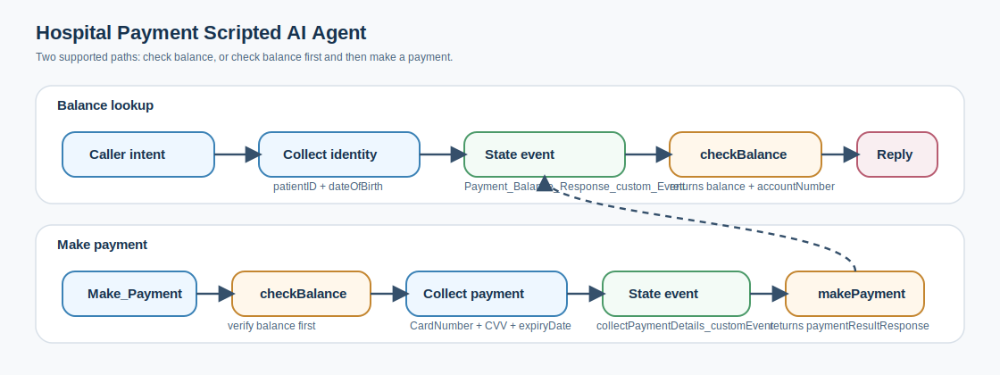
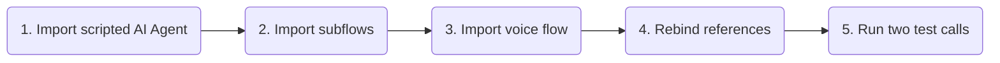
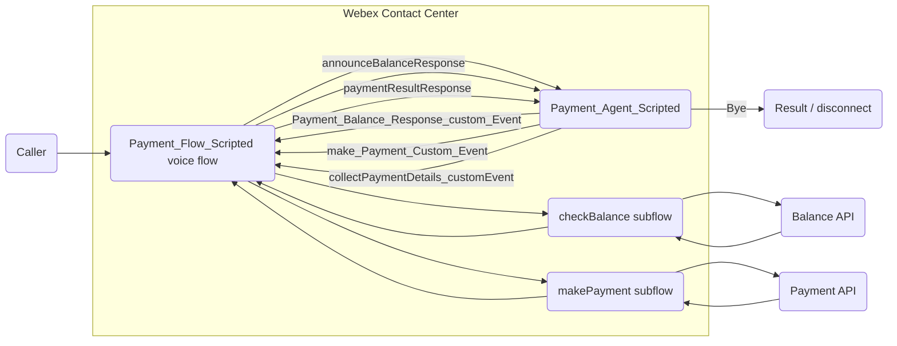

# Payment AI Agent Scripted - Webex Contact Center

A scripted Webex Contact Center AI Agent sample for a hospital payment line. Callers can check an outstanding balance or make a payment, while Flow Designer subflows handle the backend balance and payment API calls.

---

## Try It Fast

| Step | Do this | Where |
|---|---|---|
| 1 | Import [Payment_AI_Agent_Scripted.json](exports/Payment_AI_Agent_Scripted.json). | AI Agent Studio |
| 2 | Import [checkBalance_subflow.json](exports/checkBalance_subflow.json) and [makePayment_subflow.json](exports/makePayment_subflow.json). | Flow Designer - Subflows |
| 3 | Import [Payment_Flow_Scripted_voiceFlow.json](exports/Payment_Flow_Scripted_voiceFlow.json). | Flow Designer - Flows |
| 4 | Rebind the `AI_Agent_payment` activity to the imported `Payment_Agent_Scripted` AI Agent and rebind both subflow activities. | Flow Designer |
| 5 | Place test calls for balance lookup and payment. | Phone |

Do not import the subflow JSON files from the regular Flows page. They are `SUBFLOW` exports and must be imported from the Subflows area.

---

## What The Agent Does

This playbook demonstrates a scripted payment journey:

1. Greets the caller on the hospital payment line.
2. Detects whether the caller wants to check a balance or make a payment.
3. Collects `patientID` and `dateOfBirth` before balance lookup.
4. Sends a custom state event to the Webex CC voice flow.
5. Uses `checkBalance` to retrieve balance, account number, and response data.
6. Announces the balance or continues into payment-detail collection.
7. Uses `makePayment` to complete the payment path.
8. Returns the final payment result to the scripted AI Agent and disconnects the call.

---

## Test Script

| Scenario | Caller says | Expected behavior |
|---|---|---|
| Balance lookup | "I want to check my balance." | Agent collects patient ID and date of birth, the voice flow invokes `checkBalance`, and the agent announces the returned balance. |
| Make payment | "I want to make a payment." | Agent checks balance first, collects payment details, the voice flow invokes `makePayment`, and the agent announces the payment result. |
| End call | "Goodbye." | Agent emits `Bye`; the voice flow disconnects the call. |
| Human help | "I want to talk to an agent." | Agent emits the escalation path configured in the scripted export and voice flow. |

---

Files In This Playbook

| File | Type | Purpose |
|---|---|---|
| [Payment_AI_Agent_Scripted.json](exports/Payment_AI_Agent_Scripted.json) | Webex CC Scripted AI Agent export | Scripted AI Agent export for the hospital payment conversation. |
| [Payment_Flow_Scripted_voiceFlow.json](exports/Payment_Flow_Scripted_voiceFlow.json) | Webex CC Voice Flow export | Main voice flow that launches the scripted AI Agent and routes state events. |
| [checkBalance_subflow.json](exports/checkBalance_subflow.json) | Webex CC Subflow export | Balance lookup subflow using patient ID and date of birth. |
| [makePayment_subflow.json](exports/makePayment_subflow.json) | Webex CC Subflow export | Payment subflow using collected payment details plus account and balance data from balance lookup. |
| [payment_scripted_functionality_details.md](docs/payment_scripted_functionality_details.md) | Implementation notes | Full step-by-step explanation of both supported paths. |
| [payment-scripted-flow.svg](assets/payment-scripted-flow.svg) | Visual asset | Simple overview diagram used in this README. |

Architecture

The scripted AI Agent owns the caller conversation and slot collection. The main voice flow owns event routing, parsing metadata, invoking subflows, and returning `eventName` plus `eventDataJson` back to the agent. The subflows own backend fulfillment.

State Events

| State event | Direction | Purpose |
|---|---|---|
| `Payment_Balance_Response_custom_Event` | Agent to voice flow | Start balance lookup with `patientID` and `dateOfBirth`. |
| `make_Payment_Custom_Event` | Agent to voice flow | Start payment path by checking balance first. |
| `announceBalanceResponse` | Voice flow to agent | Announce returned balance. |
| `state_update` | Agent and voice flow | Continue payment path and trigger `collectPaymentDetails`. |
| `collectPaymentDetails_customEvent` | Agent to voice flow | Send `CardNumber`, `CVV`, and `expiryDate` for payment processing. |
| `paymentResultResponse` | Voice flow to agent | Announce payment result. |
| `Bye` | Agent to voice flow | End and disconnect the call. |

Import And Rebind Notes

### AI Agent Studio

- Import [Payment_AI_Agent_Scripted.json](exports/Payment_AI_Agent_Scripted.json).
- Publish the scripted AI Agent after import.
- Confirm the required scripted intents are present: `Payment Balance`, `Make_Payment`, and `collectPaymentDetails`.

### Flow Designer

- Import [checkBalance_subflow.json](exports/checkBalance_subflow.json) from the Subflows area.
- Import [makePayment_subflow.json](exports/makePayment_subflow.json) from the Subflows area.
- Import [Payment_Flow_Scripted_voiceFlow.json](exports/Payment_Flow_Scripted_voiceFlow.json) from the Flows area.
- Rebind `AI_Agent_payment` to the imported `Payment_Agent_Scripted` agent.
- Rebind the `checkBalance` and `makePayment` subflow activities if the import leaves them pointing at older object IDs.
- Validate and publish the voice flow.

Security And Production Notes

- Treat patient ID, date of birth, account number, card number, CVV, and expiry date as sensitive data.
- Review whether card details should be collected by the scripted AI Agent or by a PCI-compliant secure collection pattern in Flow Designer.
- Disable unnecessary logging or transcripts for sensitive payment details.
- Replace demo API endpoints and authentication before using this outside a lab.
- Confirm masking, retention, and audit controls before routing real callers.

For the full implementation walkthrough, see [payment_scripted_functionality_details.md](docs/payment_scripted_functionality_details.md).
