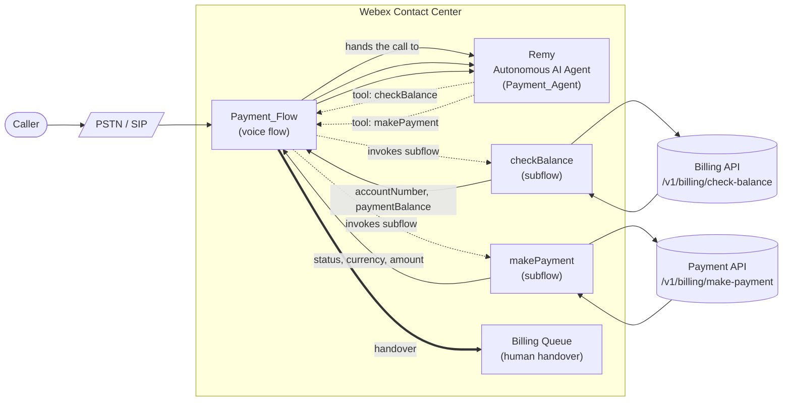
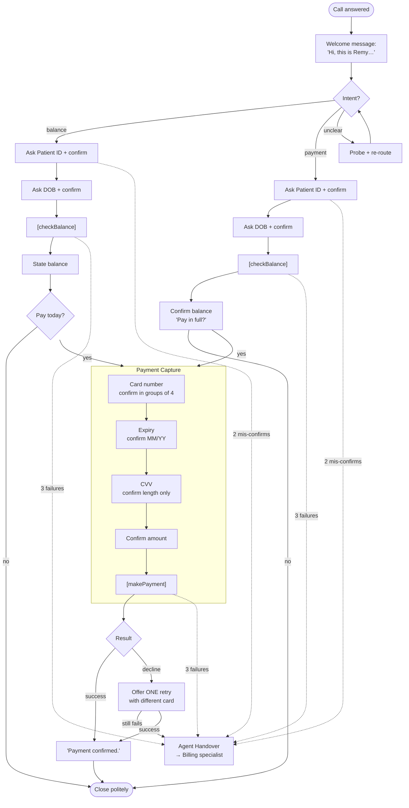

# Hospital Payment Line — Webex Contact Center Autonomous AI Agent

A reference implementation of an **autonomous voice AI agent** built on **Webex Contact Center** that lets patients call in to **check their outstanding hospital balance** and **pay it by credit card** — end-to-end, without a human agent — while safely escalating anything out of scope.

The agent is named **Remy**, runs on the Webex CC **Autonomous AI Agent (AI Agent Studio)** platform, and is wired into a voice flow that uses one main flow two subflows as fulfillment back-ends.

---

## Contents

| File | Type | Purpose |
|---|---|---|
| [Payment_Agent.json](Payment_Agent.json) | Webex CC **Autonomous AI Agent** export | The LLM-driven virtual agent "Remy" — identity, scope, task flow, guardrails, and the two tool definitions (`checkBalance`, `makePayment`). |
| [Payment_Flow.json](Payment_Flow.json) | Webex CC **Voice Flow** export | The main inbound voice flow that invokes the AI agent, dispatches tool events to subflows, and handles queueing/disconnect. |
| [checkBalance.json](checkBalance.json) | Webex CC **Subflow** export | Fulfillment for the `checkBalance` tool — calls the hospital billing API and returns the balance to the AI agent. |
| [makePayment.json](makePayment.json) | Webex CC **Subflow** export | Fulfillment for the `makePayment` tool — calls the hospital payment processor API and returns the payment status to the AI agent. |

---

## What it does

Remy handles the full self-service journey on a voice call:

1. **Greets** the caller and asks intent (*check balance* vs *make a payment*).
2. **Verifies identity** by collecting and confirming **Patient ID** and **Date of Birth**.
3. **Looks up the balance** via the `checkBalance` tool.
4. If the caller wants to pay, **collects card number, expiry, CVV, and amount that caller intends to pay.
5. **Charges the card** via the `makePayment` tool and confirms the result on the call.
6. **Escalates** to a human billing specialist on repeated mis-confirmations, repeated tool failures, explicit human-agent requests, or out-of-scope topics (insurance, disputes, medical records, appointments, clinical questions, financial assistance).

---

## High-level architecture

The pattern is the standard Webex CC AI Agent + Flow integration:
- The **flow** owns telephony (answer, music, queue, disconnect) and **executes fulfillment** for the agent's tools.
- The **AI agent** owns the conversation — it decides *when* to call a tool and emits a tool/event payload.
- The flow listens for those events (`state_event_decider`), parses the AI-supplied parameters, runs the matching **subflow** to do the actual REST call, and returns the result back to the agent.

---

## Conversation flow (Remy)

### Retry & escalation rules
- **Field confirmation:** max **2** mis-confirmations per field → handover.
- **Tool calls:** retry up to **3** times on transient errors → handover.
- **Caller asks for a human:** immediate handover.

---

> The sample exports point at demo AWS API Gateway endpoints. **Replace them with your own backend URLs** (and add authentication headers) before deploying to anything real — see *Security notes* below.

---

## Deploying this in your Webex Contact Center tenant

**Steps**

1. **Import the AI agent.** In AI Agent Studio, create a new Autonomous AI Agent and import [Payment_Agent.json](Payment_Agent.json). Verify the two custom tools (`checkBalance`, `makePayment`) are present and enabled.
2. **Import the subflows.** In Flow Designer, import [checkBalance.json](checkBalance.json) and [makePayment.json](makePayment.json) as Subflows. Open each HTTP Request activity and **replace the demo `httpRequestUrl`** with your own endpoint. Add authentication headers as needed.
3. **Import the main flow.** Import [Payment_Flow.json](Payment_Flow.json). In the `AI_Agent_payment` activity, bind it to the AI agent you imported in step 1. In `Invoke_checkBalance_Subflow` and `Invoke_makePayment_Subflow`, bind them to your imported subflows.
4. **Wire the handover queue.** Point `QueueContact_a09` at your billing team's queue.
5. **Test end-to-end.** Place a test call, walk both Path A (balance only) and Path B (balance + payment), and verify handover paths (request human, force 3 tool failures, force 2 mis-confirmations).

---

## Try it — sample data & scenarios

Use this section to drive end-to-end tests once the flow is imported and your backend is reachable (or stubbed — see the mock backend snippet below).

### Sample patient data

| Patient ID | DOB (mm-dd-YYYY) | Account ID | Balance | Notes |
|---|---|---|---|---|
| `102938` | `10-10-1990` | `ACC-1001` | `245.30` | Happy path — Path A and Path B both work. |
| `400000` | `12-31-1999` | — | — | Returns `error: "NOT_FOUND"` → tests the "no Patient ID/DOB" fallback. |

### Sample card details.

| Card number | Expiry | CVV | Stub should return | Exercises |
|---|---|---|---|---|
| `4111 1111 1111 1111` | `08/29` | `123` | `status: APPROVED` | Happy-path payment, success copy. |

### Scenarios to walk

| # | Goal | Caller says | Expected agent behavior |
|---|---|---|---|
| 1 | **Path A — balance only** | "I just want to check my balance." | Asks Patient ID → confirms → asks DOB → confirms → calls `checkBalance` → states balance → asks if they want to pay → on "no" closes politely. |
| 2 | **Path B — balance + pay in full** | "I want to make a payment." | Verifies Patient ID + DOB → calls `checkBalance` → "Pay this in full today?" → captures card/expiry/CVV/amount → calls `makePayment` → confirms success. |

## Security notes — please read before going to production

The sample is intentionally minimal so it's easy to study. **Do not ship it as-is.** At minimum, before exposing it to real callers:

- **Replace the demo API endpoints** in both subflows with your own, and put them behind an authenticated gateway. The HTTP Request activities currently have `authenticated: false`.
- **PCI scope:** card number, expiry, and CVV all flow through Webex CC variables and your backend. If you process real card data, you take on PCI DSS obligations. Strongly consider a **tokenized / hosted-fields** payment processor pattern (e.g. fetch a one-time token, charge the token server-side) instead of passing raw PAN/CVV through the flow.
- **Mark card / CVV / DOB variables as Secure** in Flow Designer so they're not logged or exposed on the agent desktop.

---

## License & attribution

This is a reference / sample asset. Add your organization's preferred license before publishing (MIT or Apache-2.0 are common choices for samples).
