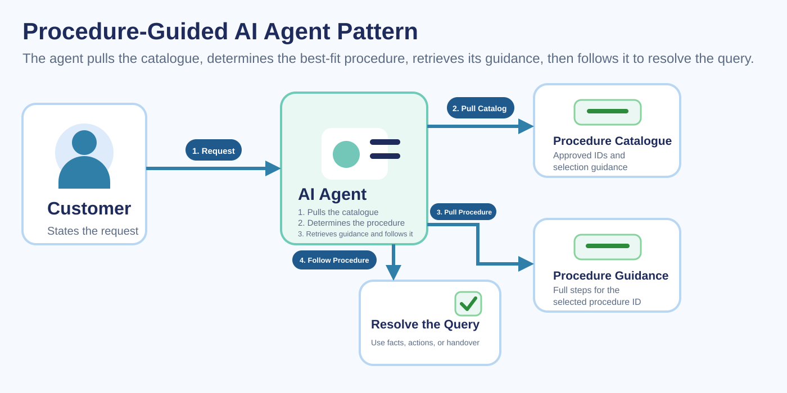
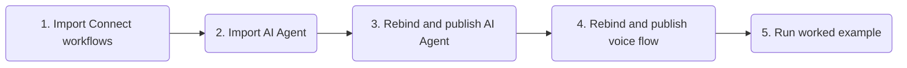
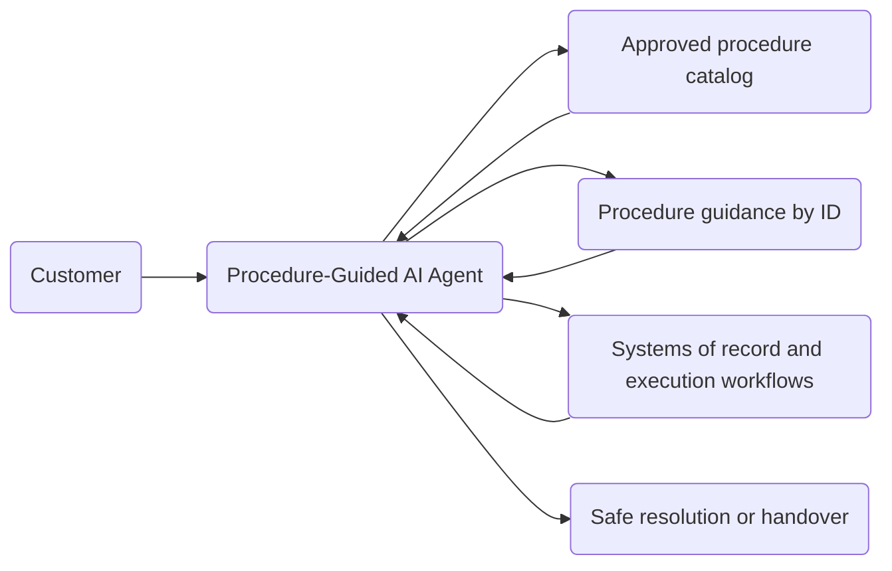

# Procedure-Guided AI Agent Pattern

A reference implementation of an AI agent that uses an approved procedure catalogue to make controlled service decisions across industries.

The key pattern is simple and reusable: the agent reasons over approved procedure names, descriptions, applicability criteria, and selection guidance alongside the customer's request, selects the best-fit `procedure_id`, then retrieves full guidance using that ID. It applies that guidance to determine which actions to call, reasons over their results, and continues only through allowed procedure steps.

---

## Try It Fast

| Step | Do this | Where |
|---|---|---|
| 1 | Import and activate [Authenticate_Customer.workflow](exports/Authenticate_Customer.workflow), [Fetch_Account_Details.workflow](exports/Fetch_Account_Details.workflow), [Fetch_Procedure_Catalog.workflow](exports/Fetch_Procedure_Catalog.workflow), [Fetch_Procedure_Guidance.workflow](exports/Fetch_Procedure_Guidance.workflow), [Raise_Issue_Ticket.workflow](exports/Raise_Issue_Ticket.workflow), [Send_Customer_Communication.workflow](exports/Send_Customer_Communication.workflow), and [Submit_Financial_Service_Action.workflow](exports/Submit_Financial_Service_Action.workflow). | Webex Connect |
| 2 | Import [Procedure_Guided_Agent.json](exports/Procedure_Guided_Agent.json). | AI Agent Studio |
| 3 | Rebind each agent action to the matching workflow, then publish the AI Agent. | AI Agent Studio |
| 4 | Import [Procedure_Guided_Agent_Voice_Flow.json](exports/Procedure_Guided_Agent_Voice_Flow.json), rebind its `AI_Agent` activity to the published agent and its queue to the target human path, then publish the flow. | Webex Contact Center Flow Designer |
| 5 | Associate the published flow with your voice entry point, then run the worked example to confirm the end-to-end journey. | Webex Contact Center |

---

## What The Agent Does

The Procedure-Guided Agent Pattern follows a bounded decision sequence:

1. Understands the customer's request and authenticates when required.
2. Fetches the approved procedure catalogue.
3. Reasons over procedure names, descriptions, applicability criteria, and selection guidance based on the customer's request.
4. Selects the ID of the best-fit procedure.
5. Fetches procedure guidance using the selected procedure ID.
6. Interprets the returned guidance to determine which permitted actions, if any, are required next.
7. Calls those actions to retrieve authoritative facts or perform procedure-directed tasks, then applies the guidance to the returned results.
8. Repeats allowed steps as required, then explains the customer-safe outcome or hands over when required.

Although the included agent export is a financial-services worked example, the underlying pattern is cross-industry and can be reused anywhere a bounded set of approved procedures must guide conversational decisions.

---

## Procedure Catalogue Pattern

The catalogue is a bounded decision aid, not a keyword lookup or a service that interprets free-text customer intent. It and the full procedure guidance are returned in structured JSON so IDs and response fields can be exchanged consistently; the guidance itself is written in plain English, describing checks, choices, action conditions, and allowed outcomes for the agent to interpret.

---

## Responsibility Boundaries

This pattern works because the responsibilities stay cleanly separated:

- The AI agent owns customer interaction, bounded procedure selection, guidance interpretation, tool choice, consent, and customer-safe explanation.
- The procedure catalogue owns the approved selection space: names, descriptions, applicability criteria, and selection guidance.
- The procedure-guidance service owns the selected procedure's checks, constraints, required disclosures, escalation conditions, and allowed outcomes.
- Tools and workflows own authoritative facts, validation, durable state, audit, and execution.
- Fulfillment workflows return authoritative facts, constraints, and execution outcomes; the agent uses the procedure guidance to interpret them and determine its next conversational step.

---

## Test Script

All values below are synthetic, generated demo data. Replace them with safe test data in your own environment.

| Profile | Synthetic test data |
|---|---|
| Profile A | ZIP code: `94105` Date of birth: `1990-04-12` OTP: `482913` Account last four digits: `9821` |
| Profile B | ZIP code: `10001` Date of birth: `1985-09-30` OTP: `482913` Account last four digits: `4410` |

For each scenario, the agent should authenticate, select the relevant procedure, retrieve its guidance, call the required actions, and explain the safe next step.

| Scenario | Customer says | Test profile | Additional data |
|---|---|---|---|
| Missing Deposit | "A deposit is missing from my account." | Profile A | None |
| Remove Card Freeze | "I want to remove a freeze from my card." | Profile A | Card last four digits: `7842` |
| Update Address | "I need to update my address." | Profile B | None |

| Boundary check | How to test | Expected behavior |
|---|---|---|
| Authentication failure | Use any synthetic profile with an invalid OTP. | Agent does not call customer-bound downstream actions and offers an appropriate fallback or handover path. |
| No safe procedure match | Ask for something that does not map cleanly to an approved procedure. | Agent explains scope briefly and offers `Agent handover` rather than improvising a procedure choice. |
| Specialist required | Use a scenario where the returned guidance requires specialist handling. | Agent does not invent a workaround and offers or triggers handover according to the configured path. |
| Incomplete fulfillment result | Return incomplete, ambiguous, or unconfirmed details from a test action. | Agent explains that the detail is not yet confirmed and follows the allowed next step from guidance and verified facts. |
| Human request | At any point, say "I want to speak to someone." | Agent uses `Agent handover` and the target channel routes the interaction to the configured human or specialist path. |

---

Files In This Playbook

| File | Type | Purpose |
|---|---|---|
| [Procedure_Guided_Agent.json](exports/Procedure_Guided_Agent.json) | Webex AI Agent Studio export | Worked-example agent configuration for the procedure-guided pattern, including authentication, catalogue lookup, guidance retrieval, fulfillment actions, and handover. |
| [Procedure_Guided_Agent_Voice_Flow.json](exports/Procedure_Guided_Agent_Voice_Flow.json) | Webex Contact Center Flow Designer export | Voice entry flow that invokes the AI Agent, plays a fallback error message, and routes handover to a configured human queue. |
| [Authenticate_Customer.workflow](exports/Authenticate_Customer.workflow) | Webex Connect workflow export | Authentication workflow for protected servicing. |
| [Fetch_Account_Details.workflow](exports/Fetch_Account_Details.workflow) | Webex Connect workflow export | Authoritative fact retrieval for account, payment, case, or profile context. |
| [Fetch_Procedure_Catalog.workflow](exports/Fetch_Procedure_Catalog.workflow) | Webex Connect workflow export | Bounded procedure catalogue retrieval. |
| [Fetch_Procedure_Guidance.workflow](exports/Fetch_Procedure_Guidance.workflow) | Webex Connect workflow export | Full-guidance retrieval by the selected `procedure_id`. |
| [Raise_Issue_Ticket.workflow](exports/Raise_Issue_Ticket.workflow) | Webex Connect workflow export | Issue or escalation record creation and update. |
| [Send_Customer_Communication.workflow](exports/Send_Customer_Communication.workflow) | Webex Connect workflow export | Consent-based customer communication workflow. |
| [Submit_Financial_Service_Action.workflow](exports/Submit_Financial_Service_Action.workflow) | Webex Connect workflow export | Worked-example action workflow for a permitted servicing action. |

Architecture

AI Agent Behavior Guide

The included agent export uses these behavior rules:

- Authenticate before customer-bound actions when required.
- Load the procedure catalogue before taking issue-specific action.
- Use the catalogue plus the customer's request to select the best-fit `procedure_id`.
- Retrieve full guidance only by the selected `procedure_id`.
- Use returned guidance to determine which permitted actions to call, including actions that retrieve authoritative facts or perform procedure-directed tasks.
- Ask only for missing information required for the next safe step.
- Obtain consent before optional actions or communications.
- Explain only customer-safe facts and hand over when guidance or verified facts require specialist support.

Included tools:

| Tool | Purpose | Required inputs |
|---|---|---|
| `authenticate_customer` | Verify the customer before protected servicing. | `zipcode`, `date_of_birth`, optional `otp` |
| `get_procedure_catalog` | Load approved procedure IDs, applicability criteria, and selection guidance. | None |
| `get_procedure_guidance` | Retrieve full guidance for the selected `procedure_id`. | `procedure_id` |
| `fetch_account_details` | Retrieve authoritative account, payment, case, or profile facts for the current request. | Worked-example identifiers from prior authenticated context |
| `raise_issue_ticket` | Create or update issue or escalation records when required. | Worked-example authenticated context |
| `send_customer_communication` | Send an approved customer communication after consent. | Worked-example authenticated context plus communication details |
| `submit_financial_service_action` | Submit a permitted worked-example servicing action. | Worked-example authenticated context plus action-specific inputs |
| `Agent handover` | Escalate to a person or specialist path when needed. | None |

Import And Rebind Notes

### Webex Connect

- Import all seven workflow exports from `exports/`.
- Review Javascript stubs and modify if necessary.
- Publish the workflows before configuring the agent.

### AI Agent Studio

- Import [Procedure_Guided_Agent.json](exports/Procedure_Guided_Agent.json).
- Rebind each tool fulfillment to the corresponding imported workflow.
- Configure `Agent handover` for the target human or specialist path.
- Publish the agent.

### Webex Contact Center Flow Designer

- Import [Procedure_Guided_Agent_Voice_Flow.json](exports/Procedure_Guided_Agent_Voice_Flow.json).
- Rebind the `AI_Agent` activity to the published Procedure-Guided Agent.
- Rebind `Queue_Contact` to the target human or specialist queue, and review the error prompt for your service.
- Publish the flow, then associate it with the required voice entry point.

Security, Privacy, And Publishing Notes

### Security Notes

- Ask only for the minimum information required for the next safe step.
- Treat protected values, internal procedure content, identifiers, tokens, and backend details as internal-only unless a disclosure rule explicitly allows customer-safe output.
- Use authoritative facts and validated execution results as the source of truth.

### Known Limitations

- The included agent export is a worked financial-services example and should be retuned for other industries.
- The supplied Webex Connect workflow exports and voice-flow export are demo implementations only.
- The pattern improves bounded procedural reasoning but does not replace backend validation, eligibility checks, or authoritative systems of record.

---

## License And Attribution

This is a reference playbook for Webex Contact Center AI Agent solution design. Add the preferred repository license and attribution before publishing.
