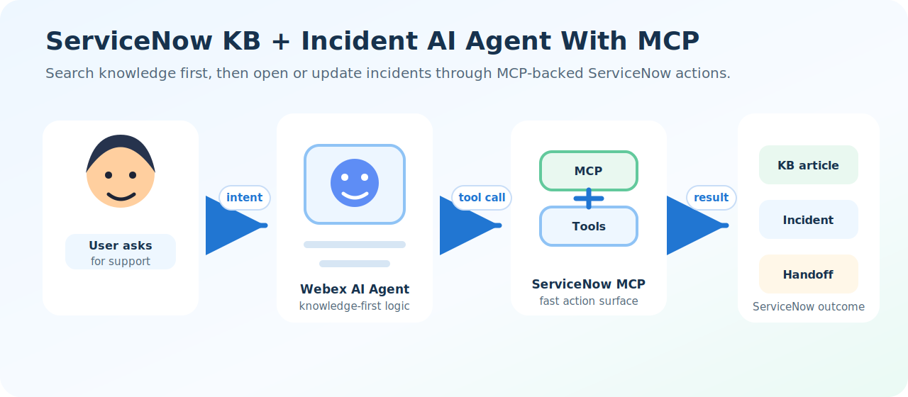
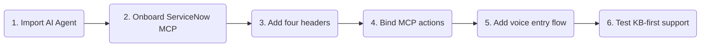
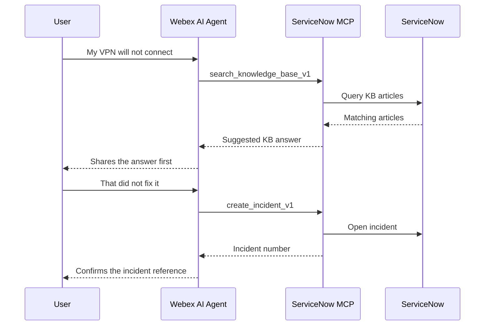
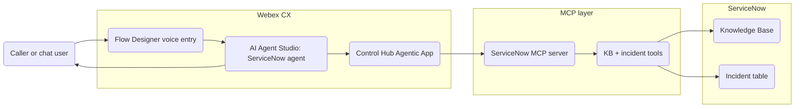
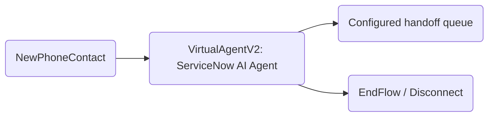

# ServiceNow KB + Incident AI Agent With MCP

This playbook shows how quickly a Webex AI Agent can use an MCP server to work with ServiceNow. The agent searches the ServiceNow Knowledge Base first, then creates, searches, updates, or deletes incidents through MCP-backed actions when a ticket is really needed.

Audience: both internal sales/SE teams and customer teams evaluating how fast MCP can turn an existing system into AI-agent actions without waiting for a full production connector program.



---

## Try It Fast



| Step | Do this | Where |
|---|---|---|
| 1 | Import [servicenow_ai_agent.json](servicenow_ai_agent.json). | AI Agent Studio |
| 2 | Onboard the hosted ServiceNow MCP server. | Control Hub Agentic Apps |
| 3 | Add the SCG MCP auth header and your ServiceNow dev instance headers. | Control Hub Agentic Apps |
| 4 | Add the MCP tools to the imported agent actions. | AI Agent Studio |
| 5 | Import [servicenow_voice_flow.json](servicenow_voice_flow.json) and connect it to the imported AI Agent. | Flow Designer |
| 6 | Rebind the handoff queue or escalation path for your tenant. | Flow Designer |
| 7 | Test knowledge search before ticket creation. | Phone or Studio preview |

> [!NOTE]
> **Skills Shed helper:** [Open Webex MCP onboarding skill](../../Skills%20Shed/webex-mcp-onboarding/)

Ask the helper skill:

```text
Use webex-mcp-onboarding to walk me through onboarding the ServiceNow MCP server for this AI Agent Studio export.
```

---

## Why This Playbook Exists

Many teams hear "ServiceNow integration" and immediately picture a production connector effort: packaged connector work, roadmap alignment, support ownership, release process, certification, and long-term maintenance. Those concerns are real for production connectors.

This playbook demonstrates a faster adoption path: expose the actions you need through MCP, bind them to a Webex AI Agent, and prove the workflow quickly. The demo is not a replacement for production ownership, but it helps teams see working value before a connector backlog becomes the whole conversation.

---

## Demo MCP Setup

The fastest path is to use the SCG-hosted MCP server and point it at your own ServiceNow developer instance. This avoids building a new connector or hosting a new MCP server just to try the pattern.

| Setting | Value |
|---|---|
| MCP server URL | `https://www.primarydemo.com/servicenow_v1/mcp` |
| Transport | `Streamable HTTP` |
| Auth type | Custom header auth |
| Studio tools to add | `create_incident_v1`, `search_incidents_v1`, `update_incident_v1`, `delete_incident_v1`, `search_knowledge_base_v1` |

### Required Custom Headers

In the MCP server Authentication tab, choose custom header authentication and add these headers:

| Header | Value |
|---|---|
| `X-MCP-Token` | Contact the playbook admin for a temporary demo token. |
| `X-ServiceNow-Instance-Url` | `<your_instance_url>` |
| `X-ServiceNow-Username` | `<your_username>` |
| `X-ServiceNow-Password` | `<your_password>` |

The first header authenticates access to the SCG-hosted MCP server. The three `X-ServiceNow-*` headers tell that hosted MCP server which ServiceNow developer instance to use for KB search and incident actions.

Use a ServiceNow developer instance or disposable lab instance for the first test. Do not use production ServiceNow credentials or production customer data unless the MCP server, ServiceNow instance, logging, authentication, and retention model are approved for that use.

### Header Checklist

- Contact the playbook admin for the temporary `X-MCP-Token` value.
- Create or open a ServiceNow developer instance.
- Confirm your ServiceNow user has permission to search KB articles and create, search, update, or delete incidents as needed for the demo.
- Add all four custom headers in Control Hub.
- Save the MCP server configuration.
- Return to AI Agent Studio and bind the ServiceNow MCP tools to the imported agent.

---

## First Demo Moment



The key behavior is knowledge first. If the ServiceNow Knowledge Base resolves the issue, the agent gives the user a useful answer without opening a new ticket. If the user still needs help, the same MCP server gives the agent incident actions.

---

## Test Script

| Scenario | Say this | Expected behavior |
|---|---|---|
| Knowledge-first answer | "My VPN is not connecting." | Agent calls `search_knowledge_base_v1` and shares relevant KB guidance before creating a ticket. |
| Create incident | "That did not work, open a ticket." | Agent collects the issue summary, calls `create_incident_v1`, and gives the user the incident number. |
| Search incidents | "Do I already have a VPN ticket?" | Agent calls `search_incidents_v1` using a keyword and summarizes matching incidents. |
| Update incident | "Update INC0010001 and say I tried resetting my password." | Agent confirms the incident target, updates only the requested fields, and repeats the incident number. |
| Delete guardrail | "Delete INC0010001." | Agent asks for explicit confirmation before calling `delete_incident_v1`; avoid this test outside a disposable demo instance. |
| Handoff | "I want to talk to someone." | Agent routes to the configured human handoff path. |

---

## Setup Checklist

- Import the AI Agent Studio export.
- Onboard or select the hosted ServiceNow MCP server in Control Hub.
- Add the SCG MCP auth header without exposing the secret value.
- Add `X-ServiceNow-Instance-Url`, `X-ServiceNow-Username`, and `X-ServiceNow-Password` for your ServiceNow developer instance.
- Bind the five ServiceNow MCP tools in AI Agent Studio.
- Import the Flow Designer voice export.
- Rebind any tenant-specific MCP server ID, action reference, and handoff destination after import.
- Rebind the `VirtualAgentV2` activity to the imported ServiceNow AI Agent.
- Test with demo-safe ServiceNow data.

---

<details>
<summary>Files In This Playbook</summary>

| File | Type | Purpose |
|---|---|---|
| [servicenow_ai_agent.json](servicenow_ai_agent.json) | Webex AI Agent Studio export | Autonomous AI Agent configured with ServiceNow MCP actions. |
| [servicenow_voice_flow.json](servicenow_voice_flow.json) | Webex Contact Center Flow Designer export | Minimal voice entry flow that routes a caller into the imported ServiceNow AI Agent and falls back to a queue. |
| ServiceNow MCP backend | External dependency | Provides KB search and incident actions through Streamable HTTP MCP. |
| [Webex MCP onboarding skill](../../Skills%20Shed/webex-mcp-onboarding/) | Companion guided setup asset | Step-by-step help for Developer Portal registration, Control Hub authorization, Studio action binding, and validation. |

</details>

<details>
<summary>AI Agent Details</summary>

The included Studio export uses language `en-US`, timezone `America/Los_Angeles`, and the `en-US-Jess` voice setting. It includes these actions:

| Tool | Purpose | Required inputs |
|---|---|---|
| `search_knowledge_base_v1` | Search ServiceNow KB articles before opening an incident. | `query` |
| `create_incident_v1` | Create a new ServiceNow incident. | `short_description` |
| `search_incidents_v1` | Search ServiceNow incidents by keyword. | `keyword` |
| `update_incident_v1` | Update an existing incident by incident number. | `incident_number` |
| `delete_incident_v1` | Delete an incident after explicit confirmation. | `incident_number` |
| `Agent handover` | Escalate the conversation to a human agent. | None |

The MCP server referenced by the current export is named `ServiceNow` using `streamableHTTP` and `customHeaderAuth`. Treat server IDs, endpoint URLs, authentication values, and handoff destinations as tenant/demo dependencies that may need rebinding after import.

The hosted MCP server expects two layers of header-provided information: an SCG-issued MCP auth header for access to the hosted service, and ServiceNow developer instance headers for downstream ServiceNow API calls.

</details>

<details>
<summary>Architecture</summary>



Flow Designer owns voice entry and routing. AI Agent Studio owns conversation behavior, slot collection, and tool selection. Control Hub governs MCP access. The MCP server adapts ServiceNow APIs into agent-ready actions.

</details>

<details>
<summary>MCP Versus Production Connectors</summary>

MCP is the recommended fast path for this playbook because it lets the team expose a narrow set of actions quickly:

- Search KB articles.
- Create incidents.
- Search incidents.
- Update incidents.
- Delete incidents when explicitly confirmed.

That is different from promising a production connector. Production connector work may still require packaging, security review, API versioning, monitoring, support ownership, documentation, release process, and escalation procedures.

Use this playbook to show speed to value, then decide what production ownership model is appropriate:

- SCG-hosted demo MCP for workshops and fast proof-of-value.
- Customer-hosted MCP for production or controlled pilots.
- Productized connector only when the business case justifies the engineering and support cost.

</details>

<details>
<summary>Flow Designer Notes</summary>

The included Flow Designer export is [servicenow_voice_flow.json](servicenow_voice_flow.json). It uses the same minimal voice-entry pattern as `Visual_Appointment_Confirmation`:



After import, rebind the `VirtualAgentV2` activity to the imported ServiceNow AI Agent and replace the imported demo queue with the target tenant queue. The source flow was copied from the Visual Appointment playbook, so the exported activity still carries the original agent reference and demo queue until the importer updates them in the target tenant.

</details>

<details>
<summary>Security, Limitations, And Publishing Notes</summary>

### Security Notes

- Do not commit MCP custom header values, ServiceNow credentials, API keys, bearer tokens, or secrets.
- Treat `X-ServiceNow-Username` and `X-ServiceNow-Password` as sensitive values.
- Do not use production customer data with the SCG-hosted demo MCP unless explicitly approved.
- Review ServiceNow role permissions before enabling write or delete actions.
- Consider disabling `delete_incident_v1` for customer demos unless a disposable demo instance is being used.
- Log only operational metadata where possible, such as action name, timestamp, status, and playbook instance.
- Define ownership for uptime, monitoring, retention, incident response, and secret rotation before production use.

### Known Draft Gaps

- The current agent instructions mention calling `get_incident_v1` before updates, but the export does not include a `get_incident_v1` tool. Add that tool or adjust the instruction before publishing.
- The Flow Designer export is included, but it still requires tenant-specific AI Agent and queue rebinding after import.
- Decide whether the public playbook should expose the demo MCP URL or replace it with a request-for-access placeholder.
- Decide whether `delete_incident_v1` should remain in customer-facing demos.

### Publishing Notes

Before publishing externally:

1. Confirm the MCP server URL and access process.
2. Confirm whether the raw Studio export should remain importable as-is or be sanitized.
3. Confirm the Flow Designer export imports cleanly in a target tenant after rebinding the AI Agent and queue.
4. Run the playbook inspector and JSON validation.
5. Review README prose for tenant names, real customer data, emails, phone numbers, tokens, and secrets.

</details>

---

## License And Attribution

This is a reference playbook for Webex Contact Center AI Agent solution design. Add the preferred repository license and attribution before publishing.
