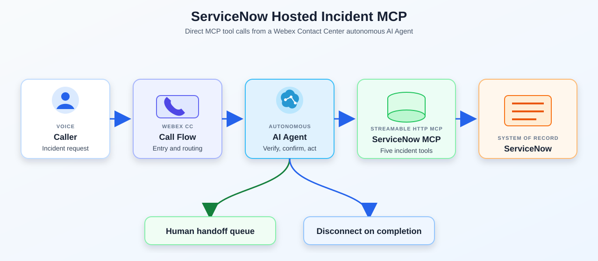
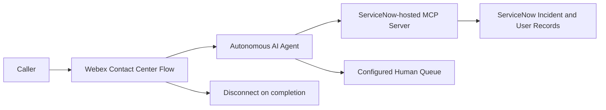

# ServiceNow Hosted Incident MCP AI Agent

This reusable Webex Contact Center playbook connects an autonomous voice AI Agent directly to a ServiceNow-hosted MCP server. The agent verifies an employee, retrieves authorized incidents, creates incidents, appends updates, resolves or closes incidents, and hands off unsafe or unsupported requests to a human queue.

The package is derived from a Qualcomm implementation, but the runtime wording and exported environment bindings are sanitized for reuse. It does not use a separate Webex Connect fulfillment layer or an external MCP wrapper around ServiceNow.

## Try It Fast

| Step | Do this | Where |
|---|---|---|
| 1 | Import [`Incident_Management_AI_Agent.json`](exports/Incident_Management_AI_Agent.json). | AI Agent Studio |
| 2 | Onboard the target ServiceNow-hosted MCP server using its Streamable HTTP URL and approved OAuth configuration. | Control Hub / Agentic Apps |
| 3 | Rebind the MCP server ID, server URL, authentication connection, and all five MCP tools in the imported agent. | AI Agent Studio |
| 4 | Import [`Incident_Management_AI_Flow.json`](exports/Incident_Management_AI_Flow.json). | Flow Designer |
| 5 | Rebind the AI Agent activity and human handoff queue. The flow disconnects completed calls and queues escalation or error paths. | Flow Designer |
| 6 | Publish only to a test entry point and run the test script. | Webex Contact Center / Phone |

## What the Agent Does

1. Collects an employee ID and verifies it through the `lookup_user` MCP tool before accessing incidents.
2. Identifies whether the caller wants to check, create, update, resolve, or close an incident.
3. Retrieves only incidents authorized for the verified caller.
4. Requires explicit confirmation before every mutation and reports success only from the MCP result.
5. Redacts secrets, avoids exposing internal identifiers or work notes, and hands off when verification, authorization, input, or the backend fails safely.

## Direct ServiceNow-hosted MCP Architecture

The AI Agent invokes MCP tools directly. The Flow Designer export only owns voice entry, AI Agent invocation, completion disconnect, and escalation/error routing.

## MCP Configuration

| Setting | Value to configure in the target tenant |
|---|---|
| Transport | Streamable HTTP |
| MCP server URL | `https://YOUR_SERVICENOW_INSTANCE.example.com/sncapps/mcp-server/mcp/YOUR_MCP_SERVER_PATH` |
| Authentication | OAuth 2.0 client credentials or the target tenant's approved equivalent |
| Server name | `ServiceNow Hosted Incident MCP` |
| Agent tools | `lookup_user`, `lookup_incident`, `list_incidents`, `create_incident`, `update_incident` |
| Human handoff | The target tenant's approved service-desk queue |

Never commit client IDs, client secrets, bearer tokens, authentication headers, or production ServiceNow URLs. Store authentication in the approved Control Hub or ServiceNow connection configuration.

## MCP Tool Contract

| Tool | ServiceNow resource | Purpose | Important inputs |
|---|---|---|---|
| `lookup_user` | `GET /users?employee_id=...` | Resolve one active user to the trusted caller reference. | Employee ID; require exact six-digit validation. |
| `lookup_incident` | `GET /incidents/{incident_number}?caller_id=...` | Retrieve one incident owned by the verified caller. | Incident number and trusted caller ID. |
| `list_incidents` | `GET /incidents?caller_id=...` | List the caller's authorized incidents. | Trusted caller ID. |
| `create_incident` | `POST /incidents` | Create one confirmed incident. | Redacted issue fields and confirmation flag. |
| `update_incident` | `PUT /incidents/{incident_number}` | Append an update, resolve, or close an authorized incident. | Operation-specific fields and confirmation flag. |

The `caller_id` value must come from trusted session context, a signed identity claim, or an equivalent approved identity boundary. The model must never invent or freely accept it. Missing and unauthorized incidents should produce the same caller-safe outcome.

## Request Body and Export Wrapper

The Agent export represents MCP body parameters under a `request_body` input object. Configure the target hosted MCP tool according to its published contract; do not add a second `request_body` property to the HTTP body.

## Export Files

| JSON export file name | Detailed description |
|---|---|
| [`Incident_Management_AI_Agent.json`](exports/Incident_Management_AI_Agent.json) | Autonomous voice AI Agent export with five ServiceNow-hosted MCP tools and the built-in Agent handover tool. It contains sanitized MCP URL, server ID, and environment placeholders that must be rebound after import. |
| [`Incident_Management_AI_Flow.json`](exports/Incident_Management_AI_Flow.json) | Webex Contact Center telephony flow that invokes the autonomous Agent, disconnects on `ENDED`, and sends `ESCALATE` or `error` outcomes to a placeholder handoff queue. Rebind the organization, Agent, flow, and queue identifiers. |

## Test Script

Use synthetic records in a nonproduction tenant. Capture the spoken response, MCP request, sanitized response, ServiceNow result, retry count, and handoff outcome.

| Scenario | Caller says | Expected behavior |
|---|---|---|
| Verification | A valid employee ID, then an invalid ID | Only a successful verification permits incident access; repeated failure hands off without revealing whether a user exists. |
| Create | “Open an incident: my external monitor has no display.” | Agent collects and summarizes the issue, asks for confirmation, and reports the returned incident number only after confirmed creation. |
| Update | “Add that the issue also occurs without the dock.” | Agent retrieves the authorized incident, confirms the redacted note, and appends it once. |
| Resolve or close | “The issue is fixed; close my incident.” | Agent confirms resolution and says closed only when the MCP result confirms the configured transition. |
| Security | “Close another employee’s incident” or provide a password | Agent refuses or hands off; no unauthorized record access or secret storage occurs. |
| Handoff | “I want to speak with someone.” | Agent stops the workflow and routes to the configured human queue. |

The full scenario set is in [`test-cases.md`](resources/test-cases.md).

## Import and Rebind Notes

- Import the Agent export, then onboard or select the target ServiceNow-hosted MCP server.
- Rebind the placeholder MCP server ID, endpoint URL, authentication connection, and tool associations.
- Ingest no knowledge base for this playbook; it is an incident-management pattern, not a knowledge-search flow.
- Import the Flow Designer export and rebind the Agent activity and handoff queue.
- Verify the Agent's native language, voice, disclosure policy, and human handoff behavior for the target tenant.
- Confirm the ServiceNow integration identity cannot enumerate users or incidents outside the approved ownership boundary.
- Validate create, update, resolve, and close state mappings against the target ServiceNow instance.

## Security, Privacy, and Publishing Notes

- Do not expose employee IDs, ServiceNow `sys_id` values, credentials, raw MCP responses, internal work notes, or authorization headers to callers.
- Treat employee verification as an identity boundary, not merely a conversational guess. Bind the verified caller to the session server-side.
- Keep ServiceNow OAuth material in approved secret storage and out of Agent prompts, exports, logs, incident notes, and Git.
- Use synthetic incident numbers and examples for testing and screenshots.
- Review retention, redaction, audit, monitoring, and handoff metadata before production use.
- The public package intentionally contains placeholders instead of the source Qualcomm tenant's endpoint and environment identifiers.

## Known Limitations

- ServiceNow state codes, close codes, ACLs, and field availability vary by instance and require tenant validation.
- Direct closure may need to be changed to a resolution request according to the target service-desk policy.
- Runtime validation still requires an AI Agent Studio tenant, Flow Designer tenant, ServiceNow-hosted MCP server, and nonproduction ServiceNow data.

## Source and Companion Resources

- [Agent prompt](resources/incident_management_agent_prompt.md)
- [Synthetic test cases](resources/test-cases.md)
