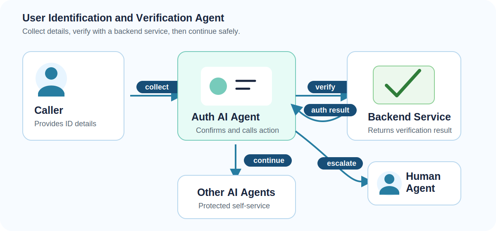
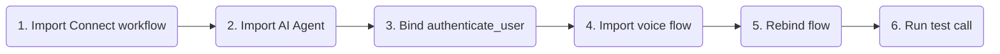
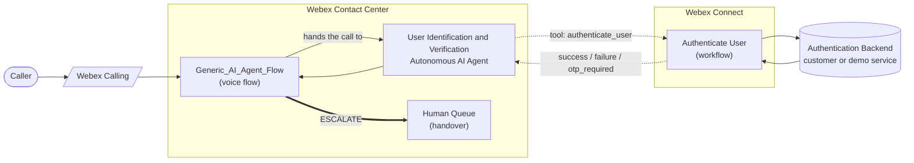
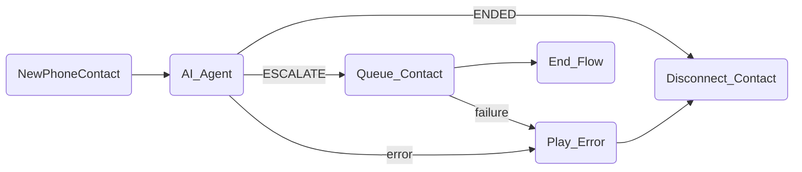

# User Identification and Verification - Webex Contact Center Autonomous AI Agent

A reference implementation of an autonomous voice AI agent built on Webex Contact Center that verifies a caller's identity before protected support or self-service journeys continue.

The agent runs on the Webex CC Autonomous AI Agent platform, uses a Webex Connect workflow to perform authentication, and is wired into a reusable voice flow with escalation to a human agent.



---

## Try It Fast



| Step | Do this | Where |
|---|---|---|
| 1 | Import [Authenticate_User.workflow](exports/Authenticate_User.workflow) and publish. | Webex Connect |
| 2 | Import [User_Identification_Verification.json](exports/User_Identification_Verification.json). | AI Agent Studio |
| 3 | Update the `authenticate_user` action fulfillment to point at the `Authenticate User` workflow, then publish the agent. | AI Agent Studio |
| 4 | Import [Generic_AI_Agent_Flow.json](exports/Generic_AI_Agent_Flow.json). | Flow Designer |
| 5 | Rebind the `AI_Agent` activity to the imported ID&V agent and replace the escalation queue with the target human support queue. | Flow Designer |
| 6 | Place a test call and verify OTP, failed verification, error, and handoff paths. | Phone |

---

## What The Agent Does

The ID&V agent handles the verification step on a voice call:

1. Greets the caller and explains that verification is required.
2. Collects date of birth and postal code.
3. Calls the `authenticate_user` action, fulfilled by the Webex Connect `Authenticate User` workflow.
4. If the workflow requests step-up verification, asks for a one-time passcode and calls `authenticate_user` again with `otp`.
5. If authentication succeeds, thanks the caller by the returned name and allows the protected journey to continue.
6. Escalates to a human agent when the caller asks for a person, cannot complete verification, repeatedly fails verification, or the backend path is unavailable.

---

## Backend Verification Contract

The included AI Agent export uses the `authenticate_user` action. 

### Request

```json
{
  "date_of_birth": "1990-10-10",
  "postal_code": "94105",
  "otp": "123456"
}
```

`otp` is optional and should be included only when the prior action response asks the user for a one-time passcode.

### Response

```json
{
  "outcome": "success",
  "outcome_description": "Authentication was successful.",
  "customer_name": "Jane"
}
```

| Status | Agent behavior |
|---|---|
| `success` | Continue to the protected journey or requested self-service task. |
| `failure` | Offer one retry if policy allows, then hand off. |
| `otp_required` | Ask for the one-time passcode and call `authenticate_user` again with `otp`. |

---

## Sample Verification Data

Use this section to drive end-to-end tests once the agent, workflow, voice flow, and backend are imported and reachable.

| Date of birth | Postal code | OTP | Stub should return | Notes |
|---|---|---|---|---|
| `1990-10-10` | `99999` | - | `failure` | Tests failed verification without revealing which field failed. |
| `2010-01-01` | `10001` | `1234` | `otp_required`, then `success` | Tests OTP challenge and second `authenticate_user` call. |

**Note**: The sample workflow uses hard coded user details for demo purposes.

---

## Test Script

| Scenario | Caller says | Expected behavior |
|---|---|---|
| OTP step-up | "My date of birth is January 1, 2010, and my ZIP is 10001." | Agent calls `authenticate_user`; if OTP is required, asks for the code and calls the tool again with `otp`. |
| Failed verification | Provide mismatched DOB and postal code, or invalid otp. | Agent does not reveal which field failed and follows retry or handoff policy. |
| Human request | "I want to speak to someone." | Agent routes to the configured queue. |
| Backend unavailable | Connect workflow or authentication service returns an error. | Agent apologizes and follows the configured fallback path without exposing internal details. |

---

<details>
<summary>Files In This Playbook</summary>

| File | Type | Purpose |
|---|---|---|
| [User_Identification_Verification.json](exports/User_Identification_Verification.json) | Webex CC Autonomous AI Agent export | The AI agent instructions, settings, and tools: `authenticate_user` and `Agent handover`. |
| [Authenticate_User.workflow](exports/Authenticate_User.workflow) | Webex Connect workflow export | Fulfillment workflow for `authenticate_user`; performs user authentication, including OTP step-up verification. |
| [Generic_AI_Agent_Flow.json](exports/Generic_AI_Agent_Flow.json) | Webex CC Voice Flow export | Main inbound voice flow that invokes the AI agent, handles normal completion, routes escalation to a human queue, and plays an error prompt on failures. |

</details>

<details>
<summary>Architecture</summary>



The pattern is the standard Webex CC AI Agent + Webex Connect fulfillment integration:

- The voice flow owns telephony, queueing, disconnect, and error handling.
- The AI agent owns the conversation: collecting verification details, deciding when to call `authenticate_user`, and escalating when needed.
- Webex Connect owns fulfillment for the authentication action and calls the backend service that makes the verification decision.

</details>

<details>
<summary>AI Agent Behavior Guide</summary>

The included AI Agent export uses these behavior rules:

- Explain that verification is required before account-specific help can continue.
- Collect only the fields required by the configured verification policy.
- Confirm sensitive fields carefully without reading full protected values unnecessarily.
- Never reveal which specific field failed verification.
- Do not say an account exists until the backend returns an approved result.
- Use the backend `outcome_description` when returned, to assist agent decisions.
- Offer retries only within the approved policy.
- Escalate to a human agent for repeated failures, backend errors, caller distress, or explicit human-agent requests.

Included tools:

| Tool | Purpose | Required inputs |
|---|---|---|
| `authenticate_user` | Verify the caller using date of birth and postal code. Supports OTP when requested by the authentication response. | `date_of_birth`, `postal_code`; optional `otp` |
| `Agent handover` | Escalate to a human agent if the user asks for it or cannot complete verification. | None |

</details>

<details>
<summary>Import And Rebind Notes</summary>

### Webex Connect

- Import [Authenticate_User.workflow](exports/Authenticate_User.workflow).
- Connect it to the target authentication backend or demo stub.
- Verify the workflow response shape matches the AI Agent action expectations.
- Publish the workflow.

### AI Agent Studio

- Import [User_Identification_Verification.json](exports/User_Identification_Verification.json).
- Confirm the `authenticate_user` action is enabled.
- Rebind the action fulfillment to the imported Webex Connect workflow in the target environment.
- Publish the agent.

### Flow Designer

- Import [Generic_AI_Agent_Flow.json](exports/Generic_AI_Agent_Flow.json).
- Rebind `AI_Agent` to the imported User Identification and Verification agent.
- Replace the imported escalation queue with the target human support queue.
- Publish to a test entry point before routing production traffic.

</details>

<details>
<summary>Flow Designer Details</summary>

The included voice flow is [Generic_AI_Agent_Flow.json](exports/Generic_AI_Agent_Flow.json).



| Activity | Purpose |
|---|---|
| `NewPhoneContact` | Starts the inbound voice flow. |
| `AI_Agent` | Invokes the User Identification and Verification AI Agent. |
| `Queue_Contact` | Escalates to the configured human queue when the agent emits `ESCALATE`. |
| `Play_Error` | Plays a system-error message before disconnecting. |
| `Disconnect_Contact` | Disconnects after normal agent completion or error handling. |
| `End_Flow` | Ends after queue handling. |

</details>

<details>
<summary>Security, Privacy, And Publishing Notes</summary>

### Security Notes

- Treat customer identifiers, dates of birth, phone numbers, postal codes, and OTP values as sensitive.
- Use secure variables for sensitive fields where supported.
- Confirm whether verification data can be stored, logged, replayed, or displayed to human agents.
- Avoid saying which field failed verification.
- Avoid confirming whether an account exists until the caller is verified.
- Define retry limits, lockout behavior, fraud handling, and escalation ownership before production use.

### Known Limitations

- The included exports contain original import metadata and must be reviewed before external publication.
- The Webex Connect workflow must be connected to the target authentication backend or demo stub.
- Verification policy differs by customer, industry, country, and data type.
- Step-up verification requires an approved OTP or secondary authentication provider.

### Publishing Notes

Before publishing externally:

1. Review all exports for tenant-specific IDs, org IDs, queue IDs, creator emails, URLs, and credentials.
2. Decide whether to preserve raw importability or create sanitized customer-facing copies.
3. Replace any demo service references with the supported demo backend or approved customer-hosted pattern.
4. Add screenshots or a short sanitized test transcript once the implementation is proven.

</details>

---

## License And Attribution

This is a reference playbook for Webex Contact Center AI Agent solution design. Add the preferred repository license and attribution before publishing.
