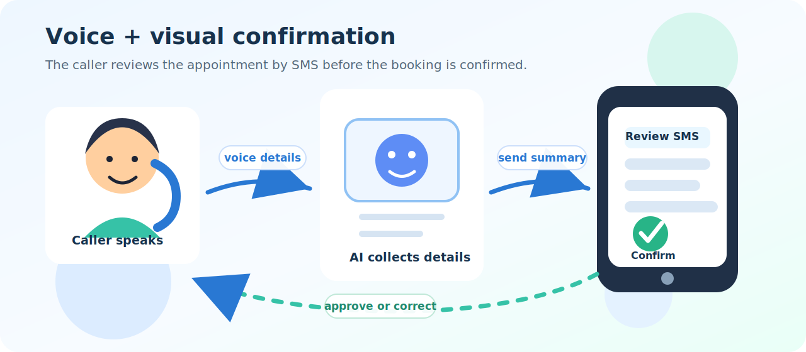
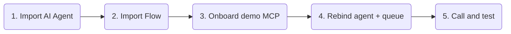
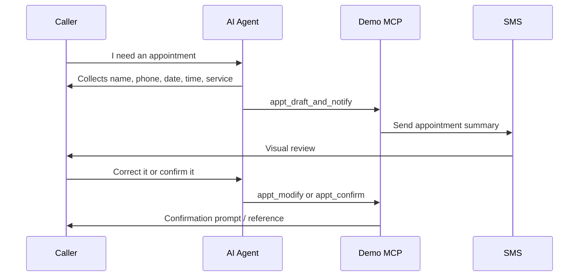
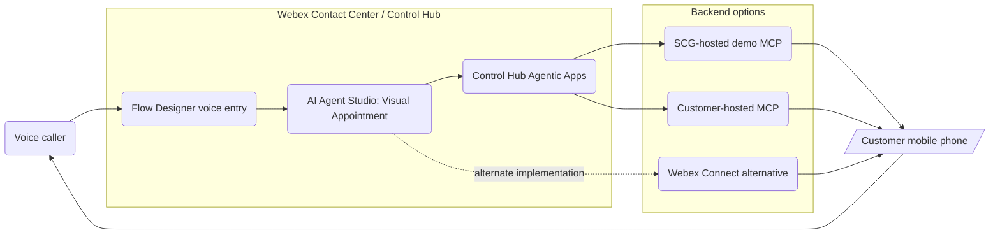
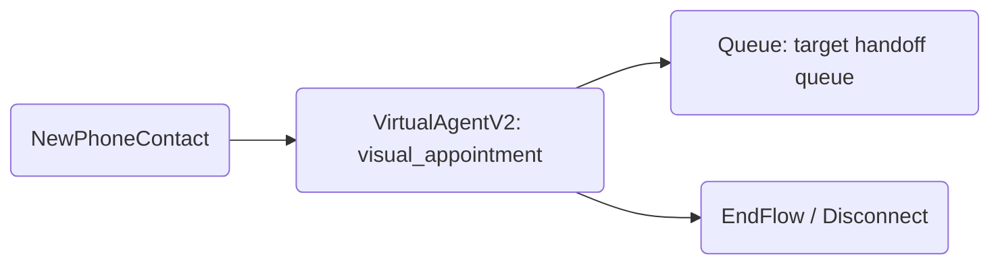

# Visual Appointment Confirmation - Webex Contact Center Autonomous AI Agent

Voice AI can mishear important details. This playbook shows a simple fix: collect appointment details by voice, send the caller an SMS summary to visually review, then confirm the appointment only after the caller approves it by voice.

Use the recommended demo path first. Production MCP and Webex Connect options are available below, but they are not required for the first try.



---

## Try It Fast



| Step | Do this | Where |
|---|---|---|
| 1 | Import [visual_appointment.json](visual_appointment.json). | AI Agent Studio |
| 2 | Import [Visual_Appointment_Confirmation.json](Visual_Appointment_Confirmation.json). | Flow Designer |
| 3 | Onboard the demo MCP backend. | Skills Shed or manual setup |
| 4 | Rebind `VirtualAgentV2` to the imported AI Agent. | Flow Designer |
| 5 | Replace the imported queue with your test queue. | Flow Designer |
| 6 | Publish to a test entry point or test DID. | Flow Designer |
| 7 | Call in and test the visual confirmation loop. | Phone |

---

## Demo MCP Setup

New to MCP onboarding for Webex AI Agent Studio? Use the guided onboarding skill to walk through Developer Portal registration, Control Hub authorization, tool enablement, Studio action binding, and validation.

<a href="../../Skills%20Shed/webex-mcp-onboarding/" style="display:inline-block;background:#1f6feb;color:#ffffff;padding:10px 18px;border-radius:999px;text-decoration:none;font-weight:700;">Open Skills Shed: Webex MCP onboarding skill</a>

After opening or installing that skill in your assistant of choice, such as Codex, ask:

```text
Use webex-mcp-onboarding to walk me through onboarding the Visual Appointment demo MCP URL for my Webex AI agent.
```

For experienced users who want to configure it manually:

| Setting | Value |
|---|---|
| MCP server URL | `https://www.primarydemo.com/visual_appointment_v1/mcp` |
| Transport | `Streamable HTTP` |
| Auth type | Custom header auth |
| Header key/value | Use `X-MCP-Token` with a 24-hour demo token generated at [MCP Factory](https://www.primarydemo.com/mcp-factory). Do not publish the secret value. |
| Studio tools to add | `appt_draft_and_notify`, `appt_modify`, `appt_confirm`, `appt_cancel`, `appt_nudge`, `appt_get_draft` |

This demo backend is for lab/demo use only. Do not use production customer data.

---

## Caller Experience



The demo moment: if speech recognition hears `Niko` as `Nico`, the caller sees the issue in the SMS and corrects it before the appointment is confirmed.

---

## Test Script

| Scenario | Say this | Expected behavior |
|---|---|---|
| Happy path | "I need a consultation Friday April 11 at 10 AM." | Agent sends SMS summary, waits, then confirms after approval. |
| Name correction | "Change my name to Niko." | Agent updates the draft and sends a new SMS. |
| Time correction | "Make it 2 PM instead." | Agent updates the appointment time and sends a new SMS. |
| Quiet caller | Stay silent after SMS. | Agent nudges up to three times. |
| Cancel | "Never mind, cancel it." | Agent cancels and does not confirm. |
| Handoff | "I want to talk to someone." | Flow routes to the configured queue. |

---

<details>
<summary>Files In This Playbook</summary>

| File | Type | Purpose |
|---|---|---|
| [visual_appointment.json](visual_appointment.json) | Webex AI Agent Studio export | Autonomous AI Agent with voice-oriented instructions and MCP appointment tools. |
| [Visual_Appointment_Confirmation.json](Visual_Appointment_Confirmation.json) | Webex Contact Center Flow Designer export | Voice entry flow that routes a caller into the imported AI Agent and falls back to a queue. |
| MCP backend | External dependency | SMS-backed appointment draft, modify, confirm, nudge, cancel, and get-draft actions. |
| [Webex MCP onboarding skill](../../Skills%20Shed/webex-mcp-onboarding/) | Companion guided setup asset | Step-by-step help for Developer Portal registration, Control Hub Agentic Apps, Studio MCP action binding, and validation. |

</details>

<details>
<summary>Architecture</summary>



Flow Designer owns voice entry and routing. AI Agent Studio owns the conversation, appointment collection, and tool-use instructions. Control Hub governs MCP server access and tool availability. The backend sends SMS messages and stores the appointment draft/confirmation state.

</details>

<details>
<summary>Backend Paths</summary>

### Recommended: SCG-Hosted Demo MCP

- Fastest path to value.
- Intended for internal demos, workshops, and quick customer previews.
- Requires an `X-MCP-Token` 24-hour demo token from [MCP Factory](https://www.primarydemo.com/mcp-factory), configured as custom header auth in Control Hub.
- Should be rate-limited and logged by non-sensitive metadata such as action name, timestamp, status, and playbook instance.
- Do not use production customer data.
- Do not promise production availability or retention behavior.

Suggested demo controls:

- Self-service `X-MCP-Token` values expire after 24 hours.
- Optional non-secret header such as `X-Playbook-Instance`.
- Rate limits per token.
- Minimal logs that avoid full names, phone numbers, appointment notes, or message bodies.
- Clear expiration policy for demo tokens.

### Advanced: Production MCP With A Customer-Hosted Server

Use this when the customer wants MCP as the long-term pattern.

- Customer or implementation team hosts the MCP server.
- Customer owns uptime, monitoring, logging, incident response, and secret rotation.
- Security review covers hosting, data flow, authentication, retention, and SMS provider behavior.
- Use the Webex MCP onboarding skill/process to onboard the server.

### Advanced: Webex Connect Fulfillment Alternative

Use this when the customer wants the visual confirmation pattern but does not want to host an MCP server.

- Webex Connect can own SMS sending, workflow orchestration, callbacks, and external API calls.
- This may be easier for customers already using Webex Connect for digital channels.
- The AI Agent pattern stays the same.
- The fulfillment implementation changes from MCP tools to Webex Connect workflows/actions.

</details>

<details>
<summary>AI Agent Details</summary>

The included Studio export configures an autonomous voice agent with these key instructions:

- Collect all required appointment details before calling tools.
- Format dates as `Day Month DD, YYYY`.
- Format times as `H:MM AM/PM`.
- Use the customer phone number as the `session_id`.
- After each MCP tool call, read the returned `voice_prompt` exactly.
- Never confirm a booking without explicit customer approval.
- If the customer goes quiet while reading the SMS, call `appt_nudge`, but no more than three times.
- If the customer asks to change a field, call `appt_modify`.
- If the customer cancels, call `appt_cancel`.

| Tool | Purpose | Required inputs |
|---|---|---|
| `appt_draft_and_notify` | Create a draft appointment and send the SMS summary. | `session_id`, `phone`, `name`, `date`, `time_slot`, `service` |
| `appt_modify` | Update one draft field and resend the SMS summary. | `session_id`, `field`, `new_value` |
| `appt_confirm` | Confirm and book the appointment, then send final confirmation SMS. | `session_id` |
| `appt_cancel` | Cancel a draft or confirmed booking and notify the customer. | `session_id` |
| `appt_nudge` | Return a soft voice prompt while the customer reviews the SMS. | `session_id` |
| `appt_get_draft` | Retrieve the current draft without sending another SMS. | `session_id` |
| `Agent handover` | Escalate to a human agent when requested. | None |

The MCP server referenced by the current export is `visual_appointments` using `streamableHTTP` and `customHeaderAuth`. Treat server IDs, URLs, and auth values as tenant/demo dependencies that may need rebinding after import.

</details>

<details>
<summary>Flow Designer Details</summary>

The included Flow Designer export is [Visual_Appointment_Confirmation.json](Visual_Appointment_Confirmation.json). It is a minimal voice entry flow:



| Item | Value |
|---|---|
| Flow name | `Visual_Appointment_Confirmation` |
| Flow type | `FLOW` |
| Entry event | `NewPhoneContact` |
| AI Agent activity | `VirtualAgentV2` |
| Exported agent reference | `visual_appointment(visual_appointment-io9zVsaC)` |
| Queue fallback | Imported demo queue; replace with the target tenant queue |
| Associated channels | None in export |

After import, rebind the `VirtualAgentV2` activity to the imported Visual Appointment AI Agent in the target tenant. Also replace the imported demo queue with the target tenant queue or handoff destination.

</details>

<details>
<summary>Security, Limitations, And Publishing Notes</summary>

### Security Notes

- Do not use production customer data with the SCG-hosted demo MCP unless explicitly approved.
- Do not commit MCP auth headers, API keys, SMS provider credentials, or tokens.
- Review whether phone number, name, service type, location, and notes are logged by the MCP server or SMS provider.
- Limit demo backend logging to operational metadata where possible.
- Define data retention and deletion behavior before production use.
- Customer-hosted MCP deployments need security review for hosting, authentication, network access, logging, secret rotation, and incident ownership.
- Webex Connect may be preferred when the customer already uses it for SMS and workflow orchestration.
- Before customer-facing publication, review exported Flow Designer metadata such as org IDs, creator emails, queue IDs, agent IDs, and tenant-specific names.

### Known Limitations

- The Flow Designer export is a minimal voice entry and queue fallback sample.
- The MCP backend is externally hosted and must be treated as a demo dependency until production ownership is defined.
- The exports include tenant-specific AI Agent, queue, MCP server IDs, and URLs that require rebinding after import.
- The POC validates information visually by SMS, but the caller still confirms by voice.
- The design depends on SMS deliverability and the caller having access to their mobile phone during the call.
- Production designs should consider consent, opt-in/opt-out, SMS compliance, retention, and accessibility.

### Publishing Notes

Before publishing externally:

1. Confirm the SCG-hosted demo MCP endpoint and [MCP Factory](https://www.primarydemo.com/mcp-factory) 24-hour token process are still the intended access path.
2. Decide whether to preserve the imported demo queue name for import fidelity or sanitize it before publication.
3. Decide whether to preserve importability exactly or sanitize tenant metadata before customer-facing publication.
4. Add screenshots or a short test transcript with sensitive data removed.
5. Confirm the Webex MCP onboarding skill location in the repo.
6. Decide whether the customer-facing README should include the Webex Connect alternative as a full path or a roadmap note.

</details>

---

## License And Attribution

This is a reference playbook for Webex Contact Center AI Agent solution design. Add the preferred repository license and attribution before publishing.
