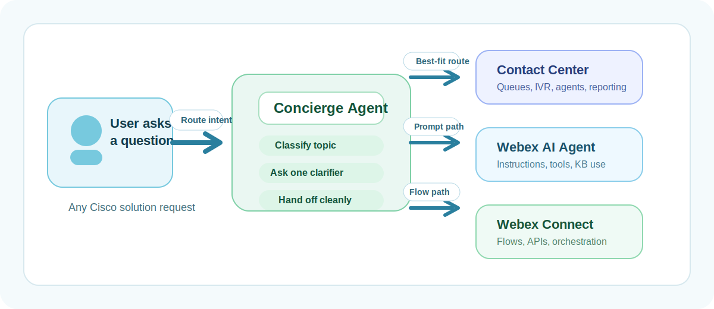
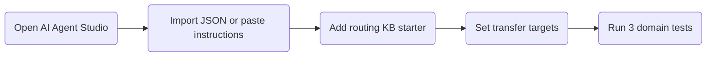

# Concierge Routing Agent Basic Template

Build a simple front-door AI agent that classifies user questions and routes them to the right specialist for Contact Center, Webex AI Agent, or Webex Connect.

This playbook is an internal starter kit. It gives you a lightweight concierge-agent pattern, a ready-to-paste instruction template, a transfer-based AI Agent Studio JSON import, a routing KB starter, and a short validation path so you can get the first version running quickly.

## Try It Fast

1. Open Webex AI Agent Studio and create a new chat or voice agent called `Concierge Routing Agent`.
2. Use [templates/concierge-ai-agent-template.md](templates/concierge-ai-agent-template.md) as the source for the Goal Summary, greeting, actions, and instructions.
3. Add the routing KB starter from [templates/routing-kb-starter.md](templates/routing-kb-starter.md).
4. Start from [templates/concierge-ai-agent-studio-import.json](templates/concierge-ai-agent-studio-import.json) if you want a draft import artifact that already includes the transfer action shape.
5. Configure only these explicit actions:
   - `handoff_to_expert_agent` as a transfer action
   - `Agent handover` for human escalation
6. Let the agent classify the topic and ask a single routing clarifier directly from its instructions rather than separate fulfillment-backed actions.
7. Replace any placeholder transfer targets such as `contact_center_expert`, `webex_ai_agent_expert` and `webex_connect_expert` with the real expert agent names used in your tenant.
8. Test one request for each domain:
   - Contact Center
   - Webex AI Agent
   - Webex Connect

## Files In This Playbook

| File | Why it matters |
| --- | --- |
| [templates/concierge-ai-agent-template.md](templates/concierge-ai-agent-template.md) | Ready-to-use starter instructions for the concierge AI agent |
| [templates/concierge-ai-agent-studio-import.json](templates/concierge-ai-agent-studio-import.json) | Draft AI Agent Studio import with a transfer-based `handoff_to_expert_agent` action |
| [templates/routing-kb-starter.md](templates/routing-kb-starter.md) | Starter content model for the concierge routing knowledge base |
| [docs/Concierge AI Agent Setup Guide.docx](docs/Concierge%20AI%20Agent%20Setup%20Guide.docx) | Team-friendly setup guide that explains the architecture and KB design decisions |

## Recommended Setup Checklist

- Create one concierge agent only.
- Keep the concierge scope narrow: classify, clarify, transfer, and escalate.
- Create or confirm the expert agents you want to transfer to.
- Replace placeholder transfer targets with tenant-specific expert agent names.
- Add the routing KB content before testing.
- Keep classification and clarifier behavior in the agent instructions unless you have a real need for fulfillment-backed actions.
- Pass a short transfer summary so the expert agent receives intent and clarifications already collected.

## Test Script

Use the following test messages to prove the first version works:

1. Contact Center test:
   `How do I configure queue routing for agents?`
   Expected result: classified by the concierge and routed or transferred to the Contact Center expert.

2. Webex AI Agent test:
   `How do I write AI Agent Studio instructions for a support bot?`
   Expected result: classified by the concierge and routed or transferred to the Webex AI Agent expert.

3. Webex Connect test:
   `How do I trigger a webhook from a Connect flow?`
   Expected result: classified by the concierge and routed or transferred to the Webex Connect expert.

4. Overlap test:
   `How do I connect one AI agent to another using Connect?`
   Expected result: one short clarifying question or routing to the primary owning expert based on your configured rule.

5. Unsupported test:
   `Can you help me with Meraki switch firmware?`
   Expected result: supported-domain explanation plus `Agent handover` or fallback path.

## Troubleshooting And Validation

- If the concierge starts answering specialist questions itself, reduce the amount of deep product content in the routing KB.
- If routing is inconsistent, strengthen the cross-domain disambiguation article and add more realistic sample utterances.
- If transfer feels abrupt, pass a better conversation summary into the transfer action.
- If multiple domains overlap often, bias routing toward the user's primary intended outcome rather than the first keyword found.
- If you use the draft AI Agent Studio import JSON, replace placeholder target agents before using it beyond a demo import.

Architecture notes

The strongest architecture is:

- Concierge agent for classification and transfer
- Separate expert agents for deep answers
- Agent-native clarification for ambiguous routing
- Built-in Agent handover for human escalation

The concierge KB should support one question well: what topic is this request about, and where should it go next?

Routing KB design notes

Use one article per domain plus:

- one cross-domain disambiguation article
- one unsupported-topic and escalation article

Each domain article should contain:

- domain definition
- owned topics
- common user goals
- typical phrases
- strong routing indicators
- do-not-route-here boundaries
- exact route target

Future upgrade path

This playbook starts with a markdown-based concierge template and draft import artifact. A natural next step is to add:

- tenant-specific expert-agent names in the transfer target list
- optional fulfillment-backed classification only if required by a real implementation
- Webex Connect handoff orchestration where needed
- reporting and audit flows

