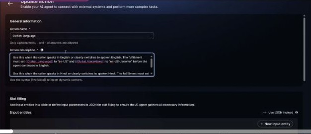
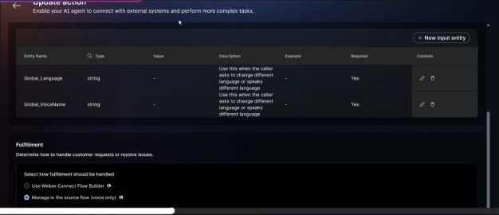
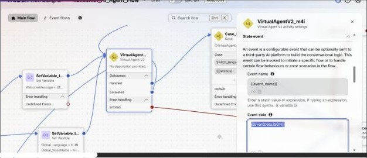
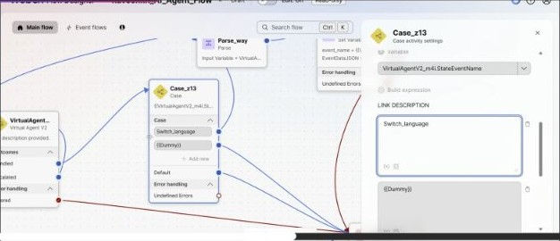
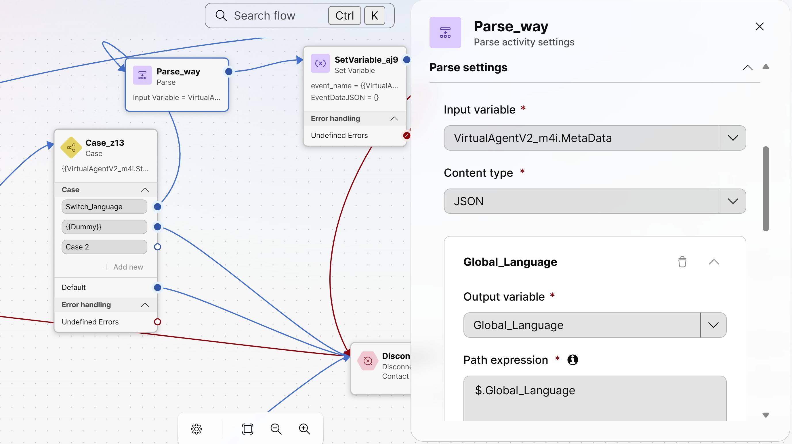
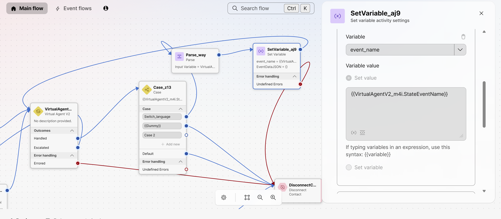
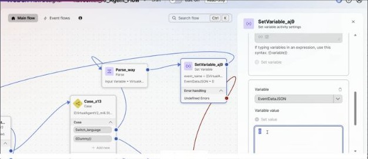

# Configure Custom Data and Custom Events for AI Agents

## Summary

This playbook shows how to pass initial session data to a voice AI Agent through Flow Designer, return an action to the source flow through the VAV2 **Handled** outcome, process the action data, and re-enter the same VAV2 activity so the agent can continue fulfillment.

The example uses the **Switch_language** action. Flow Designer reads the action name from **StateEventName**, parses the action output from **MetaData**, updates flow variables, and sends the event name and any fulfillment result back to the AI Agent.

## Owner and maintenance

- Author: Naveen Kumar AN (**naveenkn**)
- FDE Team Lead reviewer: FDE Team Lead
- Maintainer: FDE Team
- Last validated: 2026-10-01 (documentation and supplied configuration reviewed; no live voice call executed)
- Version: 0.1.0

## Applicability

- Supported product: Webex Contact Center Flow Designer and Webex AI Agent Studio
- Supported feature: Autonomous Voice AI Agent using Virtual Agent V2
- Supported channel: Voice
- Intended audience: Flow Designers, AI Agent builders, solution architects, and FDEs
- Use this pattern when an AI Agent action needs the source voice flow to perform fulfillment and return a result to the same agent session.
- The supplied flow demonstrates changing language and voice based on action output.

## Prerequisites

- Access to Webex Contact Center Flow Designer and Webex AI Agent Studio.
- A voice AI Agent configured for the intended Contact Center AI integration.
- A Flow Designer voice flow containing a Virtual Agent V2 activity.
- An AI Agent action whose fulfillment is handled by the source flow.
- Flow variables for the event name and event data. In this example, they are **event_name** and **EventDataJSON**.
- Any initial session data must be a valid JSON object containing only values the agent needs.

## Architecture and flow

The flow follows this sequence:

1. The initial flow prepares optional session data.
2. Virtual Agent V2 starts the AI Agent conversation.
3. The action exits to the source flow through **Handled**.
4. A Case activity matches **StateEventName**.
5. Parse Data reads the action output from **MetaData**.
6. Set Variable assigns the action name and fulfillment result.
7. The flow returns to the same VAV2 activity so the AI Agent continues.

The initial VAV2 invocation can send session data in **EventDataJSON** while **event_name** is blank. When an action exits to the flow, the flow matches **StateEventName**, processes **MetaData**, and sets the event values used when the same VAV2 activity is invoked again.

## Implementation

### Import the reference exports

The package includes sanitized exports that you can import as a starting point:

- [AI Agent Studio export](exports/naveenkn_flowershop_LanguageChange.json)
- [Flow Designer export](exports/naveenkn_AI_Agent_Flow_Draft.json)

Import the AI Agent JSON into Webex AI Agent Studio, then review the agent instructions, language and voice settings, and every action before publishing it. The reusable export has its knowledge-base association and logo cleared, so select the resources required in the target organization.

Import the flow JSON into Flow Designer, then select the target Contact Center AI configuration and AI Agent in the Virtual Agent V2 activity. The reusable export has organization, flow, creator, AI Agent, and screen-pop identifiers cleared. Confirm all variables, queues, entry points, error paths, and activity mappings before validating or publishing the flow.

### 1. Configure the AI Agent action

In AI Agent Studio, create or open the action that needs source-flow fulfillment.

1. Use the action name that Flow Designer will match. The supplied flow uses **Switch_language**.
2. Define the action inputs the flow must receive. The example uses **Global_Language** and **Global_VoiceName**.
3. In the fulfillment section, select **Manage in the source flow (Voice only)**.
4. Save the action and publish the agent configuration through your normal change process.

The action name is returned by VAV2 in **StateEventName**. The collected action values are returned in **MetaData**.

*Vidcast capture around 1:05.*

### 2. Confirm the fulfillment mode

The action’s fulfillment setting must be **Manage in the source flow (Voice only)** for this pattern. This lets the source voice flow perform the work and provide the response through the VAV2 event fields.

*Vidcast capture around 3:15.*

### 3. Set initial session data and configure VAV2

Before the first VAV2 invocation:

1. Leave **event_name** blank.
2. If the agent needs client or session values at startup, place the complete JSON object in **EventDataJSON**.
3. Confirm that the JSON property names match the variables referenced in the AI Agent goal, instructions, action descriptions, or slots.
4. In VAV2 State Event settings, map Event Name to **event_name** and Event Data to **EventDataJSON**.

The initial **event_name** variable must resolve to an empty value. **EventDataJSON** carries the initial JSON data.

*Vidcast capture around 2:39.*

### 4. Route the Handled outcome to a Case activity

Connect the VAV2 **Handled** outcome to a Case activity. Use the VAV2 output **StateEventName** as the Case expression.

Create one Case branch per action name handled by the source flow. The supplied flow uses **Switch_language**. Add an intentional default path for unknown or unhandled action names; do not let an unexpected event enter the fulfillment loop.

*Vidcast capture around 4:31.*

### 5. Parse the action output

On the matching Case branch, add a Parse Data activity that reads the VAV2 **MetaData** output. Map only the properties needed by the flow.

| JSONPath in MetaData | Flow variable in the example | Purpose |
|---|---|---|
| $.Global_Language | Global_Language | Language selected by the action |
| $.Global_VoiceName | Global_VoiceName | Voice selected by the action |

Use paths that match your action’s output schema. Handle missing or invalid fields before returning to VAV2.

*Vidcast capture around 5:26.*

### 6. Set the return event and fulfillment data

After fulfillment and parsing:

1. Set **event_name** to the action name returned in **StateEventName**.
2. Set **EventDataJSON** to a valid JSON object containing the fulfillment result the AI Agent needs to continue.
3. If the action has no result to return, an empty JSON object is appropriate; the supplied flow export uses that form.
4. Connect the Set Variable activity back to the same VAV2 activity.

The **EventDataJSON** field is the payload delivered back to the agent. Include the result values the agent needs; do not rely on flow variables alone to update agent context.

*Set **event_name** to the VAV2 **StateEventName** value before returning to the same VAV2 activity.*

*Vidcast capture around 7:50. The supplied flow export uses an empty JSON object for this example; use your fulfillment output when the agent needs data.*

## Validation

Run a test call with non-sensitive test values.

1. Start the voice flow and confirm the initial VAV2 event name is blank.
2. If initial context is configured, confirm the AI Agent can use the values sent through **EventDataJSON**.
3. Ask the agent to trigger the configured action.
4. Confirm VAV2 exits through **Handled** and **StateEventName** matches the action name exactly.
5. Confirm the matching Case branch runs and Parse Data maps the expected **MetaData** properties.
6. Confirm Set Variable assigns the return event and a valid JSON fulfillment result.
7. Confirm the flow loops to the same VAV2 activity and the AI Agent continues without repeating its welcome message.
8. Exercise the default Case path with an unrecognized event and confirm it fails safely.

Expected result: the source flow handles the action, returns the necessary result, and the same AI Agent conversation continues from its fulfillment point.

## Operations and handoff

- Keep action names and Case values synchronized. A renamed action must be updated in every matching Case branch.
- Keep Parse Data mappings synchronized with the action’s output schema.
- Validate the event name, JSON payload, and loop after changing the agent action, VAV2 configuration, or flow variables.
- Use a defined default/error path for unknown actions, invalid JSON, missing output values, and fulfillment failures.
- Revalidate this pattern in the target Contact Center environment before production use.

## Security and privacy

- Send only the minimum session and fulfillment data required by the AI Agent.
- Do not place credentials, payment card data, secrets, or unnecessary personal information in **EventDataJSON**, logs, screenshots, or flow descriptions.
- Apply the organization’s retention, access-control, and data-handling rules to flow variables and AI Agent inputs.

## Evidence and outcomes

This draft was checked against the supplied AI Agent and Flow Designer JSON exports, the shared Vidcast, and the Cisco Help Center guidance on 2026-10-01. The screenshots show the action configuration, source-flow fulfillment selection, VAV2 event fields, Case expression, Parse Data mapping, Set Variable selection, and loop context. A live call and runtime behavior have not been tested as part of this draft.

Internal source engagements (access restricted): [CCC-3584](https://imimobile.atlassian.net/browse/CCC-3584) and [CCC-3612](https://imimobile.atlassian.net/browse/CCC-3612).

## Troubleshooting

| Symptom | Check | Corrective action |
|---|---|---|
| The action exits but no Case branch matches | Compare the action name with **StateEventName** and each Case value | Use the exact action name in the matching Case branch |
| The flow does not take the Handled route | Confirm the action uses **Manage in the source flow (Voice only)** and the VAV2 Handled output is connected | Correct the action fulfillment setting or connect the Handled output |
| Parse Data returns empty values | Inspect the VAV2 **MetaData** structure and JSONPath mappings | Update the paths and handle missing values |
| The AI Agent restarts at its welcome message | Check that the flow invokes the same VAV2 activity with the matching event name | Return to the same VAV2 node and preserve the event/session context |
| The agent cannot use initial session context | Confirm **event_name** is blank on the initial invocation and the data is valid JSON in **EventDataJSON** | Correct the initial variable assignments and property names |
| The agent resumes without fulfillment results | Check the Set Variable assignment for **EventDataJSON** | Return a JSON object containing the result values the action needs |

## References

- [Configure custom data and custom events for AI agents](https://help.webex.com/en-us/article/n5uo60x/Configure-custom-data-and-custom-events-for-AI-agents)
- [Recorded Vidcast walkthrough](https://app.vidcast.io/share/06edc431-be2e-4b18-9f44-47b33350fcc3)
