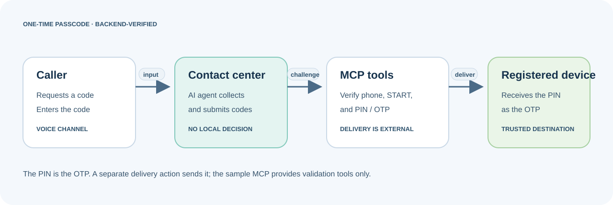

# OTP Validation with MCP

Authenticate a voice caller before transferring them to a Client Management Expert. The intended journey confirms the account phone, validates a previously shared START Code, then sends a PIN as the one-time passcode (OTP) to the registered device and validates it.

**[Open the live demo](https://playground.webexaiagentservice.com/showcase/)**

## Downloadable Content Files

| Category | File |
|---|---|
| Webex Contact Center Voice Flows | Not provided |
| Webex Contact Center Fulfilment Flows | Not provided |
| Webex Connect Fulfilment Flows | Not provided |
| AI Agent Export JSON | [Demo Authentication.json](downloads/Demo%20Authentication.json) |
| Sample Knowledge Base Files | Not provided |
| Sample MCP | [sample_otp_authentication_mcp.py](content/sample_otp_authentication_mcp.py) |

## Try It Fast

The current agent export and MCP source expose phone, START Code, and PIN tools. In this journey, the PIN is the OTP. Import [Demo Authentication.json](downloads/Demo%20Authentication.json) into AI Agent Studio. Deploy the supplied Sample MCP for a demo, replace it with an MCP server of your choice, or implement the same tool contract in a Webex Connect Fulfilment flow; then bind the agent actions to that fulfillment path and configure `Agent handover`. The demo generates the START Code and PIN; it validates them but does not deliver the PIN/OTP to a registered device. Bind a delivery service before treating that step as runnable. No voice flow or fulfillment workflow is included.

> **Implementation gap:** the included MCP validates the PIN/OTP with `validate_pin_code`, and the demo generates that PIN after START Code validation. The MCP has no SMS or voice delivery tool. For a previously shared START Code, replace the demo generation step with the approved shared-code lookup.

| Step | Do this | Where |
|---|---|---|
| 1 | Collect the account phone, normalize it to E.164, and call `verify_account_phone`. Continue only on `verified`; route `no_match` or `error` to `Agent handover`. | MCP server |
| 2 | Collect the previously shared START Code and call `validate_start_code` with the returned `verification_id`. Continue only on `Verified`; route `NOT Verified` or `error` to handover. | MCP server |
| 3 | After `validate_start_code` returns `Verified`, send the generated PIN/OTP to the trusted registered device. Do not let the caller change the destination. The current MCP does not send it. | Delivery service |
| 4 | Collect the delivered PIN/OTP and call `validate_pin_code` only after capture. Hand off to the Client Management Expert whether PIN validation succeeds or fails. | MCP server |
| 5 | Bind `Agent handover` to the configured expert queue and test every failure path with synthetic data. | AI Agent Studio / test environment |

For a broader journey that collects identity details before an OTP step-up, see [User Identification and Verification](../user-identification-verification/README.md).

## MCP Tool Contract

The included MCP sample exposes these tools. Reuse the same session ID for every MCP call in a verification journey.

| MCP tool | Inputs | Result and use |
|---|---|---|
| `verify_account_phone` | `account_phone` (E.164 string), `sessionId` | Returns `verified` with an opaque `verification_id`, or `error`. The declared result type also includes `no_match`, but the supplied implementation never returns it. |
| `validate_start_code` | `verification_id`, digit-only `start_code`, `sessionId` | Returns `Verified`, `NOT Verified`, or `error`. Call only after phone step and clear capture. In the demo, a successful check rotates the pane value to a generated PIN/OTP. |
| `validate_pin_code` | `verification_id`, digit-only `pin_code`, `sessionId` | Returns `Verified`, `NOT Verified`, or `error`. In this journey, the PIN is the OTP. The demo validates it against the PIN value created after START Code validation; this tool does not deliver the PIN. |
| `Agent handover` | Agent handover reason and configured routing | Use for caller requests, missing or invalid credentials, capture failures, and tool errors. Keep all codes and the verification ID out of the reason and summary. |

The returned `verification_id` is a session-bound handle for later calls, not a code to read to the caller. Preserve codes as strings so leading zeroes are retained. Normalize spoken or keypad digits only when they are clear; never guess missing digits. The demo accepts any syntactically valid E.164 phone and returns `verified`; connect the method to trusted account data for real phone verification. It generates a new START Code in the phone step; a production implementation may instead retrieve the previously shared code.

### PIN delivery to the registered device

The caller journey is: verify the phone, validate a shared or demo-generated START Code, send the generated PIN as an OTP to the registered device, validate that PIN with `validate_pin_code`, then hand off to an expert. The included MCP implements the validation steps and generates the PIN after START Code success, but it does not deliver it. Add or bind a server-side delivery action that sends the exact generated PIN to the trusted destination and applies expiry, resend, and attempt policies. Return only a masked destination and delivery outcome to the agent.

## Test Script

| Scenario | Test | Expected behavior |
|---|---|---|
| Phone capture | Provide a clear account phone in E.164 format. | Agent calls `verify_account_phone` with the session ID; continue only on `verified`. The sample currently accepts any valid E.164 number. |
| Phone service error | Simulate the pane/API request failing. | Tool returns `error`; agent stops authentication and invokes `Agent handover`. |
| Shared START Code | Enter a clear START Code, then try an incorrect value. | `validate_start_code` returns `Verified` or `NOT Verified`. The demo generates a fresh START Code during the phone step; a production version can retrieve a previously shared code instead. |
| PIN/OTP delivery | Complete the START Code step. | The service sends the PIN/OTP to the registered device. This requires a delivery method not present in the supplied MCP. |
| PIN/OTP validation | After delivery to the registered device, enter the PIN/OTP. | Agent calls `validate_pin_code` with the same session and verification ID. Transfer to an expert for both `Verified` and `NOT Verified`; tool errors also transfer. |
| Difficult capture | Speak digits unclearly twice, then try keypad entry. | Agent offers keypad after two unclear capture attempts. Do not count a clear but invalid credential as an unclear capture. |
| Caller request or missing code | Ask for an expert or say the START Code/PIN is unavailable. | Stop authentication and transfer without asking for further codes. |
| Business routing | Give a reason such as a payment, lost card, or disputed transaction. | Tell the caller the appropriate expert category, then invoke `Agent handover`; claim transfer only after the tool confirms it. |

## Agent Behavior and Handover

- Speak calmly and briefly. Allow pauses and background noise; ask for a repeat only when digits are unclear. Accept spoken digits or keypad entry and normalize only clearly provided digits.
- Allow two clear-capture attempts for each input, then offer keypad entry. If the caller still cannot provide it, transfer. Treat an action result of `NOT Verified` as an invalid credential, not an unclear capture.
- Verify phone first, then START Code, then PIN/OTP. Call each tool only after capturing its input. Continue only when the corresponding MCP result confirms the step.
- Never repeat the START Code or PIN/OTP aloud. Do not put either value or `verification_id` in a handover reason, summary, or customer-facing response.
- If the caller asks for an agent or cannot provide the START Code or PIN/OTP, stop authentication and use `Agent handover`. After PIN/OTP validation, transfer whether the result is `Verified` or `NOT Verified`, as configured for this use case.
- Give a concise, non-sensitive transfer reason. Do not claim the handover succeeded until the action confirms it.

| Caller reason | Expert category |
|---|---|
| Make a payment, payment not posted, or late fee | Payments and billing |
| Activate a card, reset PIN, or trouble signing in | Card activation and access |
| Missing or stolen card, or replacement request | Lost or stolen card |
| Unfamiliar charge or suspected account misuse | Fraud or suspicious activity |
| Question a charge, refund, or declined transaction | Transactions and disputes |
| Update contact details, ask about balance or credit limit | Account details |

## Troubleshooting

| Symptom | Check |
|---|---|
| Code never arrives | Check provider delivery status, the masked destination, country/channel support, and resend throttling. Do not read the full destination aloud. |
| Code returns `NOT Verified` | Confirm the same `sessionId` and `verification_id` are used, and check that the correct START Code or PIN/OTP was captured. |
| A code works more than once | Enforce atomic single-use consumption in the backend, including concurrent validation requests. |
| Agent continues after an error | Confirm only `verified` from phone verification and `Verified` from code validation advance the steps; errors or missing results must hand off. |

Architecture and ownership

| Component | Responsibility |
|---|---|
| AI Agent Studio agent | Collects phone, shared START Code, and delivered PIN/OTP; calls the corresponding tools and follows their exact outcomes. It does not claim authentication without a successful tool result. |
| Sample MCP server | Exposes `verify_account_phone`, `validate_start_code`, and `validate_pin_code`; writes verification state to a workspace pane through `_request_json`. |
| Workspace pane / API adapter | Stores session state and code values in the supplied demo. The adapter implementation and its credentials are not included. |
| Registered-device delivery service | Must send the PIN/OTP to the trusted destination after START Code validation. This component is not included in the supplied MCP. |
| `Agent handover` | Transfers the caller to a Client Management Expert and selects the suitable business category. |

Use the backend as the authority for each result. Do not let the caller change the registered destination or put secrets in a handover summary.

Security and operational limits

- Generate codes with a cryptographically secure random source. Set a short expiry, enforce attempt and resend limits, invalidate on success, and reject replay. OWASP also advises against logging OTP values or retaining them in long-term plaintext storage. See the [OWASP Multifactor Authentication Cheat Sheet](https://cheatsheetseries.owasp.org/cheatsheets/Multifactor_Authentication_Cheat_Sheet.html).
- The sample is demo-only: `verify_account_phone` marks any syntactically valid E.164 phone as verified; it does not compare the number with a trusted account record. The sample generates five-digit values and stores the START Code and PIN in the workspace pane, including HTML. It does not enforce code expiry or attempt limits and does not deliver the PIN/OTP. Replace these behaviors before production use.
- Treat the delivered PIN/OTP, START Code, and `verification_id` as sensitive. Never read codes aloud, place them in `Agent handover`, or include them in summaries. Restrict transcript, pane, and fulfillment logs and retention.
- Protect the code in transit and restrict who can invoke challenge creation and validation. Store only the minimum challenge data needed for verification and audit; mask destinations in conversation responses.
- Apply limits across suitable identifiers such as account, challenge, and source risk signals. Design lockout and recovery to avoid making account denial of service easy.
- SMS and voice passcodes depend on control of a phone number and can be exposed through number takeover or device compromise. Select a stronger authenticator when the assurance need or risk requires it. Consult the current [NIST SP 800-63B-4](https://pages.nist.gov/800-63-4/sp800-63b.html) requirements for your authentication context.
- Define retention, audit access, delivery fallback, fraud escalation, and accessibility requirements with the service owner before production use.

This playbook is an integration pattern, not a compliance determination. Confirm the required assurance level and channel policy for the deployment.

Import, rebind, and publish

The supplied [Demo Authentication.json](downloads/Demo%20Authentication.json) is preserved as provided. The [Sample MCP](content/sample_otp_authentication_mcp.py) has a genericized header and no static API keys or credentials. Review runtime endpoints, tenant bindings, pane access, and retention before use. No voice flow or delivery workflow is included. When adding exports for a specific implementation:

1. Keep original exports under `content/` or `downloads/` and link them in `Downloadable Content Files`.
2. Rebind the agent's three authentication tools to the target MCP server and validate the method/field mapping.
3. Rebind the agent, entry point, queue, endpoints, and credentials in the target tenant.
4. Test success, failure, expiry, replay, throttling, and service outage paths in a non-production environment.
5. Review exports for tenant identifiers and secrets while preserving importability; document any required manual cleanup.

---

## License and Attribution

This is a reference playbook for Webex Contact Center AI Agent solution design. Add the preferred repository license and attribution before publishing.
