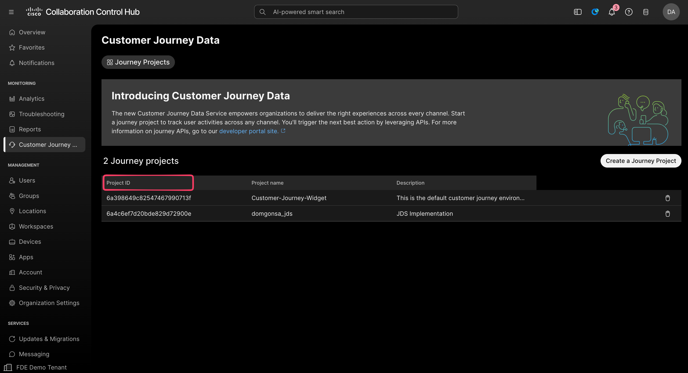
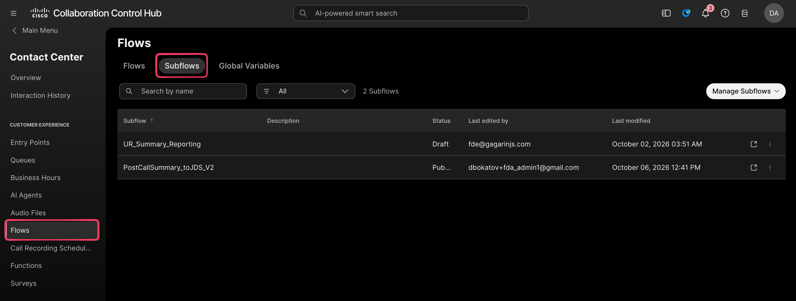
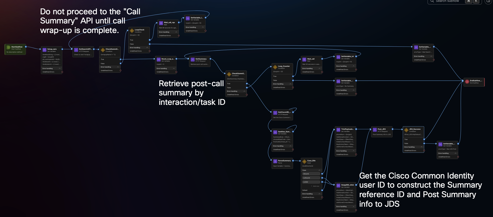
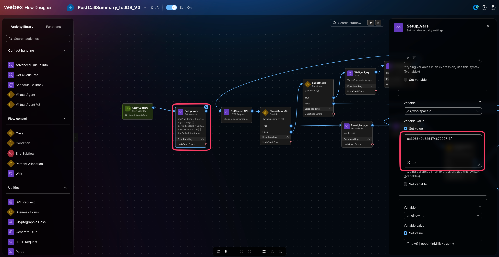
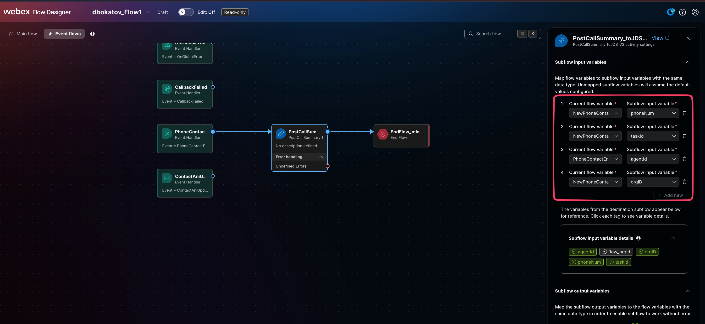
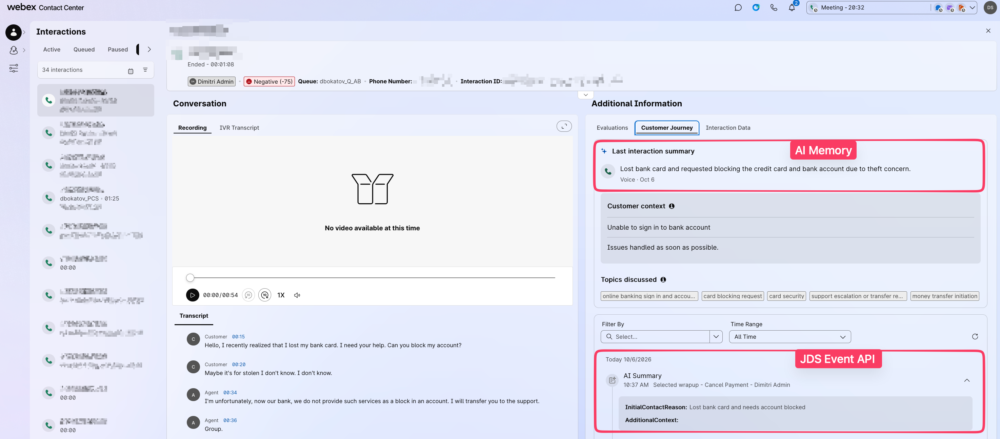

# Post-Call AI Assistant Summary to Customer Journey Data

## Summary

This playbook shows how to publish selected Webex Contact Center AI Assistant wrap-up summary fields to Customer Journey Data (JDS) after a voice interaction ends. A Flow Designer subflow waits for wrap-up completion, retrieves the generated summary for the interaction, resolves the agent identity, and posts a JDS event. The expected result is a summary event associated with the interaction and visible from Supervisor Desktop.

The current example posts summary data and a phone identity to JDS. The same pattern can be extended to include transcript text, wrap-up codes, or other interaction details by updating the flow mappings and event payload. Those additions are not included or validated in this example.

## Owner and maintenance

- Authors and co-writers: `Dimitri` and Scott Osborne who initially designed and tested this solution.
- FDE owner: `dbokatov`
- FDE Team Lead reviewer and maintaining team: FDE Team
- Last validated: 2026-10-06
- Version: 1.0.0

## Applicability

- Supported products: Webex Contact Center and Customer Journey Data
- Supported features: AI Assistant real-time transcription and wrap-up summary
- Supported channel: Voice
- Intended audience: Webex Contact Center administrators and Flow Designer developers
- When to use: You want selected AI Assistant post-call summary details in a JDS journey project, keyed to the completed voice interaction.
- Current example scope: Summary data only. The same pattern can be extended to publish transcript text, wrap-up codes, or other interaction details to JDS. Such additions require updating the event payload and reviewing the target organization's privacy and access controls.
- Requirements: An inbound voice interaction, an available interaction identifier and caller ANI, and a completed agent wrap-up.

## Prerequisites

- Customer Journey Data is activated for the Webex Control Hub organization.
- A Journey Project exists. You have permission to view its Project ID.
- AI Assistant wrap-up summaries and real-time transcription are enabled for the queues used by the flow.
- You can edit and publish the relevant Contact Center flows and subflows.
- An authenticated Webex Contact Center HTTP connector is available for the summary lookup, agent identity lookup, and JDS event request activities. The connector must have the access needed for those endpoints.
- You can place an inbound test call and inspect interaction details in Supervisor Desktop.

## Architecture and flow

```text
Agent completes voice interaction and wrap-up
                    |
                    v
Main flow: PhoneContactEnded event
                    |
                    | phoneNum, taskId, agentId, orgID
                    v
PostCallSummary_toJDS_V3 subflow
     |              |                   |
     |              |                   +--> Resolve Cisco Common Identity user ID
     |              +--> Retrieve post-call summary by interaction/task ID
     +--> Wait for wrap-up completion and summary availability
                    |
                    v
Post JDS event to the selected Journey Project
                    |
                    v
Review the interaction's Customer Journey details in Supervisor Desktop
```

The subflow posts summary fields. It does not post the complete transcript in the supplied configuration.

## Implementation

### 1. Activate Customer Journey Data and create a Journey Project

1. In Control Hub, open **Customer Journey Data**.
2. Confirm the service is activated for the organization. If it is inactive, complete the organization's activation process before configuring the flow.
3. Open **Journey Projects** and create a project if the target project does not already exist.
4. Copy the target **Project ID**. JDS APIs refer to this project identifier as the workspace ID.



### 2. Import the subflow

1. In Control Hub, go to **Contact Center → Flows → Subflows**.
2. Open **Manage Subflows** and import [`PostCallSummary_toJDS_V3.json`](flows/PostCallSummary_toJDS_V3.json) from this playbook.
3. Open the imported `PostCallSummary_toJDS_V3` subflow in Flow Designer.



The supplied subflow's activity sequence is shown below. It waits for wrap-up completion, retrieves the summary by interaction/task ID, resolves the agent identity, and posts the summary to JDS.



### 3. Set the JDS Project ID and connector

1. In the `Setup_vars` activity, set `jds_workspaceId` to the target Journey Project ID.
2. For each HTTP Request activity, select an authenticated HTTP connector from the target organization and verify its authorization.
3. Do not place client secrets or access tokens in flow variables or literal request fields.



### 4. Add the subflow to the main flow

1. Open the main inbound voice flow in Flow Designer.
2. Open its **Event flows** and select the `PhoneContactEnded` event.
3. Add the `PostCallSummary_toJDS_V3` subflow after the event handler.
4. Map the current flow variables to the subflow inputs using matching data types:

   | Main flow variable | Subflow input |
   |---|---|
   | `NewPhoneContact.ANI` | `phoneNum` |
   | `NewPhoneContact.InteractionId` | `taskId` |
   | `PhoneContactEnded.AgentID` | `agentId` |
   | `NewPhoneContact.OrgId` | `orgID` |

5. Save the main flow.



### 5. Publish and validate

1. Save and publish the subflow and main flow according to the tenant's change process.
2. Place an inbound test call to a queue with AI Assistant wrap-up summary enabled.
3. Complete the agent wrap-up and allow the flow's summary polling to finish.
4. In Supervisor Desktop, open the completed interaction and inspect **Additional Information → Customer Journey**.
5. Confirm a JDS event appears for the interaction and contains the expected summary fields.



**JDS Event API:** This is the AI Assistant high-value summarization capability. It can provide editable, detailed summaries customized for an interaction type, such as post-call wrap-up, mid-call transfer or consult, dropped-call recovery, and AI Agent handoff. This example adds the summary to JDS by sending an HTTP `POST` request.

**AI Memory:** This is a separate feature in the Customer Journey widget. It provides a one-line “last interaction” snapshot to help an agent quickly understand the customer journey. It is not a summary product, is not customizable, and does not replace AI Assistant summaries.

Expected result: a JDS event associated with the interaction is visible in Supervisor Desktop. The exact event time depends on when the wrap-up and summary become available. The screenshot shows the successful result for the supplied lab interaction.

## Validation

Follow implementation step 5 in a test queue after publishing both flows. Confirm that the completed interaction has a JDS event with the expected summary fields in Supervisor Desktop. This package has not been exercised against a live tenant; perform this validation in the target organization before production use.

## Security and privacy

- The included flow JSON and screenshots retain the identifiers and interaction details visible in the supplied lab-tenant materials, including organization and Journey Project IDs, caller number, interaction ID, sample conversation content, account identity, and flow identity. They are intentionally unredacted at the author's direction for lab use.
- No credentials, access tokens, or secrets were found in the supplied flow JSON during review. Keep credentials in the connector's authentication configuration; do not add credentials or tokens to flow variables, request fields, or screenshots.
- Before adapting this package outside the lab tenant, replace the organization and Journey Project IDs, select the target organization's authenticated connector in each HTTP Request activity, and remove or replace the sample caller, interaction, agent/account, and conversation values in any materials you redistribute.
- Review which summary fields are sent to JDS and apply the organization's data minimization, retention, access-control, and privacy requirements.
- The example sends post-call summary data and phone identity; it does not send full transcript text as supplied.
- Adding transcript text, wrap-up codes, or other details changes the data sent. Review the resulting payload and access policy before enabling those fields.

## Troubleshooting

| Symptom | Checks |
|---|---|
| No JDS event appears | Confirm JDS is active, the Journey Project ID is correct, the event flow is published, and all four subflow input mappings are set. |
| Summary is empty or not found | Confirm wrap-up is complete, AI Assistant summaries are enabled for the queue, the interaction ID is passed as `taskId`, and the connector can retrieve the summary. |
| HTTP request returns an authorization error | Reauthorize or select an active connector for the target organization and verify the required endpoint permissions. |
| JDS post is rejected | Verify `jds_workspaceId`, the event reference, request payload, and the connector's JDS permissions. Check the HTTP response in Flow Designer execution details. |
| Event is associated with the wrong caller or agent | Verify the ANI, interaction ID, agent ID, and organization ID mappings from the `PhoneContactEnded` event. |

## References

- [Customer Journey Data getting started](https://developer.webex.com/webex-contact-center/docs/journey-getting-started)
- [Webex Contact Center APIs](https://developer.webex.com/docs/contact-center)
