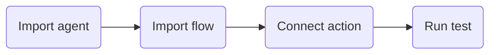

# Playbook Style

SCG playbooks should lower the friction to try a use case. They should not feel like a product manual.

## Recommended README Order

1. Title with the use case name.
2. One or two sentences that explain the outcome.
3. `Playbook Metadata` table with Vertical, Channel, and Complexity.
4. Hero visual.
5. `Try It Fast` section with the recommended path.
6. Setup checklist.
7. Test script.
8. Troubleshooting or validation.
9. Collapsed details for architecture, imports, backend paths, security, limits, and publishing.

Use `Unknown` when a metadata value is not known. Do not invent a vertical, channel, or complexity level.

## Files In This Playbook

When a README includes a `Files In This Playbook` section or table, keep it focused on files and dependencies the reader must import, configure, or understand to run the playbook.

Include examples:

- AI Agent Studio JSON exports.
- Flow Designer JSON exports.
- Required backend services or external dependencies.
- Companion skills when they are part of setup.

Do not include examples:

- Hero diagrams.
- Architecture diagrams.
- Screenshots.
- SVG, PNG, or other visual assets from `assets/`.

Diagrams and images should still live in the repo when useful. Reference or display them where they help the README, but do not list them as playbook files.

## Writing Rules

- Use short sections and concrete verbs.
- Put the easiest supported path first.
- Do not present Option A, B, and C equally unless the user explicitly asks for a comparison playbook.
- Use `<details>` blocks for material that is useful but not needed for the first successful run.
- Avoid long background paragraphs. If context is necessary, put it after the quick path.
- Use sample names, fake numbers, and demo-safe values.
- Keep internal/customer notes separate when both audiences are supported.

## Try It Fast Pattern

Use this section to make the first win feel reachable:

````markdown
## Try It Fast



1. Import the AI Agent Studio export.
2. Import the Flow Designer export.
3. Rebind tenant-specific references.
4. Run the happy-path test.
````

When setup depends on a complex helper process, add a Skills CTA directly under the step.
