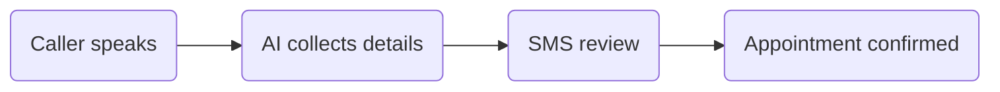

# Visual Standard

Use visuals to explain the use case before the reader has to parse steps.

## Hero Visual

- Prefer a wide SVG or generated bitmap that can render inside GitHub.
- Show the user or customer action on the left, the AI/platform logic in the middle, and the outcome or channel on the right.
- Use a friendly technical storyboard style: simple human/customer, simple device or channel, and clear flow arrows.
- Use soft blue, teal, and green accents with dark readable text.
- Use rounded cards and rounded containers.
- Put arrow labels in small pill callouts.
- Keep arrows away from text. Text must never be crossed or covered.
- Avoid real names, phone numbers, customer logos, and tenant-specific information.

## Simple Visuals And Arrow Safety

Use this for lightweight playbook visuals that do not need the full `scg-diagram` workflow.

Before drawing:

- Choose a wide canvas, usually 1200x520 or wider.
- Place major objects in 3-4 fixed zones from left to right.
- Put cards/icons inside zones and leave a clear gutter between zones.
- Reserve one horizontal arrow lane between each pair of zones. Arrows live in gutters, not inside cards.
- Reserve a separate label lane above or below the arrow lane. Labels do not sit on arrow lines.

When drawing arrows:

- Prefer straight horizontal arrows between zone edges.
- Use elbow arrows only when a return path is needed.
- Put return or approval arrows on a lower lane, separate from forward arrows.
- Keep arrowheads outside card boundaries by at least 16px.
- Keep arrows and arrow labels at least 24px away from any text.
- Do not use diagonal arrows if they would pass through a card, icon, label, or paragraph.
- Do not place text directly on an arrow path. Use a pill label near the arrow instead.

For generated bitmap prompts, include this instruction:

```text
Use a clean left-to-right storyboard with wide empty gutters between cards. Put arrows only in the gutters, labels in separate pill callouts above or below the arrows, and ensure no arrow, label, or decoration overlaps any text or icon.
```

For SVG/code-native visuals:

- Define card bounds first.
- Draw arrows after cards, using coordinates in the gutters between card bounds.
- Draw labels last, with their own rounded background.
- Verify each arrow line does not intersect a text box or card interior.

If an arrow overlaps text on the first pass, do not ship it. Simplify the visual, widen the gutters, move labels off the line, or switch to `scg-diagram` for an editable layout.

Use `scg-diagram` instead when:

- The visual has more than four major zones.
- It needs crossing paths, loops, multiple return flows, or detailed architecture.
- It will be reused in a customer deck or edited by the team.
- Manual visual QA is needed before publishing.

## Mermaid Diagrams

Use rounded boxes for the SCG standard:



Keep Mermaid diagrams short. If the architecture is complex, use one simple first-run diagram and put the detailed version in a collapsed section.

## Screenshots

- Use screenshots only when they reduce ambiguity.
- Crop out personal data, org names, tokens, and tenant-specific IDs.
- Do not make users read a screenshot as the only source of truth; pair it with the minimum written step.
