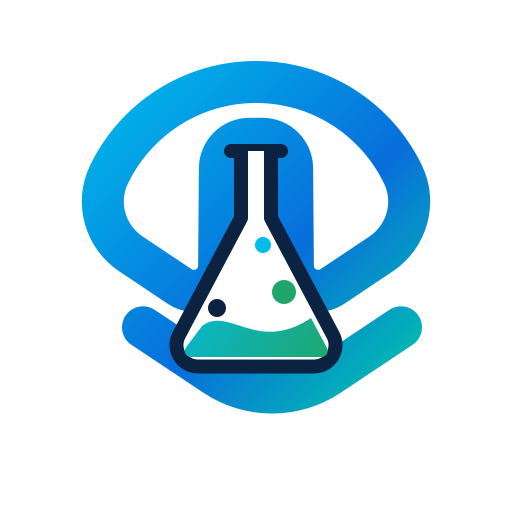

<p align="center">
  
</p>

# Webex Customer Experience AI
### Reusable AI assets built from customer learnings

This repository is where AI Solution Consulting teams publishes reusable assets created from real customer engagements, field patterns, and adoption learnings.

The goal is simple: help Cisco teams and partners build faster, avoid starting from scratch, and apply proven AI patterns with more confidence.

[Start Here](#start-here) · [Templates](#templates) · [Cookbooks](#cookbooks) · [Skills](#skills-for-personal-assistants) · [Contributing](#contributing)

---

## Asset Library

The repository is organised around three asset types:

| Asset | What It Is | When To Use It |
| --- | --- | --- |
| Templates | Pre-built use cases and structures that help consumers build quickly. | Use when you want a working starting point for a customer scenario, demo, workflow, or solution pattern. |
| Cookbooks | Best practices, build guidance, examples, and how-to material. | Use when you need to understand how to build, adapt, validate, or improve an AI use case. |
| Skills for personal assistants | Instructions that turn AI assistants into specialised experts who can build along with you. | Use when you want your assistant to behave like a domain expert for a repeatable task. |

```text
templates/       Pre-built use cases and reusable starting points
cookbooks/       Best practices, how-to guides, and build patterns
skills/          Personal-assistant skills for specialist AI workflows
brand-assets/    AI SCG identity assets for docs, slides, and pages
```

---

## Templates

Templates are pre-built use cases that help teams move quickly from idea to execution.

They are designed to give consumers a practical starting point: the structure, flow, components, prompts, or configuration pattern needed to build a specific AI use case without rebuilding the basics.

Use templates when you need to:

- Build a customer use case quickly.
- Recreate a proven demo or workflow.
- Standardise a repeatable solution pattern.
- Adapt a field-tested use case for a new customer or vertical.
- Give sales, SE, partner, or delivery teams a stronger starting point.

[Browse templates](./templates)

---

## Cookbooks

Cookbooks explain how to build well.

They capture best practices, design guidance, implementation patterns, examples, lessons learned, and practical checks from customer work. A good cookbook should help someone understand not only what to build, but how to think about the build.

Use cookbooks when you need to:

- Understand the right build pattern for a use case.
- Apply best practices from previous customer engagements.
- Avoid common design or implementation mistakes.
- Learn how to scope, structure, test, or refine an AI workflow.
- Translate a customer requirement into a working AI pattern.

[Browse cookbooks](./cookbooks)

---

## Skills For Personal Assistants

Skills turn a personal AI assistant into a specialised expert for a repeatable task.

They package domain knowledge, instructions, guardrails, and working patterns so an assistant can help build with you, not just answer questions. The intent is to make personal assistants more useful in day-to-day AI work: faster to brief, more consistent in output, and better aligned to proven SCG patterns.

Use skills when you want an assistant to help with:

- Use case discovery
- Customer call preparation
- AI workflow design
- Prompt and instruction writing
- Demo planning
- Solution positioning
- Executive narrative drafting
- Build review and improvement

[Browse skills](./skills)

---

## Start Here

Choose the asset type based on the job you need to do.

| If you need to... | Start with... |
| --- | --- |
| Build from a proven starting point | `templates/` |
| Learn how to build or adapt something | `cookbooks/` |
| Make your AI assistant an expert in a repeatable task | `skills/` |
| Package a customer learning for others | `cookbooks/` or `templates/` |

Clone the repository:

```bash
git clone <REPOSITORY_URL>
cd ai-scg-assets
```

Then open the relevant asset folder:

```bash
cd templates
cd ../cookbooks
cd ../skills
```

---

## What Good Looks Like

Every asset should be practical, specific, and easy to reuse.

Good assets come from real customer work. They capture the pattern behind the work so another team can move faster with better judgement.

Every asset should include:

- Purpose
- Intended user
- When to use it
- Required inputs
- Build or usage steps
- Example output or example configuration
- Adaptation guidance
- Owner or maintainer

---

## Contributing

Contributions should make the library more useful for the next team.

Good contributions usually come from:

- A customer engagement that produced a reusable pattern.
- A use case that should become easier to repeat.
- A demo that should become easier to rebuild.
- A best practice that should be applied consistently.
- A personal-assistant workflow that reliably improves build quality.

Before adding something new, check whether an existing asset should be improved instead. Duplication creates noise. Better assets create leverage.

---

## About

This repository is maintained by AI SCG as a publishing library for reusable AI assets based on customer learnings.

It is built for teams that need to build, adapt, and scale AI use cases faster.

---

## Licence

Add the appropriate licence for this repository before publishing externally or sharing beyond the intended audience.

---

## Trademarks

This repository may reference Cisco products, services, trademarks, or logos. Use of Cisco trademarks or logos must follow Cisco brand and trademark guidance. Third-party trademarks remain the property of their respective owners.

---

Published by AI SCG.
